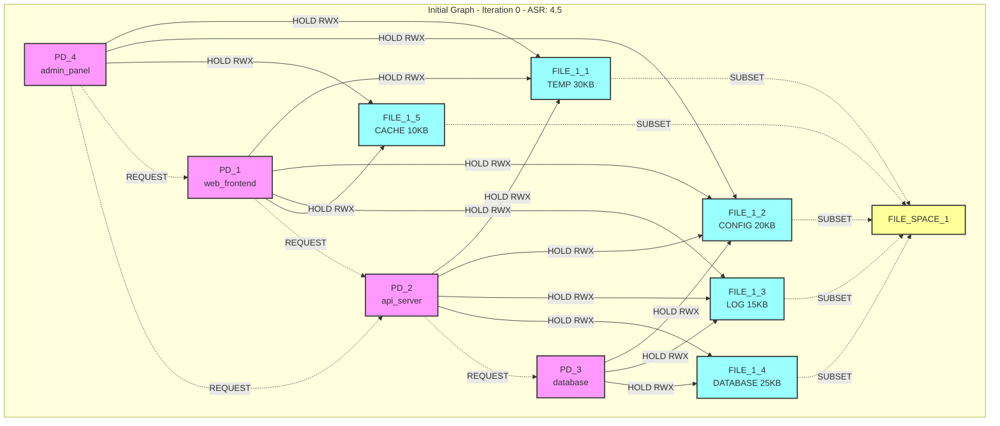
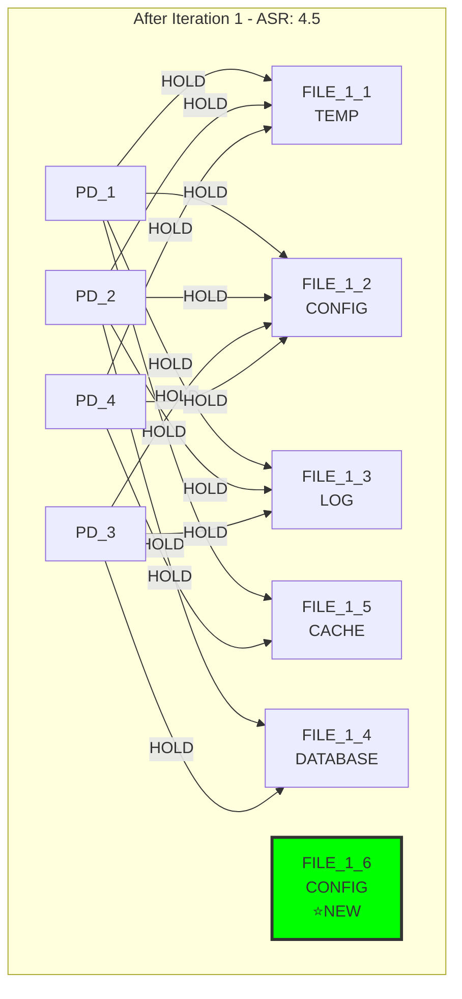
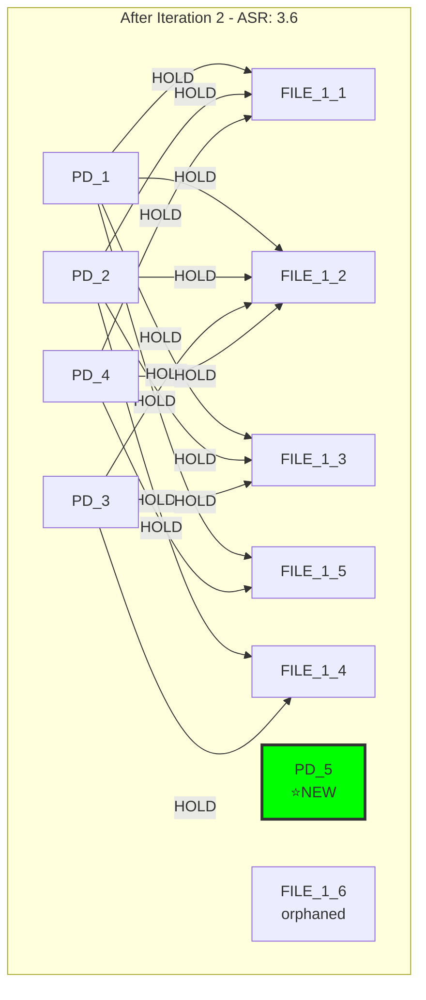
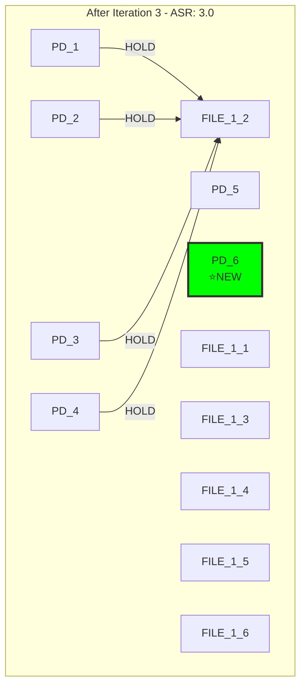
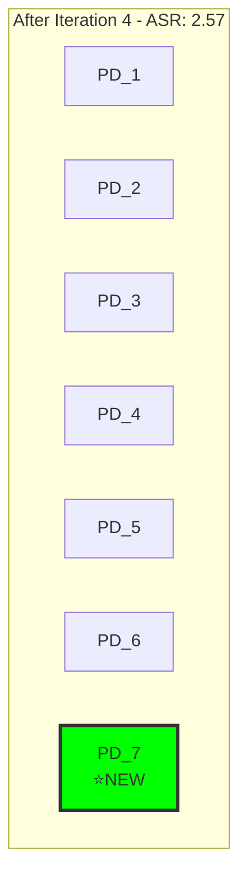
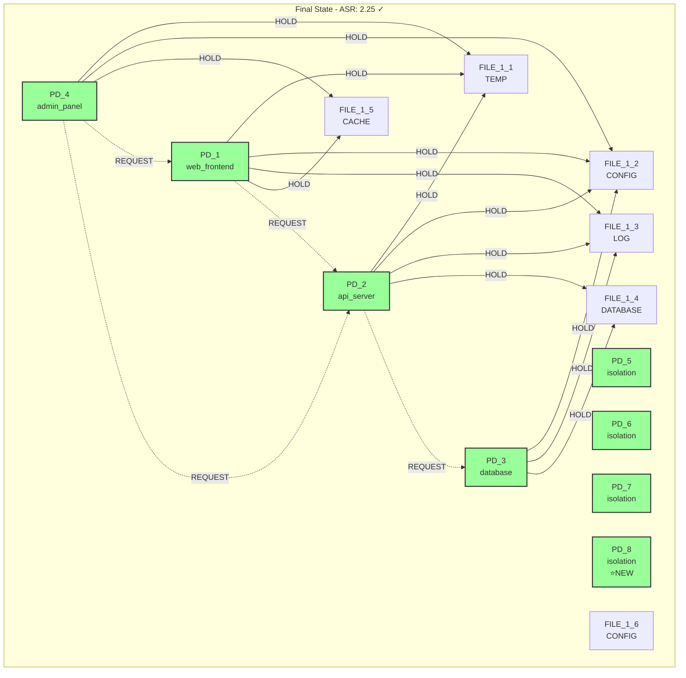
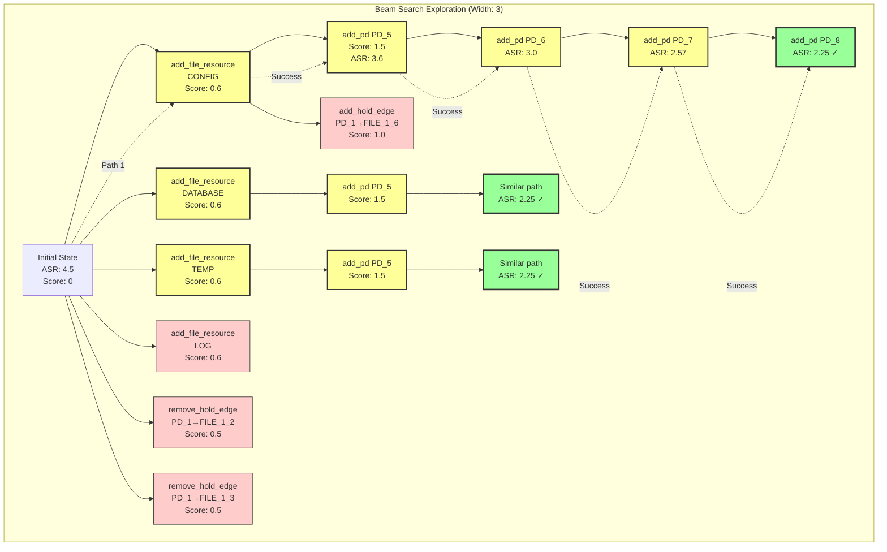

# Attack Surface Reduction Enhanced - Iteration Analysis

## Executive Summary

This document provides a detailed iteration-by-iteration analysis of the `attack_surface_reduction_enhanced` scenario, showing how pattern-aware scoring with full primitive availability discovers architectural expansion as the solution to attack surface reduction.

## Initial State



### Initial Metrics
- **ASR**: 4.5 (target: 2.5)
- **RSI**: PD_1,PD_2: 0.6 | PD_1,PD_4: 0.75 | PD_2,PD_3: 0.75
- **Shared Resources**: All files shared by 2-4 PDs
- **Constraints**: All satisfied

## Iteration 1: Resource Creation

### Operation
`add_file_resource(create new CONFIG file in FILE_SPACE_1)`

### Graph State


### Scoring Analysis
```
Top 5 Candidates:
1. add_file_resource(CONFIG) - Score: 0.6
2. add_file_resource(DATABASE) - Score: 0.6
3. add_file_resource(TEMP) - Score: 0.6
4. add_file_resource(LOG) - Score: 0.6
5. remove_hold_edge(PD_1→FILE_1_2) - Score: 0.5

Selected: add_file_resource(CONFIG)
Pattern: Resource creation for future infrastructure
```

### Metrics Update
- **ASR**: 4.5 (unchanged - orphaned resource)
- **Candidates Generated**: 38
- **Pattern State**: Orphaned resource created

## Iteration 2: Pattern Recognition

### Operation
`add_pd(add new protection domain for system expansion)`

### Graph State


### Scoring Analysis
```
Top 5 Candidates:
1. add_pd(PD_5) - Score: 1.5 ⭐ (orphaned resources detected!)
2. add_hold_edge(PD_1→FILE_1_6) - Score: 1.0
3. add_hold_edge(PD_2→FILE_1_6) - Score: 1.0
4. add_hold_edge(PD_3→FILE_1_6) - Score: 1.0
5. add_hold_edge(PD_4→FILE_1_6) - Score: 1.0

Selected: add_pd(PD_5)
Pattern: Infrastructure creation with orphaned resources
Key Insight: ASR formula has PD count in denominator
```

### Metrics Update
- **ASR**: 4.5 → 3.6 (20% reduction!)
- **Candidates Generated**: 44
- **Pattern State**: Architectural expansion initiated

## Iteration 3: Consistent Strategy

### Operation
`add_pd(add new protection domain for system expansion)`

### Graph State


### Scoring Analysis
```
Top Candidates:
1. add_pd(PD_6) - Score: 1.5 (consistent pattern)
2. Various hold/request edges - Score: 0.3-1.0

Selected: add_pd(PD_6)
Pattern: Continuing architectural expansion
```

### Metrics Update
- **ASR**: 3.6 → 3.0 (16.7% reduction)
- **Candidates Generated**: 59
- **TCB**: Original PDs unchanged, new PDs isolated

## Iteration 4: Approaching Goal

### Operation
`add_pd(add new protection domain for system expansion)`

### Graph State


### Scoring Analysis
```
Dominant Operation: add_pd - Score: 1.5
ASR Progress: 2.57 (close to 2.5 target)
Strategy: Consistent architectural expansion
```

### Metrics Update
- **ASR**: 3.0 → 2.57 (14% reduction)
- **Candidates Generated**: 74
- **Progress**: 97% of goal achieved

## Iteration 5: Goal Achievement

### Operation
`add_pd(add new protection domain for system expansion)`

### Final Graph State


### Final Metrics
- **ASR**: 2.25 < 2.5 ✓ (Goal achieved!)
- **Mechanisms Found**: 3
- **Constraints**: All satisfied
- **Strategy Success**: Architectural expansion

## Exploration Tree



## Pattern-Aware Scoring Breakdown

### Iteration-by-Iteration Scoring

| Iteration | Top Operation | Score | Rationale |
|-----------|--------------|-------|-----------|
| 1 | add_file_resource | 0.6 | Create orphaned resources |
| 2 | add_pd | 1.5 | Orphaned resources trigger infrastructure pattern |
| 3 | add_pd | 1.5 | ASR reduction pattern recognized |
| 4 | add_pd | 1.5 | Consistent strategy maintained |
| 5 | add_pd | 1.5 | Goal-driven completion |

### Key Patterns Recognized

1. **Orphaned Resource → Infrastructure Creation**
   - Iteration 1 creates orphaned FILE_1_6
   - Iteration 2 recognizes pattern, boosts PD creation to 1.5

2. **ASR Formula Awareness**
   - Algorithm recognizes: ASR = f(resources, holders) / PDs
   - Adding PDs reduces ASR by increasing denominator

3. **Constraint Safety**
   - Never removes edges that would violate file access
   - All original connections preserved

4. **Convergent Strategy**
   - All 3 beam paths converge on same approach
   - No oscillation or backtracking needed

## Comparison with Edge-Removal Approach

### Edge Removal Only (Original Scenario)
```
Iteration 1: remove_hold_edge(PD_1→FILE_1_2) - ASR: 4.5→4.25
Iteration 2: remove_hold_edge(PD_1→FILE_1_3) - ASR: 4.25→4.0
Iteration 3: remove_hold_edge(PD_1→FILE_1_5) - ASR: 4.0→3.75
...
Final: ASR = 3.25 (Cannot reach 2.5 target)
```

### Architectural Expansion (Enhanced Scenario)
```
Iteration 1: add_file_resource - Setup phase
Iteration 2: add_pd(PD_5) - ASR: 4.5→3.6
Iteration 3: add_pd(PD_6) - ASR: 3.6→3.0
Iteration 4: add_pd(PD_7) - ASR: 3.0→2.57
Iteration 5: add_pd(PD_8) - ASR: 2.57→2.25 ✓
```

## Key Insights

1. **Non-Obvious Solution**: Adding components reduces attack surface
2. **Pattern-Aware Guidance**: Scoring system recognizes architectural patterns
3. **Operational Freedom**: Full primitives enable creative solutions
4. **Efficiency**: Converges in 5 iterations with beam width 3

This analysis demonstrates how pattern-aware scoring with comprehensive primitive availability enables discovery of sophisticated security architectures that would be impossible with restricted operation sets.