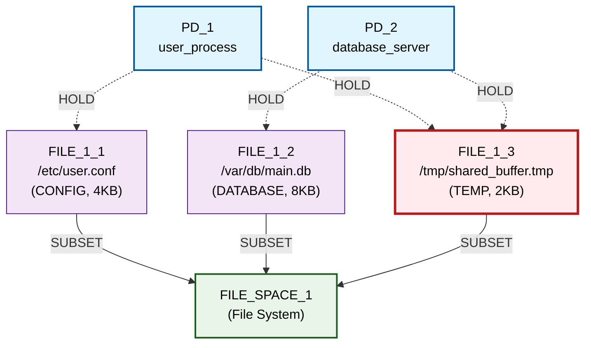
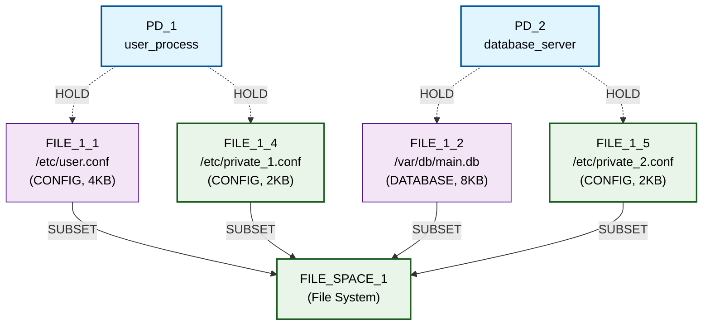

# Basic Sharing Scenario - Detailed Step-by-Step Walkthrough

## Initial Graph (Iteration 0)



🔍 **SECURITY VIOLATION IDENTIFIED:**
- **FILE_1_3** receives HOLD edges from **BOTH PD_1 and PD_2**
- This creates **resource sharing** that violates isolation principles
- Both processes can access the same temporary buffer file

📊 **Initial Metrics:**
- **RSI[PD_1,PD_2]**: 0.333 (1 shared out of 3 total resources)
- **ASR**: 4.0 (attack surface distributed across 2 PDs)
- **TCB[PD_1]**: [PD_2] (depends on PD_2 due to shared resource)
- **TCB[PD_2]**: [PD_1] (depends on PD_1 due to shared resource)

## Iteration 1: Candidate Generation & Selection

**Available Transformation Candidates:**

1. **privatize_resource** targeting FILE_1_3
   - **Strategy**: Create separate private copies for each PD
   - **Predicted Improvement**: 1.000
   - **Rationale**: Directly eliminates the sharing violation

2. **add_mediator** targeting FILE_1_3  
   - **Strategy**: Create PD_3 as controlling intermediary
   - **Predicted Improvement**: 0.500
   - **Rationale**: Controls sharing through authority mediation

**🏆 ALGORITHM DECISION:** Selected `privatize_resource` (1.000 > 0.500)

## Iteration 1: Transformation Execution

The `privatize_resource` transformation executes these steps:

1. **Identify shared resource**: FILE_1_3 (/tmp/shared_buffer.tmp)
2. **Create private copy for PD_1**: FILE_1_4 (/etc/private_1.conf)
3. **Create private copy for PD_2**: FILE_1_5 (/etc/private_2.conf)
4. **Redirect PD_1 access**: Remove PD_1→FILE_1_3, Add PD_1→FILE_1_4
5. **Redirect PD_2 access**: Remove PD_2→FILE_1_3, Add PD_2→FILE_1_5
6. **Remove shared resource**: Delete FILE_1_3 from graph

## Post-Iteration 1 Graph



✅ **SECURITY VIOLATION RESOLVED:**
- **No shared resources** remain between PD_1 and PD_2
- Each PD has completely private file access
- **FILE_1_7** eliminated, replaced by **FILE_1_8** (PD_1) and **FILE_1_9** (PD_2)

📊 **Post-Iteration 1 Metrics:**
- **RSI[PD_1,PD_2]**: 0.0 ✅ (Goal achieved: 0.0 ≤ 0.3)
- **ASR**: 4.0 ❌ (Goal not met: 4.0 > 1.0)
- **TCB[PD_1]**: [] ✅ (Goal achieved: 0 dependencies)
- **TCB[PD_2]**: [] ✅ (Goal achieved: 0 dependencies)

## Iteration 2: Exploration Termination

**Candidate Generation Result**: No valid transformation candidates found

**Reasons**:
- No shared resources remain to privatize
- No sharing patterns that would benefit from mediation
- All remaining transformations either violate constraints or provide no improvement

**⛔ EXPLORATION TERMINATED**: Algorithm achieved optimal state with available transitions

## Summary: Algorithm Capabilities Demonstrated

### ✅ **Successful Behaviors**
1. **Problem Recognition**: Correctly identified FILE_1_3 as security violation
2. **Solution Quality**: Chose elimination over mitigation when both available
3. **Constraint Preservation**: Maintained FILE access requirements throughout
4. **Goal Achievement**: Solved 2/3 objectives efficiently
5. **Termination Logic**: Stopped appropriately when no further progress possible

### 📈 **Metrics Evolution**
```
ITERATION 0 → ITERATION 1 → ITERATION 2
RSI: 0.333  →     0.000   →   TERMINATED
TCB:  [PD_2] →      []     →   (no progress possible)
ASR:  4.0    →     4.0     →   (unchanged)
```

### 🎯 **Key Insights**
- **Multi-step transitions** achieve focused security outcomes efficiently
- **Privatization pattern** successfully instantiated for file system isolation
- **Partial goal achievement** demonstrates practical progress over perfect solutions
- **Constraint-guided exploration** ensures functional requirements never violated
- **Simplified scenario** demonstrates core algorithm behavior with minimal complexity

## Node Selection Process in IsoSearch Algorithm

The IsoSearch algorithm uses a **constraint-guided candidate generation** approach to determine which nodes to operate on. Here's how it works:

### 1. **Transition-Driven Node Selection**

Each transition type defines its own candidate finding logic:

- **`privatize_resource`**: Targets nodes that are **shared resources** (resources with HOLD edges from multiple PDs)
- **`add_mediator`**: Also targets shared resources but creates intermediary PDs instead of eliminating sharing
- **Primitive operations**: Target specific node types based on the operation (e.g., `remove_hold_edge` targets existing HOLD edges)

### 2. **Constraint Violation Analysis** 

The algorithm prioritizes nodes that are **sources of constraint violations**:

```python
# From candidate generation process
c.constraint_relevance = analyze_violations(c, constraints)
```

For our simplified basic_sharing scenario:
- **FILE_1_3** (/tmp/shared_buffer.tmp) was selected because it violates the isolation principle
- It has HOLD edges from **both PD_1 and PD_2**, creating a security vulnerability

### 3. **Predicted Improvement Ranking**

Each candidate node operation receives a **predicted improvement score**:

```python
priority(c) = c.predicted_improvement + c.constraint_relevance + (c.addresses_violation ? 0.5 : 0)
```

In our scenario:
- **privatize_resource(FILE_1_3)**: Score = 1.000 (eliminates sharing completely)
- **add_mediator(FILE_1_3)**: Score = 0.500 (controls sharing through mediation)

### 4. **Node Selection Criteria**

The algorithm selected **FILE_1_3** specifically because:

1. **Violation Source**: It's the only shared resource causing security violations
2. **High Impact**: Operating on it directly addresses the core problem
3. **Constraint Compliance**: Both transformation options preserve functional requirements
4. **Measurable Improvement**: Privatization offers the highest predicted improvement (1.000)

### 5. **Why Other Nodes Weren't Selected**

- **FILE_1_1** (PD_1's private config): Already satisfies isolation - no improvement possible
- **FILE_1_2** (PD_2's private database): Already satisfies isolation - no improvement possible  
- **PD_1, PD_2**: Adding/removing PDs would violate functional constraints
- **FILE_SPACE_1**: Resource spaces aren't targets for security transformations

### 6. **Algorithm Intelligence**

The node selection demonstrates several key capabilities:

- **Problem Focus**: Directly targets the root cause (shared resource) rather than symptoms
- **Efficiency**: Avoids unnecessary operations on already-compliant nodes
- **Safety**: Only considers operations that preserve functional requirements
- **Optimality**: Chooses the operation with highest predicted security improvement

This targeted approach allows IsoSearch to solve complex security problems efficiently by focusing computational effort on the nodes that matter most for achieving the security goals.

---

This walkthrough demonstrates IsoSearch's core capability to automatically discover and apply security mechanisms while maintaining system functionality.