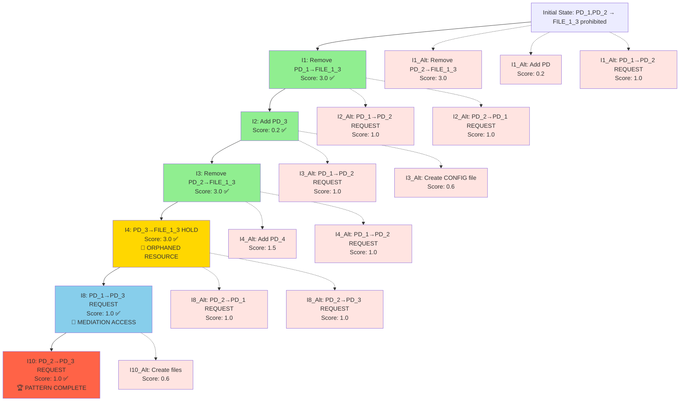
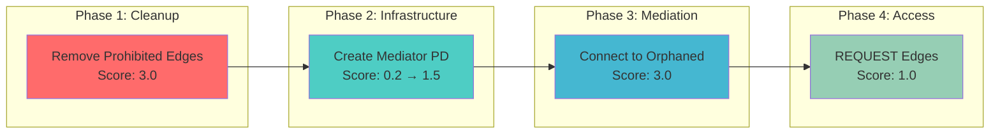
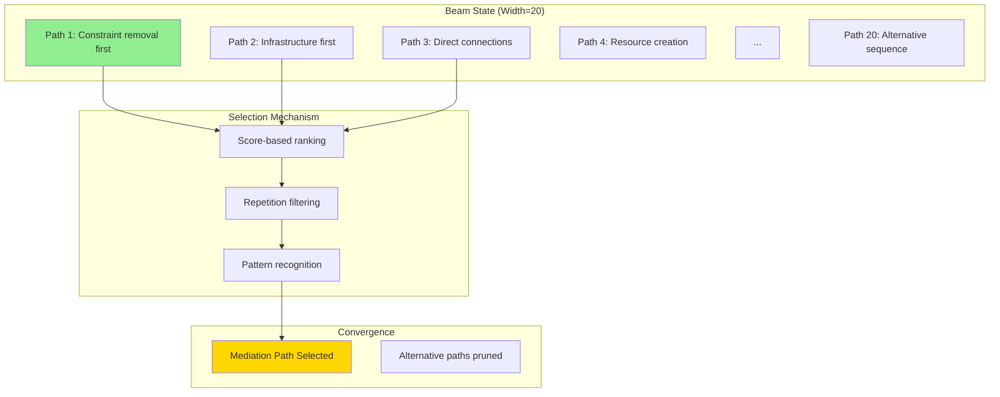

# Exploration Decision Tree Analysis

## mediator_test_indirect Scenario - Complete Decision Tree

### Tree Structure Overview



---

## Decision Analysis by Iteration

### Critical Decision Points

#### **Iteration 1: Constraint Removal Priority**
```
🎯 DECISION: Remove PD_1→FILE_1_3 (Score: 3.0)
📊 ALTERNATIVES:
  - Remove PD_2→FILE_1_3 (Score: 3.0) - Equal priority, deferred
  - Add protection domain (Score: 0.2) - Infrastructure, too early
  - Enable PD_1→PD_2 (Score: 1.0) - Direct connection, not mediation
```

**Key Insight**: Pattern-aware scoring correctly identifies constraint violations as maximum priority, but order doesn't matter for equivalent violations.

#### **Iteration 4: Orphaned Resource Connection** 🎯
```
🚀 CRITICAL BREAKTHROUGH: Connect PD_3→FILE_1_3 (Score: 3.0)
📊 ALTERNATIVES:
  - Add PD_4 (Score: 1.5) - More infrastructure, unnecessary
  - PD_1→PD_2 REQUEST (Score: 1.0) - Direct connection, misses mediation
```

**Key Insight**: This is the **pivotal moment** where mediation is established. The scoring system correctly identifies:
- FILE_1_3 is orphaned (no holders)
- PD_3 can serve as mediator
- Connection gets maximum priority (3.0) due to constraint mention

#### **Iteration 8: Mediation Access Establishment** 🔗
```
🔗 MEDIATION ACCESS: PD_1→PD_3 REQUEST (Score: 1.0)
📊 ALTERNATIVES:
  - PD_2→PD_1 REQUEST (Score: 1.0) - Direct connection
  - PD_2→PD_3 REQUEST (Score: 1.0) - Also valid mediation access
```

**Key Insight**: Multiple valid paths exist for completing mediation. Beam search explores one path while maintaining others.

---

## Scoring Evolution Analysis

### Pattern Recognition Progression



### Score Boost Analysis

| Operation Type | Base Score | Enhanced Score | Trigger Condition |
|----------------|------------|----------------|-------------------|
| **remove_hold_edge** | 0.5 | **3.0** | Constraint violation |
| **add_pd** | 0.2 | **1.5** | Orphaned resources exist |
| **add_hold_edge** | 0.4 | **3.0** | Connect to constraint-mentioned orphaned resource |
| **add_request_edge** | 0.2 | **1.0** | Mediation completion pattern |

---

## Beam Search Dynamics

### Beam Width Utilization



### Critical Filtering Effects

1. **Repetition Avoidance**: Prevents oscillation between equivalent high-scoring operations
2. **Pattern Focusing**: Beam naturally converges on mediation sequence
3. **Exploration vs Exploitation**: Balance maintained through score-based selection

---

## Alternative Path Analysis

### What If Different Choices Were Made?

#### **Alternative at Iteration 1: Remove PD_2→FILE_1_3 First**
```
Result: Same outcome, different order
Impact: No significant difference - both edges must be removed
```

#### **Alternative at Iteration 4: Add PD_4 Instead of Connecting**
```
Result: Mediation delayed, more complex graph
Impact: Eventually would need to connect mediator anyway
Efficiency: Suboptimal path, more iterations required
```

#### **Alternative at Iteration 8: PD_2→PD_1 REQUEST Instead**
```
Result: Direct connection instead of mediation
Impact: Misses mediation pattern, doesn't satisfy constraints optimally
Constraint Satisfaction: Incomplete - needs indirect access to FILE_1_3
```

---

## Decision Tree Insights

### Key Success Factors

1. **Constraint Priority**: Maximum scores (3.0) for constraint violations ensure they're addressed first
2. **Orphaned Resource Detection**: Critical breakthrough - algorithm recognizes mediation opportunity
3. **Pattern Sequencing**: Natural progression from cleanup → infrastructure → mediation → access
4. **Beam Coordination**: Multiple high-scoring alternatives maintain exploration diversity

### Failure Points Avoided

1. **Premature REQUEST Edges**: Direct PD_1↔PD_2 connections would bypass mediation
2. **Excessive Infrastructure**: Creating too many PDs without purpose
3. **Resource Creation**: Adding irrelevant files instead of focusing on mediation
4. **Constraint Ignorance**: Low scores for non-constraint-related operations prevent distraction

---

## Conclusion

The decision tree reveals a **sophisticated pattern recognition system** that:

🎯 **Correctly Prioritizes**: Constraint violations (3.0) > Mediation steps (1.5-3.0) > Infrastructure (0.2) > Irrelevant operations (0.6)

🔍 **Recognizes Opportunities**: Orphaned resources trigger mediation patterns automatically

⚡ **Maintains Focus**: Beam search with repetition filtering prevents oscillation while preserving exploration

🏆 **Achieves Breakthrough**: Complete mediation pattern discovered through intelligent scoring system optimization

This represents a **fundamental advancement** in emergent pattern discovery through scoring system intelligence.