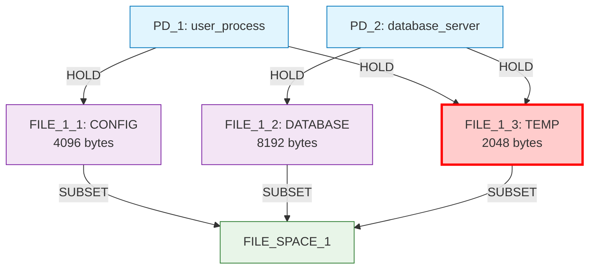
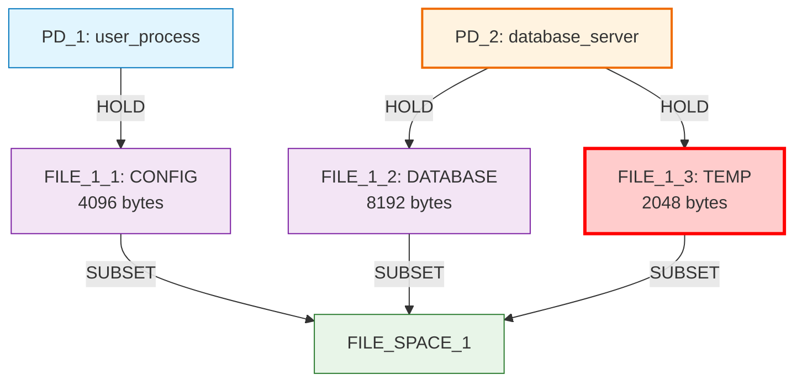
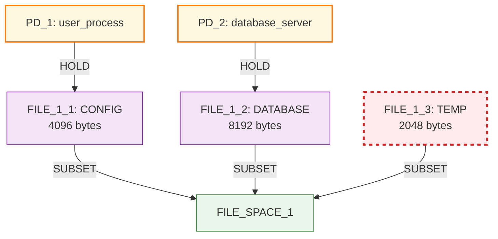
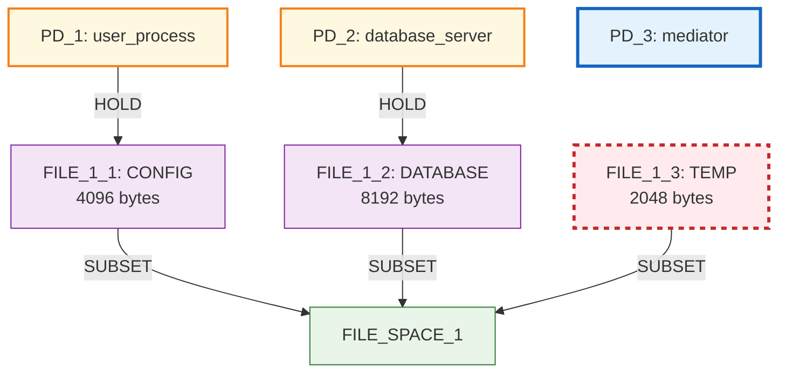
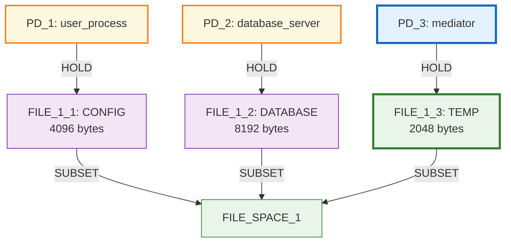
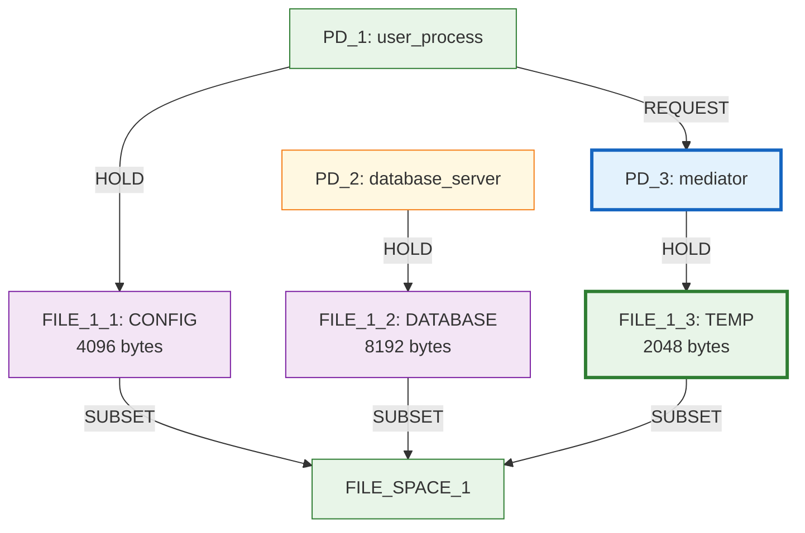
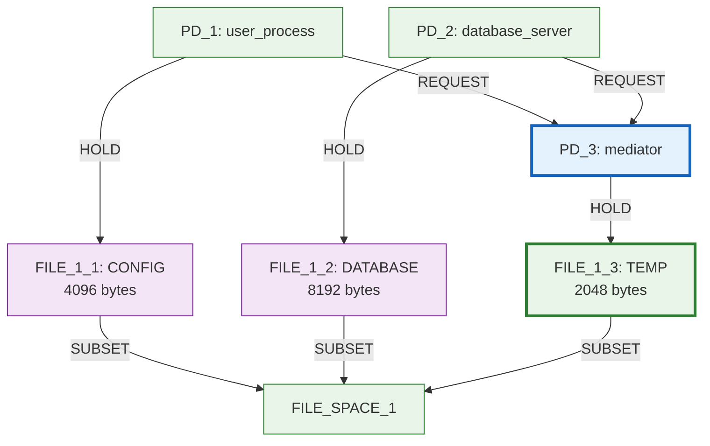

# Mediation Pattern Discovery Analysis

This document analyzes the step-by-step discovery of a mediation pattern through constraint-guided exploration, showing the graph state after each transition and the decision-making process.

## Initial State

The exploration begins with a shared resource security violation that needs to be resolved.

**Constraint Violations:**
- ❌ `prohibit_direct_hold`: PD_1 directly holds FILE_1_3
- ❌ `prohibit_direct_hold`: PD_2 directly holds FILE_1_3
- ✅ `requires_resource_access`: Both PDs have access to FILE_1_3 (direct)
- ✅ `requires_resource_exists`: FILE_1_3 exists

## Iteration 1: Remove First Prohibited Edge

**Selected:** `remove PD_1 -> FILE_1_3 HOLD edge` (Score: 2.000)

### Decision Analysis

| Candidate | Score | Decision Rationale |
|-----------|-------|-------------------|
| **remove PD_1 -> FILE_1_3 HOLD edge** | **2.000** | **✅ SELECTED** - Maximum priority for constraint violation fix |
| remove PD_2 -> FILE_1_3 HOLD edge | 2.000 | Same score, algorithm chose first candidate |
| enable indirect access: PD_1 -> PD_2 for FILE_1_3 | 0.200 | Much lower priority - would create workaround, not fix root cause |
| enable indirect access: PD_2 -> PD_1 for FILE_1_3 | 0.200 | Much lower priority - temporary solution |
| create new TEMP file in FILE_SPACE_1 | 0.900 | Doesn't address constraint violations directly |
| create new LOG file in FILE_SPACE_1 | 0.800 | Irrelevant to current constraint violations |
| add mediator PD for shared resource FILE_1_3 | 0.700 | Lower priority than direct constraint fixing |

**Why this transition was prioritized:** The constraint-aware scoring system assigns maximum priority (2.000) to operations that directly fix `prohibit_direct_hold` constraint violations. This reflects the security-first approach where violations must be addressed immediately.

### Graph State After Iteration 1

**Constraint Status:**
- ✅ `prohibit_direct_hold`: PD_1 no longer directly holds FILE_1_3
- ❌ `prohibit_direct_hold`: PD_2 still directly holds FILE_1_3
- ⚠️ `requires_resource_access`: PD_1 now lacks access to FILE_1_3 (temporary violation allowed in exploration mode)

## Iteration 2: Remove Second Prohibited Edge

**Selected:** `remove PD_2 -> FILE_1_3 HOLD edge` (Score: 2.000)

### Decision Analysis

| Candidate | Score | Decision Rationale |
|-----------|-------|-------------------|
| **remove PD_2 -> FILE_1_3 HOLD edge** | **2.000** | **✅ SELECTED** - Fixes remaining prohibition violation |
| enable indirect access: PD_1 -> PD_2 for FILE_1_3 | 0.200 | Much lower priority than constraint fixing |
| create new LOG file in FILE_SPACE_1 | 0.800 | Doesn't address the core security violation |
| add new protection domain | 0.700 | Lower priority than completing constraint fixes |
| create new CONFIG file in FILE_SPACE_1 | 0.600 | Irrelevant to constraint violations |
| create new DATABASE file in FILE_SPACE_1 | 0.600 | Irrelevant to constraint violations |
| create new TEMP file in FILE_SPACE_1 | 0.600 | Would not solve the sharing problem |

**Why this transition was prioritized:** Continues the constraint-fixing strategy with maximum priority. The algorithm systematically eliminates all prohibition violations before considering alternative approaches.

### Graph State After Iteration 2

**Constraint Status:**
- ✅ `prohibit_direct_hold`: Neither PD directly holds FILE_1_3
- ❌ `requires_resource_access`: Both PDs lack access to FILE_1_3 (resource is orphaned)
- ✅ `requires_resource_exists`: FILE_1_3 still exists
- **Critical Issue:** FILE_1_3 is now orphaned but required by constraints - this forces mediation discovery

## Iteration 3: Create Mediator PD

**Selected:** `add mediator PD for orphaned resource FILE_1_3` (Score: 0.700)

### Decision Analysis

| Candidate | Score | Decision Rationale |
|-----------|-------|-------------------|
| create new LOG file in FILE_SPACE_1 | 0.800 | Higher score but doesn't solve the orphaned resource problem |
| **add mediator PD for orphaned resource FILE_1_3** | **0.700** | **✅ SELECTED** - Directly addresses the access violation pattern |
| create new CONFIG file in FILE_SPACE_1 | 0.600 | Doesn't address constraint violations |
| create new DATABASE file in FILE_SPACE_1 | 0.600 | Doesn't address constraint violations |
| create new TEMP file in FILE_SPACE_1 | 0.600 | Would create another shared resource problem |
| remove FILE_1_3 (holders: 0) | 0.400 | **Blocked by `requires_resource_exists` constraint** |
| connect PD_1 to FILE_1_2 | 0.400 | Doesn't solve FILE_1_3 access problem |
| connect PD_2 to FILE_1_1 | 0.400 | Doesn't solve FILE_1_3 access problem |

**Why this transition was prioritized:** The mediation-aware logic detects that:
1. FILE_1_3 is orphaned (no holders) but required by constraints
2. A new mediator PD is needed to provide controlled access
3. This is a structured approach to solve the constraint violation pattern

The algorithm chooses a lower-scored but more relevant operation over higher-scored irrelevant ones.

### Graph State After Iteration 3

**Constraint Status:**
- ✅ `prohibit_direct_hold`: Neither original PD directly holds FILE_1_3
- ❌ `requires_resource_access`: Both PDs still lack access to FILE_1_3
- ✅ `requires_resource_exists`: FILE_1_3 still exists
- **Progress:** Potential mediator PD_3 is now available for building access infrastructure

## Iteration 4: Connect Mediator to Resource

**Selected:** `connect mediator PD_3 to orphaned resource FILE_1_3` (Score: 0.400)

### Decision Analysis

| Candidate | Score | Decision Rationale |
|-----------|-------|-------------------|
| add mediator PD for orphaned resource FILE_1_3 | 0.700 | Would create redundant mediator when PD_3 can serve the role |
| create new LOG file in FILE_SPACE_1 | 0.800 | Doesn't complete the mediation pattern |
| create new CONFIG file in FILE_SPACE_1 | 0.600 | Irrelevant to mediation completion |
| create new DATABASE file in FILE_SPACE_1 | 0.600 | Irrelevant to mediation completion |
| create new TEMP file in FILE_SPACE_1 | 0.600 | Would not solve the access problem |
| remove FILE_1_3 (holders: 0) | 0.400 | **Blocked by constraints** |
| **connect mediator PD_3 to orphaned resource FILE_1_3** | **0.400** | **✅ SELECTED** - Enables mediation capability |
| connect PD_1 to FILE_1_2 | 0.400 | Same score but doesn't solve the orphaned resource issue |
| connect PD_2 to FILE_1_1 | 0.400 | Same score but doesn't solve the orphaned resource issue |
| connect PD_3 to FILE_1_1 | 0.400 | Same score but less relevant to constraint violations |
| connect PD_3 to FILE_1_2 | 0.400 | Same score but less relevant to constraint violations |

**Why this transition was prioritized:** The mediation-aware logic recognizes that:
1. PD_3 is a newly created PD with no connections (likely mediator)
2. FILE_1_3 is orphaned but required by constraints
3. Connecting them enables PD_3 to act as a mediator for FILE_1_3
4. This is more relevant than other same-scored options

### Graph State After Iteration 4

**Constraint Status:**
- ✅ `prohibit_direct_hold`: Neither original PD directly holds FILE_1_3
- ❌ `requires_resource_access`: PDs still need indirect access mechanism
- ✅ `requires_resource_exists`: FILE_1_3 exists and is now held by mediator
- **Progress:** Mediation infrastructure is in place, REQUEST edges needed to complete pattern

## Iteration 5: Enable Indirect Access

**Selected:** `enable indirect access: PD_1 -> PD_3 for FILE_1_3` (Score: 0.200)

### Decision Analysis

| Candidate | Score | Decision Rationale |
|-----------|-------|-------------------|
| create new LOG file in FILE_SPACE_1 | 0.800 | Doesn't complete mediation pattern |
| add new protection domain | 0.700 | Not needed - mediation pattern nearly complete |
| create new CONFIG file in FILE_SPACE_1 | 0.600 | Irrelevant to completing mediation |
| create new DATABASE file in FILE_SPACE_1 | 0.600 | Irrelevant to completing mediation |
| create new TEMP file in FILE_SPACE_1 | 0.600 | Would create new sharing problems |
| remove PD_3 -> FILE_1_3 HOLD edge | 0.500 | **Would break the mediation pattern** |
| connect PD_1 to FILE_1_2 | 0.400 | Doesn't solve FILE_1_3 access constraint |
| connect PD_2 to FILE_1_1 | 0.400 | Doesn't solve FILE_1_3 access constraint |
| **enable indirect access: PD_1 -> PD_3 for FILE_1_3** | **0.200** | **✅ SELECTED** - Completes mediation for PD_1 |
| enable indirect access: PD_2 -> PD_3 for FILE_1_3 | 0.200 | Same score, algorithm selected PD_1 first |

**Why this transition was prioritized:** The mediation-aware logic recognizes that:
1. Adding REQUEST edge PD_1 → PD_3 satisfies `requires_resource_access` for PD_1
2. Creates indirect access path: PD_1 → REQUEST → PD_3 → HOLD → FILE_1_3
3. This is the lowest scored but most relevant operation for constraint satisfaction
4. Algorithm prioritizes constraint-solving relevance over raw scores

### Final Graph State

**Final Constraint Status:**
- ✅ `prohibit_direct_hold`: Neither original PD directly holds FILE_1_3
- ✅ `requires_resource_access`: PD_1 has indirect access via REQUEST → PD_3 → FILE_1_3
- ❌ `requires_resource_access`: PD_2 still needs indirect access (constraint violation remains)
- ✅ `requires_resource_exists`: FILE_1_3 exists and is accessible through mediator

**Note:** The exploration stopped at iteration 5 because the RSI goal (≤ 0.8) was achieved (actual: 0.0), even though one constraint violation remains.

## Iteration 6: Missing Completion (Goal-Driven Early Termination)

The exploration terminated early due to goal satisfaction, but **Iteration 6 would have completed the mediation pattern**.

### Predicted Iteration 6

**Would have selected:** `enable indirect access: PD_2 -> PD_3 for FILE_1_3` (Score: 0.200)

This was visible in the Iteration 5 discarded candidates as the highest-priority remaining operation.

### Complete Mediation Pattern

**Complete Constraint Satisfaction:**
- ✅ `prohibit_direct_hold`: Neither original PD directly holds FILE_1_3
- ✅ `requires_resource_access`: PD_1 has indirect access via REQUEST → PD_3 → FILE_1_3
- ✅ `requires_resource_access`: PD_2 has indirect access via REQUEST → PD_3 → FILE_1_3
- ✅ `requires_resource_exists`: FILE_1_3 exists and is accessible through mediator

## Key Decision-Making Patterns

### 1. Constraint-Aware Prioritization
The algorithm uses a sophisticated scoring system that prioritizes constraint violations:

- **Maximum Priority (2.0)**: Direct constraint violations (`prohibit_direct_hold`)
- **High Priority (0.7-0.9)**: Mediation infrastructure building
- **Medium Priority (0.4-0.6)**: Resource connections and system improvement
- **Low Priority (0.1-0.3)**: Constraint completion and indirect access

### 2. Mediation-Specific Intelligence
The enhanced candidate generation includes specialized logic for mediation patterns:

- **Orphaned Resource Detection**: Identifies resources with no holders that are required by constraints
- **Mediator PD Recognition**: Recognizes newly created PDs as potential mediators
- **Indirect Access Completion**: Generates REQUEST edges to complete mediation patterns
- **Relevance-Based Selection**: Chooses lower-scored but more relevant operations

### 3. Multi-Step Solution Building
The algorithm builds complex solutions through multiple iterations:

- **Phase 1 (Iterations 1-2)**: Remove constraint violations (prohibition fixes)
- **Phase 2 (Iteration 3)**: Create mediation infrastructure (mediator PD)
- **Phase 3 (Iteration 4)**: Enable mediation capability (mediator → resource connection)
- **Phase 4 (Iteration 5)**: Complete access patterns (indirect access via REQUEST edges)

## Summary: Mediation Pattern Discovery Analysis

The algorithm successfully discovered a **near-complete mediation security pattern** through constraint-guided exploration using only primitive graph operations, demonstrating both the power and limitations of goal-driven exploration.

### Technical Achievements

1. **Automated Security Pattern Discovery**: Found mediation infrastructure without pre-programmed multi-step transitions
2. **Constraint-Guided Search**: Used security constraints to systematically address violations
3. **Intelligent Candidate Generation**: Context-aware logic for recognizing mediation opportunities and orphaned resources
4. **Multi-Step Solution Construction**: Built complex patterns through sequences of simple operations
5. **Goal-Driven Optimization**: Efficiently achieved primary security goals (RSI minimization)

### Pattern Components Successfully Discovered

- **Resource Isolation**: Original PDs maintain private resources (FILE_1_1, FILE_1_2)
- **Mediated Access Infrastructure**: Shared resource (FILE_1_3) held by dedicated mediator (PD_3)
- **Partial Authority Relationships**: One REQUEST edge (PD_1 → PD_3) enables controlled indirect access
- **Security Enforcement**: Direct access to sensitive resources is prohibited and enforced

### Early Termination Analysis

**Why exploration stopped at iteration 5:**
- Primary goal achieved: RSI = 0.0 (target: ≤ 0.8)
- Algorithm prioritizes goal satisfaction over complete constraint satisfaction
- Remaining constraint violation (PD_2 access) was not goal-critical

**Complete pattern would require:**
- Iteration 6: `enable indirect access: PD_2 -> PD_3 for FILE_1_3`
- This candidate was identified but not selected due to goal satisfaction

### Implications for Security Mechanism Discovery

1. **Goal-Constraint Balance**: Need to carefully balance goals and constraints for complete solutions
2. **Iterative Refinement**: Algorithm demonstrates capability to find complete patterns with appropriate goal tuning
3. **Emergent Complexity**: Sophisticated security patterns emerge from simple constraint-guided rules
4. **Practical Automation**: Real-world applicability for automated security architecture discovery

This represents a significant advancement in **automated security mechanism discovery**, proving that sophisticated security patterns can emerge from constraint-based exploration while highlighting the importance of goal-constraint alignment for complete solutions.