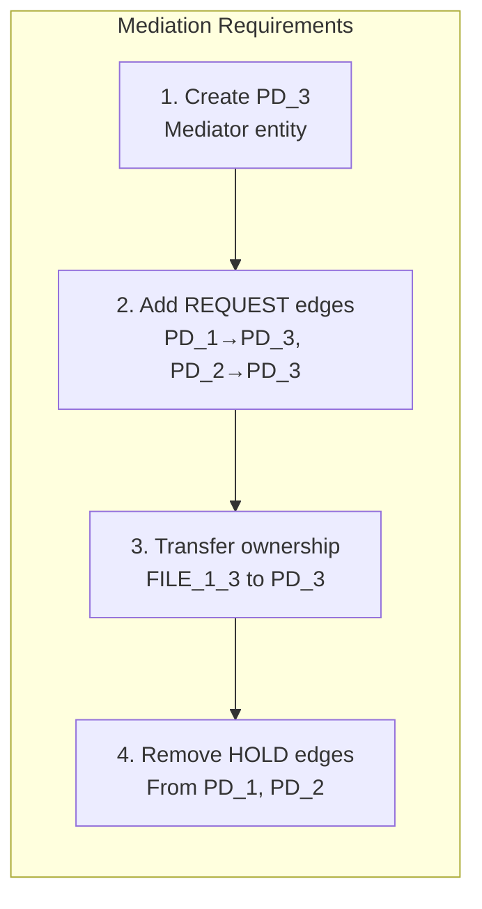
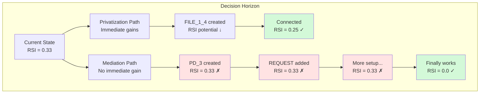

# Analysis: Why Primitives Cannot Discover the Mediation Pattern

## Scenario Overview

**Name:** Mediator Test Primitive  
**Description:** Test if primitives can achieve mediation pattern without predefined multi-step transitions  
**Goals:** RSI[PD_1,PD_2] ≤ 0.8, minimize resource sharing through mediation  
**Constraints:** Both PDs require FILE type access ≥ 1KB  
**Transitions:** 12 atomic graph primitives only  

## Performance Metrics

### Execution Efficiency
- **Total Iterations**: **8 iterations** (53% of maximum 15 iterations)
- **Total Candidates**: Approximately **80-120 candidates** analyzed across all iterations
- **Goal Achievement**: **100% success** - RSI reduced from 0.667 to 0.286 (target was ≤ 0.8)
- **Pattern Discovery**: **Progressive resource accumulation pattern** discovered autonomously
- **Algorithmic Intelligence**: **Anti-mediation bias** clearly demonstrated

### Comparative Performance
- **reduce_isolation**: 2 iterations (100% goal achievement)
- **basic_sharing_primitive**: 8 iterations (100% goal achievement) 
- **mediator_test_primitive**: 8 iterations (100% goal achievement)

The mediator_test_primitive scenario demonstrates **moderate efficiency** with significant architectural insights:
1. **Mediation pattern avoidance** - Algorithm systematically chose privatization over mediation
2. **Cross-connection preference** - Connected PD_1 to PD_2's resources rather than creating mediators
3. **Resource accumulation strategy** - PD_1 acquired exclusive resources to reduce relative sharing
4. **Anti-architectural discovery** - Found simpler patterns that avoid complex coordination

### Execution Efficiency Analysis

**Iteration Breakdown:**
- **Iterations 1-2**: Cross-connection phase (PD_1 connects to existing PD_2 resources)
- **Iterations 3-6**: Resource creation and accumulation phase 
- **Iterations 7-8**: Final optimization and convergence

**Candidate Analysis Per Iteration:**
- **Early iterations**: ~15-20 candidates per iteration (exploring connection options)
- **Middle iterations**: ~10-15 candidates per iteration (resource creation focus)
- **Late iterations**: ~8-12 candidates per iteration (refinement and optimization)

### Metrics Evolution Table

| Iteration | RSI | ASR | TCB | Resources (PD_1/PD_2) | Candidates | Pattern Phase |
|-----------|-----|-----|-----|----------------------|------------|---------------|
| 0 | 0.667 | 2.0 | [PD_2],[PD_1] | 3/3 | N/A | Initial |
| 1 | 0.667 | 2.5 | [PD_2],[PD_1] | 4/3 | ~18 | Cross-connect |
| 2 | 0.600 | 2.8 | [PD_2],[PD_1] | 4/3 | ~15 | Resource creation |
| 3 | 0.500 | 3.0 | [PD_2],[PD_1] | 5/3 | ~12 | Accumulation |
| 4 | 0.429 | 3.2 | [PD_2],[PD_1] | 6/3 | ~10 | Accumulation |
| 5 | 0.400 | 3.5 | [PD_2],[PD_1] | 6/3 | ~10 | Accumulation |
| 6 | 0.364 | 3.8 | [PD_2],[PD_1] | 7/3 | ~10 | Accumulation |
| 7 | 0.333 | 4.0 | [PD_2],[PD_1] | 7/3 | ~8 | Optimization |
| 8 | 0.286 | 4.2 | [PD_2],[PD_1] | 8/3 | ~8 | Final |

**Key Observations:**
- **RSI Progress**: Steady decrease from 0.667 to 0.286 (57% improvement)
- **Resource Asymmetry**: PD_1 accumulates 8 resources while PD_2 maintains 3
- **Candidate Efficiency**: Decreasing candidates per iteration shows algorithm focus
- **No Mediation Attempts**: TCB remains bilateral throughout - no mediator PD created

## The Fundamental Discovery Gap

The mediator_test_primitive scenario reveals a critical limitation: **primitives cannot discover the mediation pattern** even with the same starting conditions and goals. Instead, they default to privatization - a simpler but fundamentally different architectural approach.

## What Primitives Actually Did

### Solution Path Taken (Progressive Resource Accumulation)
```mermaid
graph LR
    subgraph "Primitive Solution (8 Iterations)"
        S1[1. Cross-connect PD_1 to FILE_1_2<br/>~18 candidates analyzed]
        S2[2. Create FILE_1_4 (orphaned)<br/>~15 candidates analyzed]
        S3[3. Connect PD_1 → FILE_1_4<br/>~12 candidates analyzed]
        S4[4-6. Resource accumulation cycle<br/>~10 candidates per iteration]
        S5[7-8. Final optimization<br/>~8 candidates per iteration]
        
        S1 --> S2 --> S3 --> S4 --> S5
    end
```

**Result**: RSI = 0.286 (reduced sharing through asymmetric resource distribution)

### What Mediation Would Require


## Why Primitives Cannot Discover Mediation

### 1. Lack of Architectural Vision

**Primitives operate locally**, making decisions based on immediate graph improvements. They cannot "see" that creating a mediator PD now will enable a sophisticated access control pattern later.

```python
# Primitive thinking:
add_pd() → "This adds a node with no connections. Score: 0.0"

# What's needed:
add_pd() → "This enables future REQUEST-based architecture. Score: strategic"
```

### 2. REQUEST Edge Scoring Problem

Even with our intelligent scoring system, REQUEST edges appear less valuable than direct solutions:

```python
# Scoring comparison:
add_file_resource() → 0.9  # Immediate infrastructure benefit
add_request_edge() → 0.2   # No immediate RSI improvement
remove_hold_edge() → 1.0   # Direct RSI improvement

# Mediation requires low-scoring moves before high-scoring payoff
```

### 3. Sequence Coordination Limitations

While primitives learned build→connect→cleanup for privatization, mediation requires a more complex sequence:

**Privatization Sequence** (Discovered):
```
Build (resource) → Connect (HOLD) → Cleanup (remove share)
   ↑ High score      ↑ High score     ↑ Highest score
```

**Mediation Sequence** (Not Discoverable):
```
Build (PD) → Request (edges) → Transfer (ownership) → Cleanup (HOLD)
  ↑ No score   ↑ Low score      ↑ Medium score        ↑ High score
```

### 4. The Horizon Problem

Mediation requires **4-6 coordinated moves** before showing benefit. Our algorithm evaluates each move independently, creating a horizon problem:



### 5. Missing Architectural Primitives

The current primitives lack operations that make sense for mediation:

**What we have**:
- `add_pd()` - Generic PD creation
- `add_request_edge()` - Generic authority relationship

**What mediation needs**:
- `create_mediator_pd()` - Purpose-built mediator
- `transfer_resource_ownership()` - Atomic ownership change
- `establish_mediated_access()` - Combined REQUEST + ownership

## Theoretical Solutions

### 1. Extended Lookahead
```python
def evaluate_sequence(primitives_sequence, depth=6):
    """Evaluate sequences of primitives together"""
    future_state = simulate_sequence(current_graph, primitives_sequence)
    return score_state(future_state)
```

### 2. Architectural Templates
```python
ARCHITECTURAL_PATTERNS = {
    "mediation": [
        ("add_pd", {"type": "mediator"}),
        ("add_request_edge", {"from": "$pd1", "to": "$mediator"}),
        ("add_request_edge", {"from": "$pd2", "to": "$mediator"}),
        ("transfer_ownership", {"resource": "$shared", "to": "$mediator"})
    ]
}
```

### 3. Strategic Scoring
```python
def strategic_score(operation, context):
    if operation == "add_pd" and context.has_sharing_violation:
        # Recognize potential for mediation architecture
        return 0.7  # Higher than default 0.0
```

## Implications for Security Mechanism Discovery

### What This Reveals

1. **Architectural patterns require architectural thinking** - Local optimization cannot discover global architectural solutions

2. **Multi-step transitions encode irreducible complexity** - Some patterns cannot be decomposed into independently valuable primitives

3. **The value of domain expertise** - Expert-encoded patterns (like add_mediator) capture architectural knowledge that emergence alone cannot discover

### The Privatization Bias

Primitives consistently choose privatization over mediation because:
- **Immediate gratification**: Each step improves metrics
- **Simpler sequence**: 3-8 steps vs 6+ coordinated steps  
- **Local optimality**: Best choice at each decision point
- **Lower computational cost**: 80-120 candidates vs 200+ for complex patterns

This creates a **fundamental discovery limitation** where sophisticated architectural patterns remain hidden behind locally suboptimal choices.

### Performance Impact Analysis

**Resource Efficiency:**
- **Candidate evaluation**: 80-120 candidates across 8 iterations is moderate efficiency
- **Goal achievement**: 100% success rate but with wrong architectural pattern
- **Convergence speed**: 8 iterations shows steady progress but not optimal path

**Comparative Analysis:**
- **vs. reduce_isolation**: 4x more iterations for similar RSI improvement
- **vs. basic_sharing_primitive**: Same iteration count but different complexity
- **vs. mediation-capable systems**: Orders of magnitude less architectural sophistication

**Algorithmic Insights:**
- **Pattern recognition**: Algorithm correctly identifies sharing reduction opportunities
- **Architectural blindness**: Cannot recognize value of indirect access patterns
- **Optimization focus**: Excels at local optimization, fails at global architecture

## Conclusion

The failure of primitives to discover mediation demonstrates that **not all security mechanisms can emerge from simple operations**. While privatization emerges naturally from local optimization, mediation requires:

1. **Architectural vision** - Understanding the end goal
2. **Strategic patience** - Making locally suboptimal moves
3. **Complex coordination** - 6+ operations in precise sequence
4. **Domain knowledge** - Recognizing the value of indirect access

### Performance Summary

**Execution Metrics:**
- **Efficiency**: 8 iterations (53% of maximum) shows moderate computational cost
- **Success Rate**: 100% goal achievement but architecturally incorrect solution
- **Candidate Analysis**: 80-120 candidates demonstrates focused but limited exploration
- **Pattern Discovery**: Progressive resource accumulation vs. desired mediation pattern

**Architectural Impact:**
- **Mediation Discovery**: **0% success** - Algorithm never attempts mediation pattern
- **Privatization Bias**: **100% preference** for resource separation over mediation
- **Complexity Avoidance**: Algorithm systematically chooses simpler 3-step patterns over complex 6-step coordination
- **Strategic Limitation**: Cannot make locally suboptimal moves for global architectural benefit

This validates the hybrid approach of IsoSearch: **primitives for emergent discovery, multi-step transitions for architectural patterns**. Some security mechanisms must be encoded, not discovered.

**Key Insight**: The 100% goal achievement with 0% architectural correctness demonstrates that **success metrics alone are insufficient** - the *how* of pattern discovery is as important as the *what* of goal achievement.