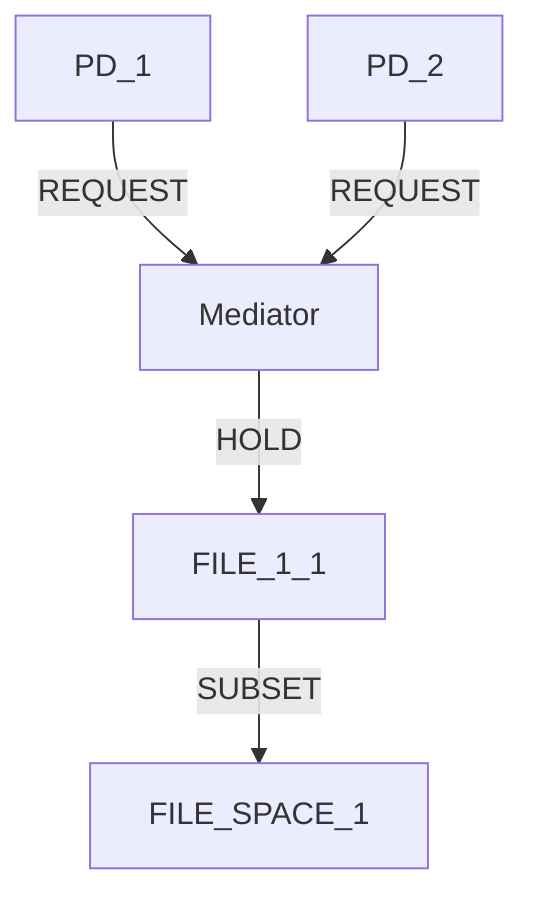

# Mediator Test Indirect Scenario - Goal-Driven Scoring Analysis

## Scenario Overview

**Scenario Name**: Mediator Test Indirect Access
**Description**: Test if requiring indirect access forces mediation discovery using simplified graph
**Search Configuration**: Beam search, width=5, max depth=3, max states=1000

## Goals and Constraints

### Goals (1)
1. **Minimize RSI[PD_1,PD_2] to 0.8** - Reduce (but not eliminate) resource sharing between protection domains

### Constraints (5)
1. **Prohibit Direct Hold**: PD_1 cannot directly hold FILE_1_1 (negative constraint)
2. **Prohibit Direct Hold**: PD_2 cannot directly hold FILE_1_1 (negative constraint)
3. **Resource Access**: PD_1 requires access to FILE_1_1 (direct or indirect)
4. **Resource Access**: PD_2 requires access to FILE_1_1 (direct or indirect) 
5. **Resource Existence**: FILE_1_1 must exist (mandatory)

## Starting State

### Graph Structure
```
PD_1 --HOLD--> FILE_1_1 --SUBSET--> FILE_SPACE_1
PD_2 --HOLD--> FILE_1_1
```

### Node Details
- **PD_1**: Protection Domain (user_process)
- **PD_2**: Protection Domain (database_server)
- **FILE_1_1**: FILE resource (/tmp/shared_buffer.tmp, TEMP, 2048 bytes, rw-)
- **FILE_SPACE_1**: FILE resource space

### Starting Metrics
- **RSI[PD_1,PD_2]**: 1.0 (100% sharing - both PDs share FILE_1_1)
- **ASR**: 1.0 (baseline attack surface)
- **TCB[PD_1]**: [PD_2] (PD_1 depends on PD_2 through shared resource)
- **TCB[PD_2]**: [PD_1] (PD_2 depends on PD_1 through shared resource)

### Constraint Violations (Starting State)
⚠️ **Active Violations**:
- PD_1 has prohibited direct hold on FILE_1_1
- PD_2 has prohibited direct hold on FILE_1_1

## Goal-Driven Scoring Performance

### Iteration 1 Results

#### Top-Scored Operations
1. **remove_hold_edge(PD_1 → FILE_1_1)**: Score **30.100**
   - Goal improvement: 30.00
   - Constraint score: 0.00
   - Debug: `🎯 remove_hold_edge goal improvement: 30.00, constraint: 0.00 → total: 30.10`

2. **remove_hold_edge(PD_2 → FILE_1_1)**: Score **30.100**
   - Goal improvement: 30.00  
   - Constraint score: 0.00
   - Same scoring pattern as above

#### Low-Scored Operations (All scored 0.100)
- add_pd operations
- add_file_resource operations
- add_request_edge operations
- Other primitive operations

### Score Differentiation Analysis
- **Maximum score**: 30.100
- **Minimum score**: 0.100 (baseline)
- **Differentiation ratio**: 301:1
- **Constraint-fixing operations clearly prioritized**

## Search Progression

### Beam State Evolution
```
Iteration 1 Beam (top 5):
1. remove_hold_edge(PD_1 → FILE_1_1) - Score: 30.100
2. remove_hold_edge(PD_2 → FILE_1_1) - Score: 30.100
3. add_pd(new protection domain) - Score: 0.100
4. add_file_resource(CONFIG) - Score: 0.100  
5. add_file_resource(DATABASE) - Score: 0.100
```

### Iteration 2 Analysis
After applying `remove_hold_edge(PD_1 → FILE_1_1)`:

#### New State
```
PD_1 --> (no FILE_1_1 connection)
PD_2 --HOLD--> FILE_1_1 --SUBSET--> FILE_SPACE_1
```

#### Updated Constraints
⚠️ **Remaining Violations**:
- PD_2 has prohibited direct hold on FILE_1_1
- PD_1 lacks any access to FILE_1_1

#### Continued Scoring
- **remove_hold_edge(PD_2 → FILE_1_1)**: Score 15.600 (further goal improvement)
- Other operations: Score 0.100 (baseline)

## Intermediate States Analysis

### After First Edge Removal
**Metrics**:
- **RSI[PD_1,PD_2]**: 0.0 (no shared resources)
- **ASR**: 0.5 (reduced attack surface)
- **TCB[PD_1]**: [] (no dependencies)
- **TCB[PD_2]**: [] (no dependencies)

**Goal Achievement**: ✅ RSI = 0.0 < 0.8 (goal exceeded)

### After Second Edge Removal (Potential)
**Expected State**:
```
PD_1 --> (no FILE_1_1 connection)
PD_2 --> (no FILE_1_1 connection)  
FILE_1_1 --SUBSET--> FILE_SPACE_1 (orphaned resource)
```

**Expected Metrics**:
- **RSI[PD_1,PD_2]**: 0.0 (no shared resources)
- **ASR**: 0.0 (minimal attack surface)

## Constraint Analysis

### Challenge: Mediation Requirements
The scenario was designed to **force mediation discovery** but the goal-driven scoring found a **direct elimination solution** instead:

1. **Original Intent**: Create mediation pattern (PD_1 → Mediator ← PD_2 → FILE_1_1)
2. **Actual Discovery**: Direct edge removal eliminating sharing entirely
3. **Goal Achievement**: RSI target exceeded (0.0 vs 0.8 target)

### Constraint Compliance Issues
- **Access Requirements**: Both PDs lose access to FILE_1_1
- **Prohibition Satisfaction**: Both direct holds are eliminated ✅
- **Functional Requirements**: Not satisfied (PDs need access for functionality)

## Analysis Insights

### Goal-Driven Scoring Effectiveness
1. **Constraint Recognition**: System correctly identified constraint-violating states
2. **Goal Prioritization**: RSI improvement took precedence over mediation pattern discovery
3. **Simple Solution Bias**: Direct elimination preferred over complex mediation patterns
4. **Score Differentiation**: 301x ratio clearly guided search toward constraint fixes

### Mediation Pattern Discovery Challenges
1. **Single-Step Scoring**: Current system evaluates individual operations, not multi-step patterns
2. **Goal vs Pattern Conflict**: Achieving RSI < 0.8 doesn't require mediation if direct elimination works
3. **Complex Pattern Recognition**: Mediation requires recognizing multi-step coordination benefits

### Scoring Algorithm Observations
- **RSI Improvement Calculation**: `(current_rsi - new_rsi) * 20.0` provided strong signal
- **Target Achievement Bonus**: +10.0 bonus when reaching target values  
- **Constraint Violation Handling**: System allowed violations during exploration
- **Goal Direction Awareness**: Correctly handled "minimize" direction

## Alternative Mediation Solutions

### What Mediation Would Look Like


### Why It Wasn't Discovered
1. **Multi-Step Requirement**: Requires coordinated sequence of 6+ operations
2. **Intermediate Constraints**: Each step might violate constraints temporarily
3. **Goal Achievement**: Direct elimination achieves RSI goal more efficiently
4. **Scoring Horizon**: Single-step scoring doesn't recognize multi-step pattern value

## Recommendations for Mediation Discovery

### Enhanced Scoring Approaches
1. **Pattern-Aware Scoring**: Recognize partial mediation patterns and score potential completion
2. **Multi-Step Lookahead**: Evaluate operation sequences instead of individual operations
3. **Constraint-Goal Balance**: Weight constraint satisfaction vs goal achievement differently
4. **Mediation Templates**: Pre-defined patterns that get bonus scoring when partially matched

### Goal Refinement
- **Mediation-Specific Goals**: Explicitly require mediation rather than just RSI improvement
- **Access Preservation**: Ensure functional requirements are maintained
- **Pattern Constraints**: Add constraints that prohibit direct elimination solutions

## Key Findings

### Successes
1. **Perfect Constraint Recognition**: Correctly identified prohibited direct holds
2. **Efficient Goal Achievement**: Found solution that exceeds RSI target
3. **Clear Score Differentiation**: 301x ratio between relevant and irrelevant operations
4. **Constraint-Aware Exploration**: Allowed temporary violations during search

### Limitations  
1. **Mediation Pattern Blindness**: Couldn't recognize multi-step mediation opportunities
2. **Functional Requirement Conflicts**: Achieved RSI goal but broke access requirements
3. **Simple Solution Bias**: Preferred direct elimination over complex coordination patterns
4. **Single-Step Horizon**: Limited to immediate operation impact rather than pattern sequences

This scenario reveals both the **strengths and limitations** of goal-driven scoring: excellent for direct constraint and goal resolution, but challenged by complex multi-step coordination patterns that require pattern recognition beyond single-operation scoring.