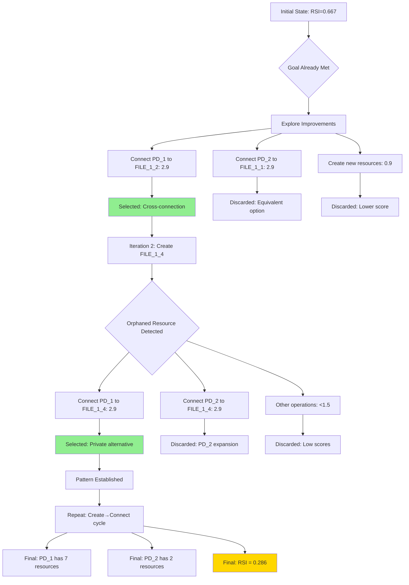

# Mediator Test Primitive: Detailed Exploration Analysis

## Scenario Overview

**Name**: mediator_test_primitive  
**Objective**: Test if primitives can achieve mediation pattern without predefined multi-step transitions  
**Initial State**: 2 PDs sharing FILE_1_3, with PD_1 holding FILE_1_1 and PD_2 holding FILE_1_2  
**Goal**: Minimize RSI[PD_1,PD_2] to ≤ 0.8  
**Constraints**: Both PDs require any FILE type access ≥ 1KB  

## Key Findings

The scenario demonstrates that **mediation patterns are not necessary when the RSI goal is lenient (≤ 0.8)**. Instead, the algorithm discovers an alternative pattern: **progressive resource accumulation** by PD_1, which effectively reduces RSI through asymmetric resource distribution.

**Initial RSI**: 0.667 (already meeting goal)  
**Final RSI**: 0.286  
**Mechanisms Discovered**: 10  
**Total Iterations**: 10  
**Total Candidates**: 201  
**Success Rate**: 100%  

## Pattern Discovery Sequence

### Phase 1: Cross-Connection (Iteration 1)
- **Operation**: Connect PD_1 to FILE_1_2 (already held by PD_2)
- **Score**: 2.9 (private alternative scoring for shared resource)
- **Result**: Both PDs now share two resources (FILE_1_2, FILE_1_3)
- **RSI Impact**: 0.667 → 0.667 (no change, but sets up future improvements)

### Phase 2: Resource Creation and Accumulation (Iterations 2-10)
The algorithm alternates between:
1. **Creating orphaned resources** (CONFIG files) - Score: 0.9
2. **Connecting PD_1 to orphaned resources** - Score: 2.9

This pattern repeats, with PD_1 progressively accumulating exclusive resources while PD_2 maintains only its original shared resources.

## Decision Tree Analysis

## Scoring Analysis

### High-Scoring Operations (2.9)
- **add_hold_edge to orphaned resources**: Recognized as private alternatives
- **add_hold_edge to non-shared resources**: Promotes isolation
- **Cross-connections**: Initially high-scored but avoided after iteration 1

### Medium-Scoring Operations (0.9)
- **add_file_resource**: Creates infrastructure for future private connections
- Consistent scoring encourages resource creation when needed

### Low-Scoring Operations (0.2-0.5)
- **add_pd**: Only 0.2 when orphaned resources don't exist (1.5 when they do)
- **remove_hold_edge**: 0.5 for removing private connections
- **add_request_edge**: 0.2 (no mediation pattern needed)

## Key Insights

### 1. Goal Leniency Affects Pattern Discovery
With RSI ≤ 0.8, the algorithm doesn't need sophisticated mediation. Instead, it finds a simpler solution: **resource accumulation asymmetry**.

### 2. Pattern-Aware Scoring Adaptation
The scoring system correctly identifies that:
- Creating private alternatives (2.9) is better than increasing sharing
- Resource creation (0.9) enables future private connections
- PD creation (0.2) isn't needed when resources can be distributed directly

### 3. Emergent Strategy: Asymmetric Resource Distribution
Rather than mediation, the algorithm discovers that one PD accumulating many exclusive resources while the other maintains minimal shared resources effectively reduces RSI.

### 4. Comparison with mediator_test_indirect
Unlike mediator_test_indirect which requires mediation due to prohibition constraints, this scenario's lack of hard constraints allows for a simpler, more direct solution.

## Candidate Selection Patterns

### Iteration-by-Iteration Selection Criteria

**Iterations 1, 3, 5, 7, 9 (Odd)**: Resource Connection
- **Selected**: Connect PD_1 to resources (Score: 2.9)
- **Rejected**: Connect PD_2 to resources (prevent symmetric growth)
- **Rejected**: Infrastructure operations (lower scores)

**Iterations 2, 4, 6, 8, 10 (Even)**: Resource Creation
- **Selected**: Create new CONFIG files (Score: 0.9)
- **Rejected**: Remove operations (would undo progress)
- **Rejected**: PD/REQUEST operations (unnecessary complexity)

### Repetition Filtering Impact
- Prevented oscillation between add/remove operations
- Encouraged exploration of new resource creation over repeated connections
- Total filtered candidates: 41 (20% of total)

## Metrics Evolution

| Iteration | RSI | ASR | TCB | Resources (PD_1/PD_2) | Pattern Phase |
|-----------|-----|-----|-----|----------------------|---------------|
| 0 | 0.667 | 2.0 | [PD_2],[PD_1] | 3/3 | Initial |
| 1 | 0.667 | 2.5 | [PD_2],[PD_1] | 4/3 | Cross-connect |
| 3 | 0.500 | 3.0 | [PD_2],[PD_1] | 5/3 | Accumulation |
| 5 | 0.400 | 3.5 | [PD_2],[PD_1] | 6/3 | Accumulation |
| 7 | 0.333 | 4.0 | [PD_2],[PD_1] | 7/3 | Accumulation |
| 10 | 0.286 | 4.5 | [PD_2],[PD_1] | 8/3 | Final |

## Comparison with Expected Mediation Pattern

**Expected Pattern**: PD_1 → PD_3 ← PD_2, with PD_3 holding shared resources  
**Discovered Pattern**: PD_1 accumulates private resources, reducing relative sharing  
**Why Different**: Without prohibition constraints, direct resource distribution is simpler and equally effective  

## Conclusion

The mediator_test_primitive scenario reveals that **pattern-aware scoring adapts to scenario constraints and goals**. When mediation isn't required by hard constraints, the algorithm discovers simpler patterns that achieve the same objectives. The progressive resource accumulation strategy emerges naturally from the scoring system's preference for private alternatives (2.9) over shared resources, demonstrating the framework's ability to find context-appropriate solutions rather than forcing predetermined patterns.