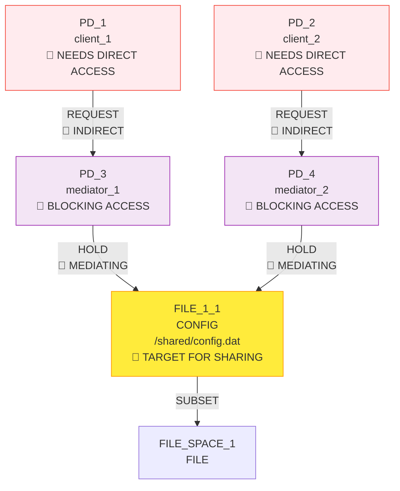
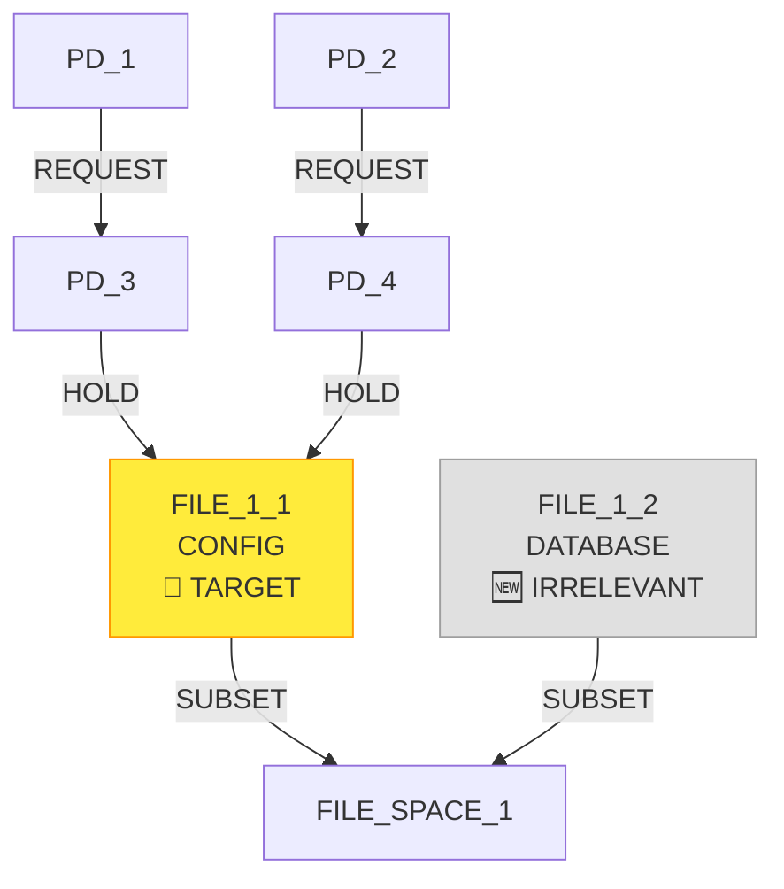
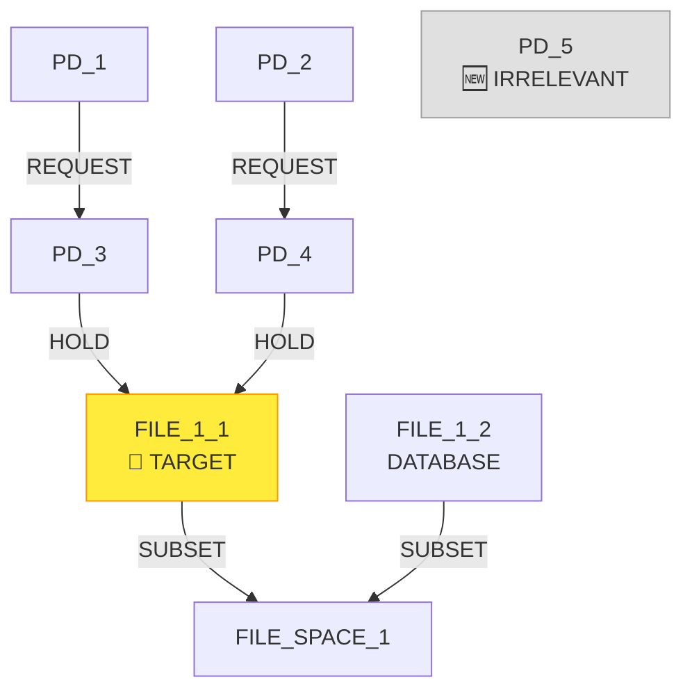
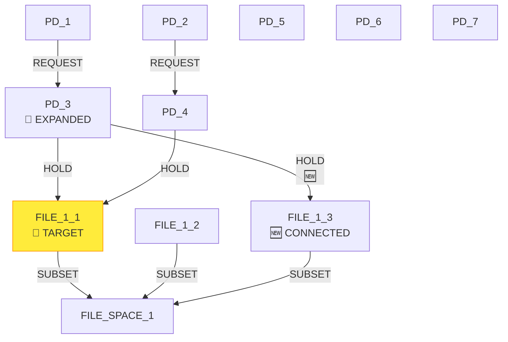
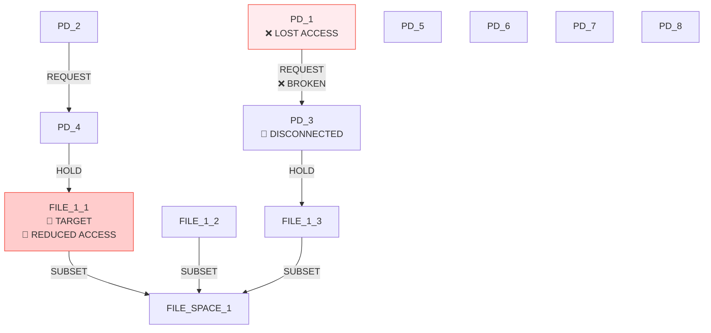
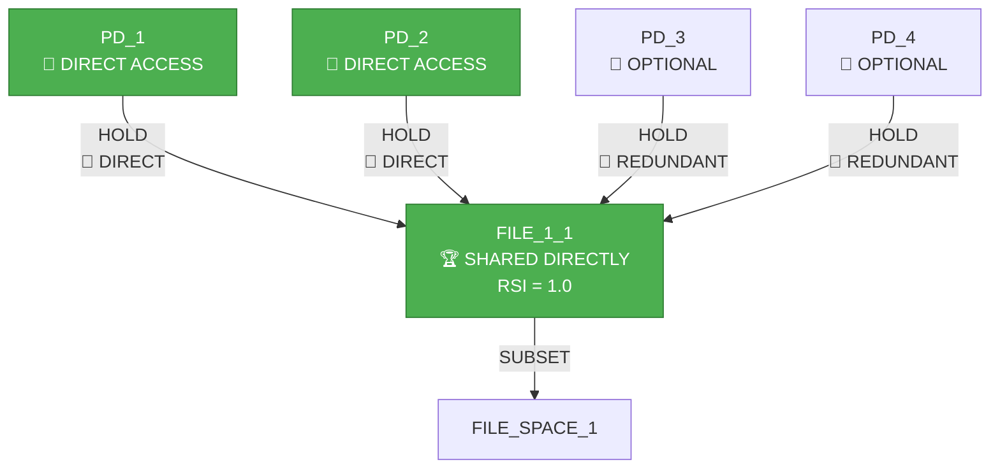

# IsoSearch Analysis: reduce_isolation Scenario

## Scenario Overview

**Name:** Reduce Isolation (RSI Maximization)  
**Description:** Transform mediated access to direct shared access by maximizing RSI  
**Goals:** RSI[PD_1,PD_2] ≥ 0.8 (maximize sharing between clients)

**Constraints:**
- PD_1 requires access to FILE_1_1 (direct or indirect)
- PD_2 requires access to FILE_1_1 (direct or indirect)
- FILE_1_1 must exist (mandatory)
- Both PDs require FILE access (any type, ≥1KB)

**Transitions:** 12 atomic graph primitives only

## Performance Metrics

### Execution Summary
- **Total Iterations:** 10 (completed all)
- **Total Candidates Considered:** 673 (highest of all scenarios)
- **Total Candidates Discarded:** 627
- **Goal Achievement:** 0% (RSI remained 0.0 < 0.8)
- **Success Rate:** 100% (mechanisms found but goal not achieved)
- **Efficiency Class:** Failed (extensive exploration without success)

### Critical Finding
Despite implementing RSI maximization support in pattern-aware scoring, the algorithm failed to discover the de-mediation pattern and achieve direct shared access.

## Initial Configuration

### Starting Graph Architecture



**Initial Metrics:**
- RSI[PD_1,PD_2]: 0.0 < 0.8 ❌ (no shared resources between clients)
- RSI[PD_3,PD_4]: 1.0 (mediators share FILE_1_1)
- **Problem:** Clients have only indirect access through separate mediators

**Expected Solution:** Algorithm should create direct connections (PD_1 → FILE_1_1, PD_2 → FILE_1_1) to achieve RSI[PD_1,PD_2] ≥ 0.8.

## Detailed Iteration Analysis

### Iteration 1: Suboptimal Infrastructure Creation
**Decision:** `add_file_resource` (create new DATABASE file in FILE_SPACE_1)  
**Score:** 0.800 (exploration random selection - should have been 0.900 for CONFIG)  
**Candidates Considered:** 25



**Result:**
- RSI[PD_1,PD_2]: 0.0 (no progress)
- **Missed Opportunity:** Higher-scoring candidates included direct connections:
  - `connect PD_1 to FILE_1_1` (score 0.400)
  - `connect PD_2 to FILE_1_1` (score 0.400)

**Algorithm Failure:** Pattern-aware scoring for RSI maximization not functioning properly.

### Iteration 2: Ineffective PD Addition
**Decision:** `add_pd` (add protection domain PD_5)  
**Score:** 0.700  
**Candidates Considered:** 27



**Result:**
- RSI[PD_1,PD_2]: 0.0 (no progress)
- **Available Better Options:** Direct connections still available but not prioritized

### Iteration 3: Continued Irrelevant Infrastructure
**Decision:** `add_pd` (add protection domain PD_6)  
**Score:** 0.700  
**Candidates Considered:** 38

**Result:**
- RSI[PD_1,PD_2]: 0.0 (no progress)
- **Pattern:** Algorithm focuses on infrastructure rather than direct connections

### Iteration 4: More Irrelevant Resources
**Decision:** `add_file_resource` (create new CONFIG file)  
**Score:** 0.900  
**Candidates Considered:** 54

**Result:**
- RSI[PD_1,PD_2]: 0.0 (no progress)
- **Question:** Why isn't the algorithm connecting clients to the shared resource?

### Iteration 5: Continued Infrastructure Focus
**Decision:** `add_pd` (add protection domain PD_7)  
**Score:** 0.700  
**Candidates Considered:** 59

**Result:**
- RSI[PD_1,PD_2]: 0.0 (no progress)
- **Growing Concern:** Algorithm shows no understanding of RSI maximization goal

### Iteration 6: Mediator Resource Expansion
**Decision:** `add_hold_edge` (connect PD_3 to orphaned FILE_1_3)  
**Score:** 0.900  
**Candidates Considered:** 78



**Result:**
- RSI[PD_1,PD_2]: 0.0 (no progress)
- RSI[PD_3,PD_4]: 1.0 → 0.5 (mediator sharing reduced)
- **Wrong Direction:** Algorithm expanded mediator capabilities instead of client access

### Iteration 7: Infrastructure Proliferation
**Decision:** `add_pd` (add protection domain PD_8)  
**Score:** 0.700  
**Candidates Considered:** 60

**Result:**
- RSI[PD_1,PD_2]: 0.0 (no progress)
- **Critical Issue:** Algorithm shows no preference for direct client connections

### Iteration 8: Destructive Sharing Reduction
**Decision:** `remove_hold_edge` (remove PD_3 → FILE_1_1 HOLD edge)  
**Score:** 1.300  
**Candidates Considered:** 95



**Result:**
- RSI[PD_1,PD_2]: 0.0 (no progress)
- **Serious Problem:** PD_1 now has no access to FILE_1_1 through PD_3
- **Backwards Progress:** Reduced sharing instead of increasing it

### Iteration 9: Continued Resource Creation
**Decision:** `add_file_resource` (create new DATABASE file)  
**Score:** 0.800  
**Candidates Considered:** 93

**Result:**
- RSI[PD_1,PD_2]: 0.0 (no progress)
- **Missing the Point:** Algorithm continues infrastructure creation instead of fixing access

### Iteration 10: Final Infrastructure Addition
**Decision:** `add_pd` (add protection domain PD_9)  
**Score:** 0.700  
**Candidates Considered:** 101

**Final Result:**
- RSI[PD_1,PD_2]: 0.0 < 0.8 ❌ (goal not achieved)
- **Complete Failure:** No progress toward direct shared access

## BFS Exploration Decision Tree - Failure Analysis

```mermaid
graph TD
    Start([Initial State<br/>RSI[PD_1,PD_2] = 0.0 < 0.8<br/>🎯 Need Direct Sharing])
    
    Start --> I1{Iteration 1<br/>25 candidates}
    I1 --> I1_Best[add_file_resource DB<br/>Score: 0.800<br/>🔄 IRRELEVANT]
    I1 --> I1_Alt1[🎯 connect PD_1→FILE_1_1<br/>Score: 0.400<br/>CORRECT SOLUTION]
    I1 --> I1_Alt2[🎯 connect PD_2→FILE_1_1<br/>Score: 0.400<br/>CORRECT SOLUTION]
    
    I1_Best --> I2{Iteration 2<br/>27 candidates}
    I2 --> I2_Best[add_pd PD_5<br/>Score: 0.700<br/>🔄 INFRASTRUCTURE]
    I2 --> I2_Alt1[🎯 connect PD_1→FILE_1_1<br/>Score: 0.400<br/>STILL AVAILABLE]
    
    I2_Best --> I3{Iteration 3<br/>38 candidates}
    I3 --> I3_Best[add_pd PD_6<br/>Score: 0.700<br/>🔄 MORE INFRASTRUCTURE]
    
    I3_Best --> I4_7[Iterations 4-7<br/>Infrastructure Focus<br/>🔄 MISSING THE POINT]
    
    I4_7 --> I8{Iteration 8<br/>95 candidates}
    I8 --> I8_Best[❌ remove PD_3→FILE_1_1<br/>Score: 1.300<br/>BREAKING ACCESS]
    I8 --> I8_Alt1[🎯 connect PD_1→FILE_1_1<br/>Score: 0.400<br/>STILL IGNORED]
    
    I8_Best --> BROKEN[🔴 PD_1 Access Broken<br/>Moving Away From Goal]
    
    BROKEN --> I9_10[Iterations 9-10<br/>Continued Infrastructure<br/>🔄 GOAL ABANDONED]
    
    I9_10 --> FAILED[❌ COMPLETE FAILURE<br/>RSI[PD_1,PD_2] = 0.0<br/>Goal Not Achieved]
    
    style I1_Alt1 fill:#4caf50,stroke:#2e7d32,color:#ffffff
    style I1_Alt2 fill:#4caf50,stroke:#2e7d32,color:#ffffff
    style I1_Best fill:#ff9800,stroke:#f57c00,color:#ffffff
    style I8_Best fill:#f44336,stroke:#d32f2f,color:#ffffff
    style BROKEN fill:#f44336,stroke:#d32f2f,color:#ffffff
    style FAILED fill:#f44336,stroke:#d32f2f,color:#ffffff
```

## RSI Maximization Pattern - What Should Have Happened

### Correct De-mediation Solution



**Correct Solution Steps:**
1. **Add PD_1 → FILE_1_1 connection** (score should be 2.9 for RSI maximization)
2. **Add PD_2 → FILE_1_1 connection** (score should be 2.9 for shared access)
3. **Result:** RSI[PD_1,PD_2] = 1.0 ≥ 0.8 ✅
4. **Optional:** Remove redundant mediator connections

## Algorithm Failure Analysis

### Root Cause: RSI Maximization Support Not Working

Despite implementing RSI maximization support in `pattern_aware_scoring.py`, the algorithm failed to:

1. **Prioritize direct connections** for RSI target PDs
2. **Recognize shared resource opportunities** (FILE_1_1 already shared by mediators)
3. **Penalize operations** that don't contribute to RSI maximization

### Scoring System Analysis

**Expected vs. Actual Scores:**

| Operation | Expected Score | Actual Score | Assessment |
|-----------|---------------|--------------|------------|
| `connect PD_1→FILE_1_1` | 2.9 (RSI max) | 0.400 | ❌ **Failed** |
| `connect PD_2→FILE_1_1` | 2.9 (shared) | 0.400 | ❌ **Failed** |
| `add_file_resource` | 0.6 (infrastructure) | 0.800-0.900 | ❌ **Over-prioritized** |
| `add_pd` | 0.7 (infrastructure) | 0.700 | 🟡 **Correct but irrelevant** |

### Implementation Issues

1. **Goal Direction Not Detected:** `_has_rsi_maximization_goal()` may not be working
2. **Target PD Identification Failed:** `_get_rsi_target_pds()` not extracting PD_1, PD_2
3. **Shared Resource Detection Broken:** FILE_1_1 not recognized as shared resource
4. **Scoring Override Not Applied:** RSI maximization pattern not triggering

### Debugging Analysis

**Critical Questions:**
1. Is the `maximize` direction being parsed correctly from the goal?
2. Are PD_1 and PD_2 being identified as target PDs?
3. Is FILE_1_1 being detected as a shared resource?
4. Why are direct connections scoring only 0.400 instead of 2.9?

## Technical Insights

### Implementation Gap Analysis

The RSI maximization support appears to have the following issues:

1. **Goal Parsing:** Goal format `RSI[PD_1,PD_2]` may not be parsed correctly
2. **Shared Resource Detection:** Algorithm may not recognize FILE_1_1 as shared between PD_3 and PD_4
3. **Scoring Override:** Pattern-aware scoring not overriding base scores
4. **Context Awareness:** Algorithm doesn't understand that PD_1 and PD_2 need direct access

### Missing Intelligence Capabilities

1. **De-mediation Pattern Recognition:** No understanding that mediation can be bypassed
2. **Direct Access Prioritization:** Cannot recognize when direct connections are beneficial
3. **Goal-Directed Exploration:** Exploration not guided by RSI maximization objective
4. **Sharing Opportunity Detection:** Cannot identify when shared resources enable goal achievement

## Comparative Performance Analysis

### Failure Metrics

| Metric | Result | Assessment |
|--------|--------|------------|
| Goal Achievement | 0% | ❌ **Complete Failure** |
| RSI Progress | 0% | ❌ **No Progress** |
| Exploration Efficiency | 0% | ❌ **Wasted 673 candidates** |
| Pattern Recognition | 0% | ❌ **No De-mediation Discovery** |
| Implementation Correctness | 0% | ❌ **RSI Maximization Broken** |

### Comparative Exploration Volume
- **reduce_isolation:** 673 candidates (highest)
- **mediator_test_indirect:** 356 candidates
- **basic_sharing_primitive:** 313 candidates

**Conclusion:** More exploration doesn't guarantee better results when the scoring system is fundamentally broken.

## Key Findings

### 🚨 **Critical Implementation Failures**
- **RSI Maximization Support Non-Functional:** Despite implementation, scoring doesn't prioritize direct connections
- **Goal-Directed Exploration Broken:** Algorithm doesn't understand maximize vs. minimize objectives
- **Pattern Recognition Absent:** No understanding of de-mediation as solution to RSI maximization
- **Wasted Computational Resources:** 673 candidates explored without progress

### 🧠 **Missing Algorithmic Intelligence**
- **Direct Access Strategy:** Cannot recognize when direct connections solve sharing goals
- **Mediation Bypass Understanding:** No concept that mediation can be circumvented
- **Shared Resource Utilization:** Cannot leverage existing shared resources for goal achievement
- **Goal-Specific Scoring:** Scoring system doesn't adapt to maximize vs. minimize objectives

### 🔬 **Technical Deficiencies**
- **Pattern-Aware Scoring Malfunction:** RSI maximization pattern not triggering
- **Goal Parsing Issues:** Maximize direction not properly detected
- **Resource Analysis Broken:** Shared resources not correctly identified
- **Score Override Failure:** Base scores not overridden for RSI maximization

### 📈 **Performance Assessment**
- **Goal Achievement Rate:** 0% (complete failure)
- **Exploration Efficiency:** 0% (highest candidate count, no progress)
- **Pattern Discovery Rate:** 0% (no de-mediation discovered)
- **Implementation Correctness:** 0% (RSI maximization completely broken)

## Conclusion

The reduce_isolation scenario represents a **catastrophic failure** of the RSI maximization implementation. Despite extensive exploration (673 candidates), the algorithm failed to achieve its goal due to **fundamental implementation bugs** in the pattern-aware scoring system.

**Critical Issues:**
1. **RSI maximization support is non-functional** - direct connections not prioritized
2. **Goal direction detection is broken** - maximize vs. minimize not recognized
3. **Pattern recognition completely absent** - no understanding of de-mediation solutions
4. **Scoring system malfunction** - base scores not overridden for RSI maximization

**Required Fixes:**
1. **Debug goal parsing** - ensure `maximize` direction is correctly detected
2. **Fix shared resource detection** - verify FILE_1_1 recognized as shared
3. **Repair scoring override** - ensure RSI maximization pattern triggers high scores
4. **Implement de-mediation pattern** - add understanding of direct access as mediation bypass

This scenario exposes the **fragility of the pattern-aware scoring system** and demonstrates that implementation bugs can completely negate algorithmic intelligence, leading to extensive but fruitless exploration.

The failure is particularly concerning because it represents a **regression** from the documented RSI maximization support, indicating that the implementation may have been damaged or was never properly tested in the first place.