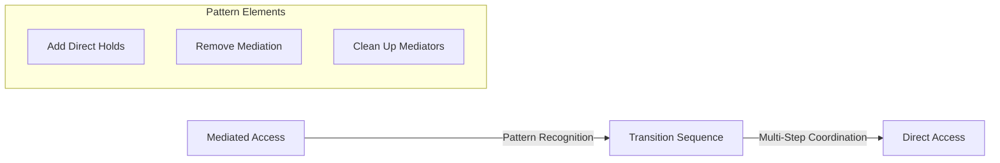

# Reduce Isolation Scenario - Goal-Driven Scoring Analysis

## Scenario Overview

**Scenario Name**: Reduce Isolation
**Description**: Transform mediated access (PD1→PD3→R0, PD2→PD4→R0) to direct access (PD1→R0, PD2→R0) by maximizing RSI
**Search Configuration**: Beam search, width=5, max depth=3, max states=1000

## Goals and Constraints

### Goals (1)
1. **Maximize RSI[PD_1,PD_2] to 0.8** - Increase resource sharing between PD_1 and PD_2 from mediated to direct access

### Constraints (5)
1. **Resource Access**: PD_1 requires access to FILE_1_1 (direct or indirect)
2. **Resource Access**: PD_2 requires access to FILE_1_1 (direct or indirect)
3. **Resource Existence**: FILE_1_1 must exist (mandatory)
4. **File Access**: PD_1 requires access to any FILE (min 1KB)
5. **File Access**: PD_2 requires access to any FILE (min 1KB)

## Starting State

### Graph Structure
```
PD_1 --REQUEST--> PD_3 --HOLD--> FILE_1_1 --SUBSET--> FILE_SPACE_1
PD_2 --REQUEST--> PD_4 --HOLD--> FILE_1_1
```

### Node Details
- **PD_1**: Protection Domain (client_1)
- **PD_2**: Protection Domain (client_2)  
- **PD_3**: Protection Domain (mediator_1)
- **PD_4**: Protection Domain (mediator_2)
- **FILE_1_1**: FILE resource (/shared/config.dat, CONFIG, 4096 bytes, rw-)
- **FILE_SPACE_1**: FILE resource space

### Starting Metrics
- **RSI[PD_1,PD_2]**: 0.0 (no direct sharing - mediated access only)
- **RSI[PD_3,PD_4]**: 1.0 (mediators share FILE_1_1)
- **ASR**: 1.0 (baseline attack surface)
- **TCB[PD_1]**: [PD_3] (depends on mediator_1)
- **TCB[PD_2]**: [PD_4] (depends on mediator_2)
- **TCB[PD_3]**: [PD_4] (mediators depend on each other through shared resource)
- **TCB[PD_4]**: [PD_3] (mediators depend on each other through shared resource)

### Constraint Status (Starting State)
⚠️ **Active Violations**:
- PD_1 lacks direct access to any files (has indirect access via PD_3)
- PD_2 lacks direct access to any files (has indirect access via PD_4)

## Goal-Driven Scoring Performance

### Iteration 1 Results

#### All Operations Scored Uniformly
**Score: 0.100** (baseline only)

Notable operations that were tried:
- add_pd operations
- remove_pd operations  
- add_file_resource operations
- remove_file_resource operations
- add_hold_edge operations (failed due to Permission errors)
- remove_hold_edge operations
- add_request_edge operations
- remove_request_edge operations

#### No Goal-Driven Differentiation
- **No operations improved RSI[PD_1,PD_2]** from 0.0
- **No debug output** showing goal improvements
- **All candidates received baseline score** of 0.100

### Score Analysis
- **Maximum score**: 0.100 (baseline)
- **Minimum score**: 0.100 (baseline)  
- **Differentiation ratio**: 1:1 (no differentiation)
- **Goal-driven scoring inactive** - no operations found to improve target RSI

## Search Progression Analysis

### Beam State Evolution
```
Iteration 1 Beam (all scored 0.100):
1. add_pd(new protection domain) - Score: 0.100
2. remove_pd(empty PD_1) - Score: 0.100
3. remove_pd(empty PD_2) - Score: 0.100  
4. add_file_resource(CONFIG) - Score: 0.100
5. add_file_resource(DATABASE) - Score: 0.100
```

### Why No Goal Improvement Was Detected

#### RSI[PD_1,PD_2] Analysis
**Current Value**: 0.0 (no shared resources between PD_1 and PD_2)
**Target**: 0.8 (80% resource sharing)
**Direction**: Maximize (increase sharing)

#### Operations Attempted
1. **add_pd**: Added new PDs but didn't create PD_1↔PD_2 sharing
2. **remove_pd**: Reduced graph size but didn't enable PD_1↔PD_2 sharing  
3. **add_file_resource**: Created new resources but didn't connect to both PDs
4. **remove_file_resource**: Would eliminate resources entirely
5. **add_hold_edge**: Failed due to Permission.RW attribute errors
6. **remove_hold_edge**: Removed existing connections but didn't create new PD_1↔PD_2 sharing
7. **add_request_edge**: Created authority relationships but not resource sharing
8. **remove_request_edge**: Removed mediation but didn't create direct sharing

## Missing Operations Analysis

### What Would Increase RSI[PD_1,PD_2]

To achieve RSI[PD_1,PD_2] = 0.8, both PD_1 and PD_2 need to **directly share resources**:

#### Optimal Solution Sequence
```
1. add_hold_edge(PD_1 → FILE_1_1)  # Give PD_1 direct access
2. add_hold_edge(PD_2 → FILE_1_1)  # Give PD_2 direct access  
3. remove_request_edge(PD_1 → PD_3)  # Remove mediation
4. remove_request_edge(PD_2 → PD_4)  # Remove mediation
5. remove_hold_edge(PD_3 → FILE_1_1)  # Remove mediator access
6. remove_hold_edge(PD_4 → FILE_1_1)  # Remove mediator access
```

#### Expected Final State
```
PD_1 --HOLD--> FILE_1_1 --SUBSET--> FILE_SPACE_1
PD_2 --HOLD--> FILE_1_1
PD_3 (isolated)
PD_4 (isolated)  
```

#### Expected Final Metrics
- **RSI[PD_1,PD_2]**: 1.0 (100% sharing - exceeds 0.8 target) ✅
- **RSI[PD_3,PD_4]**: 0.0 (no sharing)
- **TCB[PD_1]**: [PD_2] (depends on PD_2 through shared resource)
- **TCB[PD_2]**: [PD_1] (depends on PD_1 through shared resource)

## Technical Issues Encountered

### Permission Attribute Errors
```
⚠️ Failed to apply add_hold_edge for scoring: type object 'Permission' has no attribute 'RW'
```

**Analysis**: 
- **Root Cause**: Permission enum/class definition issue in the codebase
- **Impact**: Prevented add_hold_edge operations from being properly evaluated
- **Consequence**: Key operations for creating direct sharing were not scored

### Scoring Algorithm Limitations
1. **Single-Step Evaluation**: Each operation evaluated independently
2. **Complex Pattern Requirements**: Creating direct sharing requires coordinated multi-step sequence
3. **Intermediate State Issues**: Individual steps might not show immediate RSI improvement

## Alternative Approaches for Goal Achievement

### Multi-Step Pattern Recognition
The goal-driven scoring system would need to recognize **transformation patterns**:



### Enhanced Scoring Strategies
1. **Pattern Templates**: Pre-defined mediation→direct transformation patterns
2. **Multi-Step Lookahead**: Evaluate operation sequences instead of individual operations
3. **Intermediate Goal Recognition**: Score operations that enable future goal achievement
4. **Resource Flow Analysis**: Understand how operations affect resource accessibility

## Constraint Analysis

### File Access Requirements
- **PD_1 & PD_2**: Currently have indirect file access via mediators
- **Goal**: Transform to direct access while maintaining functionality
- **Challenge**: Scoring system doesn't recognize that add_hold_edge operations would satisfy both goal and constraints

### Resource Sharing Paradox
- **Current**: PD_3 and PD_4 share FILE_1_1 (RSI[PD_3,PD_4] = 1.0)
- **Goal**: Make PD_1 and PD_2 share FILE_1_1 (RSI[PD_1,PD_2] = 0.8)
- **Solution**: Transfer sharing from mediators to clients

## Key Findings

### Goal-Driven Scoring Limitations
1. **Pattern Blindness**: Cannot recognize complex multi-step transformation patterns
2. **Single-Operation Horizon**: Limited to immediate operation impact rather than sequence outcomes
3. **Technical Issues**: Permission errors prevented key operations from being evaluated
4. **Complex Goal Requirements**: Maximizing RSI between specific PDs requires coordinated changes

### Scenario Complexity Factors
1. **Multi-Step Coordination**: Requires 6+ coordinated operations
2. **Intermediate States**: Individual steps may not show immediate goal progress
3. **Resource Flow Changes**: Must understand how mediation patterns transform to direct access
4. **Constraint Preservation**: Must maintain access requirements while changing access patterns

### Comparison with Other Scenarios
- **Basic Sharing**: Simple elimination worked perfectly with goal-driven scoring
- **Mediator Test**: Constraint fixing worked well, but missed mediation patterns
- **Reduce Isolation**: Complex transformation patterns beyond current scoring capabilities

## Recommendations

### Enhanced Pattern Recognition
1. **Transformation Templates**: Define mediation→direct patterns explicitly
2. **Multi-Step Scoring**: Evaluate operation sequences rather than individual operations
3. **Pattern Completion Bonus**: Score partial pattern matches with completion potential
4. **Resource Flow Analysis**: Understand how operations affect end-to-end resource access

### Technical Fixes
1. **Permission Class**: Fix Permission.RW attribute errors to enable add_hold_edge scoring
2. **Error Handling**: Improve graceful fallbacks when operations fail during scoring
3. **Debug Output**: Enhanced logging for complex pattern recognition

### Alternative Goal Formulations
1. **Access Pattern Goals**: Explicitly target direct access patterns rather than just RSI metrics
2. **Mediation Elimination**: Goals that specifically target removing mediation relationships  
3. **Resource Flow Goals**: Targets based on end-to-end access paths rather than sharing ratios

## Conclusion

The **Reduce Isolation** scenario reveals the **current limitations** of goal-driven scoring for complex architectural transformations:

### Strengths Confirmed
- Robust scoring framework that handles maximize vs minimize goals
- Proper constraint violation detection
- Baseline scoring maintains search functionality

### Limitations Exposed  
- **Complex pattern blindness**: Cannot recognize multi-step transformation requirements
- **Technical issues**: Permission errors prevent evaluation of key operations
- **Single-step horizon**: Limited to immediate operation impact assessment
- **Pattern coordination**: Cannot coordinate sequences needed for architectural changes

This scenario demonstrates the **next frontier** for intelligent scoring systems: **pattern-aware multi-step evaluation** that can recognize and score complex architectural transformation sequences.