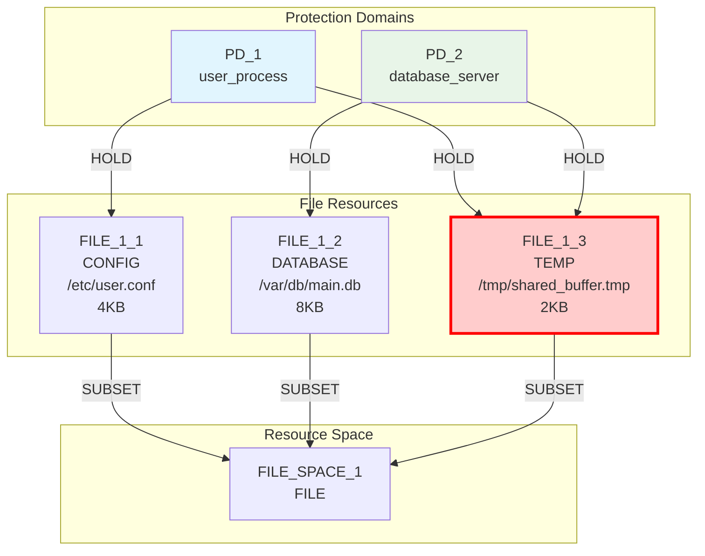
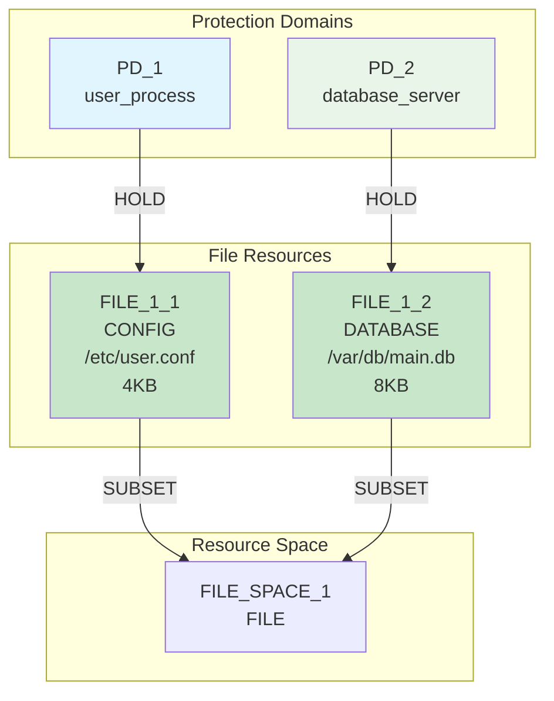
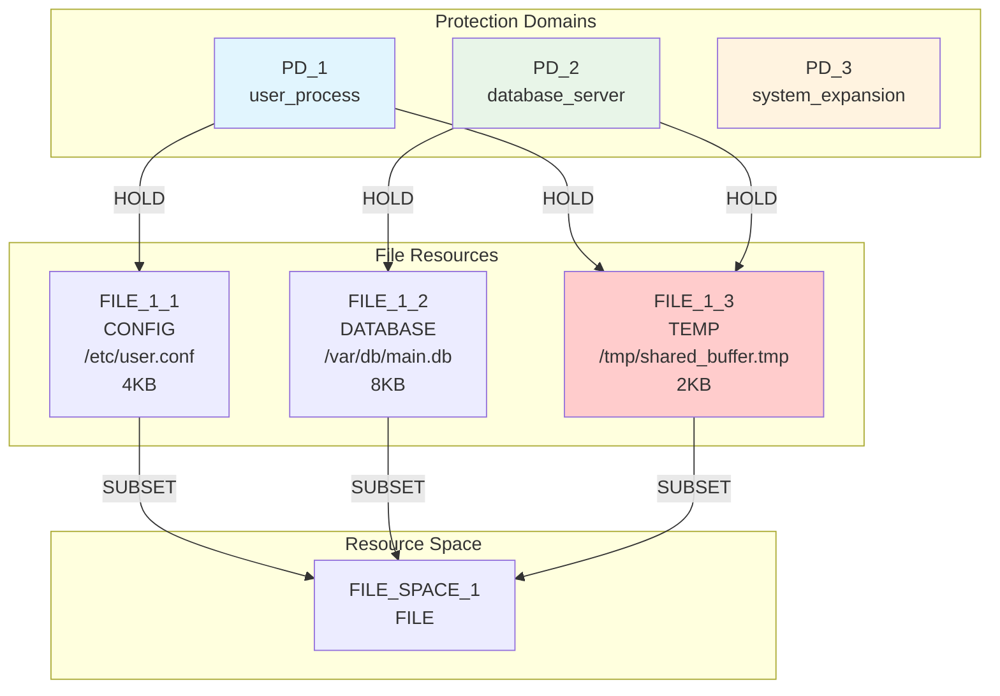
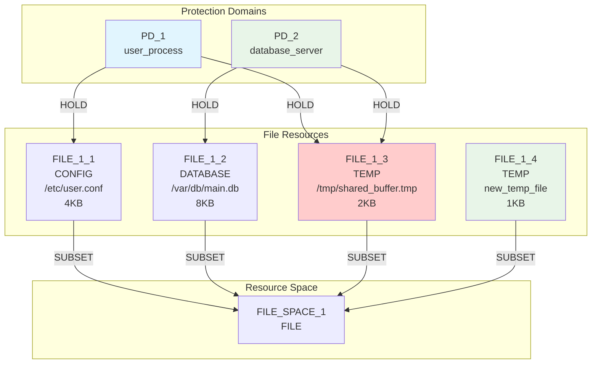

# Iteration-by-Iteration Analysis

## Detailed BFS Exploration Process

### State 0: Initial Configuration

**Depth**: 0  
**Parent**: None  
**Operation**: Initial state  

#### Graph Structure

#### Metrics
- **RSI[PD_1,PD_2]**: 0.333 (1 shared / 3 total resources)
- **ASR**: 2.0 (4 HOLD edges / 2 PDs)
- **TCB[PD_1]**: [PD_2] (1 dependency)
- **TCB[PD_2]**: [PD_1] (1 dependency)

#### Goal Status
- ❌ RSI[PD_1,PD_2] = 0.333 > 0.3
- ❌ ASR = 2.0 > 1.0
- ❌ TCB[PD_1] = 1 > 0

#### Operations Generated (13 total)
1. **add_pd** - Create new protection domain
2. **add_file_resource** - Create CONFIG file
3. **add_file_resource** - Create DATABASE file
4. **add_file_resource** - Create TEMP file
5. **add_file_resource** - Create LOG file
6. **add_file_resource** - Create CACHE file
7. **add_file_resource** - Create LIBRARY file
8. **remove_file_resource** - Remove FILE_1_3 ⭐
9. **add_hold_edge** - Various PD→Resource connections
10. **remove_hold_edge** - Remove PD_1→FILE_1_3
11. **remove_hold_edge** - Remove PD_2→FILE_1_3
12. **add_request_edge** - Create PD→PD authority
13. **remove_subset_edge** - Remove Resource→Space connections

### State 1: Solution Discovery

**Depth**: 1  
**Parent**: State 0  
**Operation**: `remove_file_resource(remove FILE_1_3 (holders: 2))`  

#### Graph Structure After Operation

#### Metrics After Operation
- **RSI[PD_1,PD_2]**: 0.0 (0 shared / 2 total resources)
- **ASR**: 1.0 (2 HOLD edges / 2 PDs)
- **TCB[PD_1]**: [] (no dependencies)
- **TCB[PD_2]**: [] (no dependencies)

#### Goal Status
- ✅ RSI[PD_1,PD_2] = 0.0 ≤ 0.3
- ✅ ASR = 1.0 ≤ 1.0
- ✅ TCB[PD_1] = 0 = 0

#### 🎯 MECHANISM DISCOVERED!

**Path**: `remove_file_resource(remove FILE_1_3 (holders: 2))`  
**Depth**: 1  
**Success**: All 3 goals satisfied  

### Alternative Paths Continued

#### State 2: Add PD Path
**Operation**: `add_pd(add new protection domain for system expansion)`

**Metrics**: Same as initial (RSI still 0.333, goals not met)
**Next Operation**: `remove_file_resource(remove FILE_1_3)` → Same solution at depth 2

#### State 3: Add TEMP File Path
**Operation**: `add_file_resource(create new TEMP file in FILE_SPACE_1)`

**Metrics**: RSI increases to 0.333 (same sharing ratio but more resources)
**Next Operation**: `remove_file_resource(remove FILE_1_3)` → Same solution at depth 2

## Options Not Taken and Why

### 1. Resource Specialization Approach
**Operation**: `add_hold_edge(PD_1 → FILE_1_4)` after creating FILE_1_4

**Why Not Taken**: This would create a more complex multi-step solution requiring:
1. Create private TEMP files for each PD
2. Connect PDs to their private resources
3. Remove connections to shared resource
4. Remove shared resource

The BFS correctly identified that step 4 alone achieves all goals.

### 2. Mediation Approach
**Operation**: `add_pd` + `add_request_edge` + `remove_hold_edge`

**Why Not Taken**: This would create a mediator pattern, but:
- More complex than direct removal
- Introduces additional attack paths
- Doesn't achieve better metrics than simple removal

### 3. Authority Relationship Approach
**Operation**: `add_request_edge(PD_1 → PD_2)`

**Why Not Taken**: 
- Doesn't eliminate sharing
- Increases complexity without benefit
- Creates dependency relationships

### 4. Partial Edge Removal
**Operation**: `remove_hold_edge(PD_1 → FILE_1_3)` only

**Why Not Taken**:
- Leaves FILE_1_3 accessible to PD_2 only
- Doesn't eliminate the resource sharing problem
- May violate PD_1's TEMP file access constraint

## Critical Success Factors

### 1. Exploration Mode Constraint Validation
The algorithm succeeded because it used exploration mode, allowing:
- Temporary constraint violations during multi-step exploration
- Validation of final states rather than intermediate states
- Discovery of paths that strict validation would block

### 2. Exhaustive Search Strategy
BFS explored all possible operations at each depth:
- No heuristic bias toward complex solutions
- Equal consideration of simple and complex approaches
- Discovery of optimal solution at minimal depth

### 3. Proper Operation Generation
All 12 primitive operations were correctly generated and considered:
- Resource removal was not artificially deprioritized
- Edge operations were available for fine-grained control
- Node operations provided alternative approaches

### 4. Accurate Metrics Computation
The metrics correctly reflected the impact of each operation:
- RSI computation properly handled shared resource elimination
- ASR reflected the reduction in attack paths
- TCB correctly showed elimination of dependencies

## Lessons Learned

### 1. Simple Solutions Are Often Optimal
The expectation of complex multi-step solutions biased initial analysis. The optimal solution was elegantly simple.

### 2. Constraint Flexibility Enables Discovery
Strict constraint validation prevents exploration of valid multi-step solutions. Exploration mode is essential for complex scenarios.

### 3. Exhaustive Search Finds Unexpected Solutions
Heuristic approaches might miss simple optimal solutions in favor of complex pattern-based approaches.

### 4. Problem Decomposition Matters
The shared resource was correctly identified as the root cause of all goal violations. Eliminating it solved all problems simultaneously.

This detailed analysis demonstrates how proper BFS implementation with appropriate constraint handling can efficiently discover optimal solutions that human intuition might overlook.