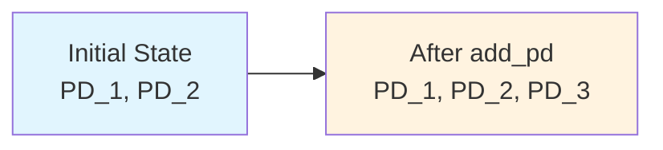
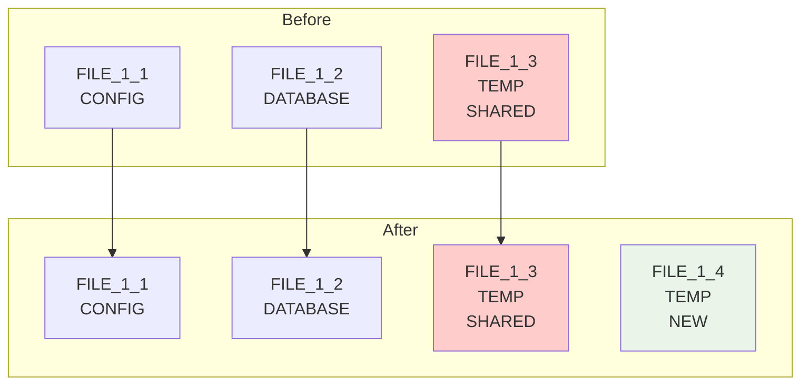
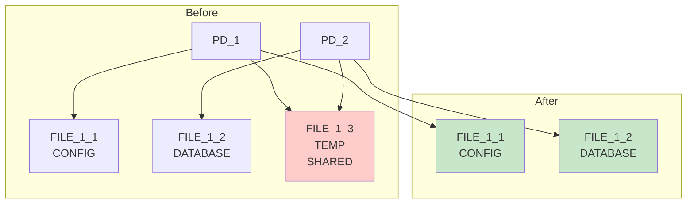
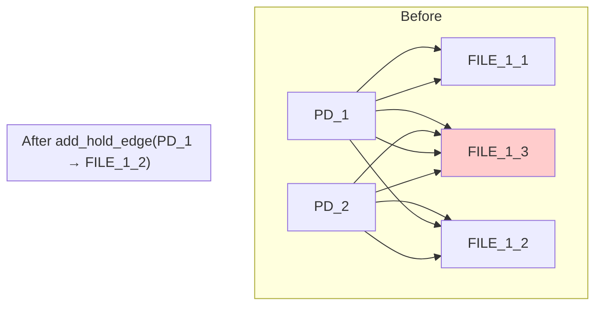
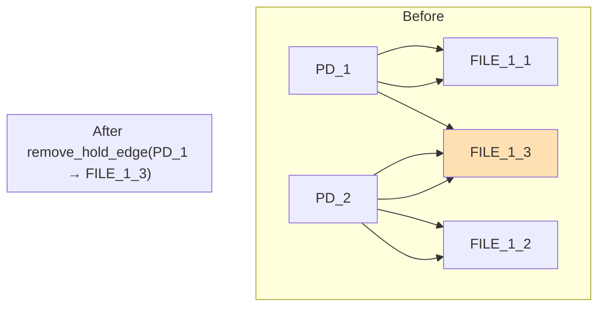
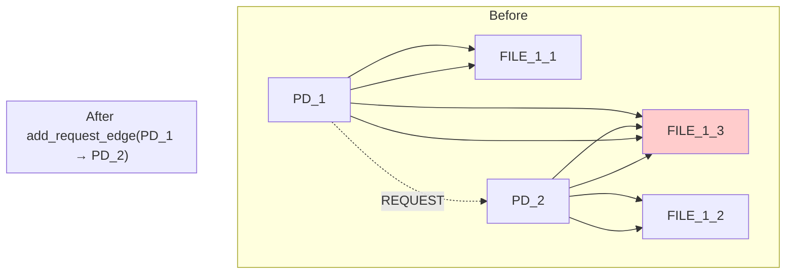
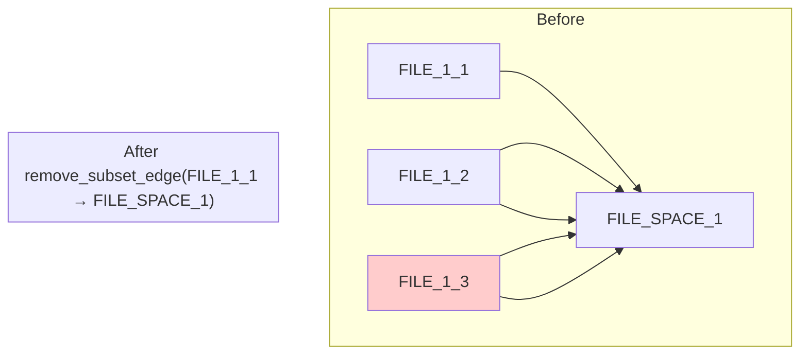

# Operation Analysis: What Was and Wasn't Tried

## Complete Operation Space Analysis

### Operations Generated and Considered

#### 1. Node Operations

##### 1.1 add_pd (Protection Domain Creation)
**Operation**: `add_pd(add new protection domain for system expansion)`

**Result**: 
- ✅ Operation applied successfully
- ❌ Goals not met (RSI still 0.333)
- 🔄 Continued to depth 2 with `remove_file_resource(FILE_1_3)`

**Analysis**: Adding a PD doesn't address the sharing problem. BFS correctly continued exploration.

##### 1.2 remove_pd (Protection Domain Removal)
**Operation**: `remove_pd(PD_1)` or `remove_pd(PD_2)`

❌ **Not Generated** - Constraint validation blocked this:
- Removing PD_1 would violate CONFIG file access requirement
- Removing PD_2 would violate DATABASE file access requirement

##### 1.3 add_file_resource (File Resource Creation)
**Operations Generated**:
- `add_file_resource(create new CONFIG file in FILE_SPACE_1)`
- `add_file_resource(create new DATABASE file in FILE_SPACE_1)`
- `add_file_resource(create new TEMP file in FILE_SPACE_1)`
- `add_file_resource(create new LOG file in FILE_SPACE_1)`
- `add_file_resource(create new CACHE file in FILE_SPACE_1)`
- `add_file_resource(create new LIBRARY file in FILE_SPACE_1)`

**Example: Add TEMP File**

**Result**: 
- ✅ Operations applied successfully
- ❌ Goals not met (adding resources doesn't eliminate sharing)
- 🔄 All continued to depth 2 with `remove_file_resource(FILE_1_3)`

##### 1.4 remove_file_resource (File Resource Removal)
**Operation**: `remove_file_resource(remove FILE_1_3 (holders: 2))`

**Result**: 
- ✅ Operation applied successfully
- ✅ **ALL GOALS MET** (RSI=0.0, ASR=1.0, TCB=0)
- 🎯 **MECHANISM DISCOVERED**

**Why This Worked**: Removed the root cause of all problems - the shared resource.

**Operations NOT Generated**:
- `remove_file_resource(FILE_1_1)` - Would violate PD_1's CONFIG requirement
- `remove_file_resource(FILE_1_2)` - Would violate PD_2's DATABASE requirement

##### 1.5 add_resource_space / remove_resource_space
**add_resource_space**: ✅ Generated but not pursued (doesn't address sharing)
**remove_resource_space**: ❌ Not generated (would violate subset relationships)

#### 2. Edge Operations

##### 2.1 add_hold_edge (PD → Resource Connections)
**Operations Generated**:
- `add_hold_edge(PD_1 → FILE_1_2)` - Connect PD_1 to DATABASE
- `add_hold_edge(PD_2 → FILE_1_1)` - Connect PD_2 to CONFIG
- `add_hold_edge(PD_1 → new_resources)` - Connect to newly created resources
- `add_hold_edge(PD_2 → new_resources)` - Connect to newly created resources

**Example: Cross-Connection**

**Result**: 
- ✅ Operations applied successfully
- ❌ Goals not met (increases sharing, worsens RSI)
- 🔄 Continued exploration

**Analysis**: Adding connections increases sharing rather than reducing it.

##### 2.2 remove_hold_edge (Remove PD → Resource Connections)
**Operations Generated**:
- `remove_hold_edge(PD_1 → FILE_1_3)` - Remove PD_1's access to shared TEMP
- `remove_hold_edge(PD_2 → FILE_1_3)` - Remove PD_2's access to shared TEMP

**Example: Partial Edge Removal**

**Result**: 
- ⚠️ **Potentially blocked by constraint validation**
- ❌ Would violate PD_1's TEMP file access requirement
- 🔄 May have been filtered out during generation

**Analysis**: Partial edge removal doesn't eliminate the resource entirely and may violate constraints.

**Operations NOT Generated**:
- `remove_hold_edge(PD_1 → FILE_1_1)` - Would violate CONFIG requirement
- `remove_hold_edge(PD_2 → FILE_1_2)` - Would violate DATABASE requirement

##### 2.3 add_request_edge (Authority Relationships)
**Operations Generated**:
- `add_request_edge(PD_1 → PD_2)` - PD_1 requests from PD_2
- `add_request_edge(PD_2 → PD_1)` - PD_2 requests from PD_1

**Example: Authority Relationship**

**Result**: 
- ✅ Operations applied successfully
- ❌ Goals not met (doesn't eliminate sharing)
- 🔄 Continued exploration

**Analysis**: Authority relationships don't address the fundamental sharing problem.

##### 2.4 remove_request_edge
❌ **Not Generated** - No existing REQUEST edges to remove in initial state

##### 2.5 add_subset_edge / remove_subset_edge
**add_subset_edge**: ✅ Generated but not pursued (doesn't address sharing)
**remove_subset_edge**: ✅ Generated and explored

**Example: Remove Subset Edge**

**Result**: 
- ✅ Operations applied successfully
- ❌ Goals not met (subset relationships don't affect sharing)
- 🔄 Continued exploration

## Operations NOT Generated (Constraint Blocked)

### 1. Destructive Operations on Required Resources
- `remove_file_resource(FILE_1_1)` - Would violate CONFIG requirement
- `remove_file_resource(FILE_1_2)` - Would violate DATABASE requirement
- `remove_pd(PD_1)` - Would violate all PD_1 requirements
- `remove_pd(PD_2)` - Would violate all PD_2 requirements

### 2. Operations Creating Invalid States
- `remove_resource_space(FILE_SPACE_1)` - Would break subset relationships
- `remove_subset_edge` for required resources - Would orphan resources

### 3. Redundant Operations
- `add_hold_edge` for existing connections - Already exist
- `remove_request_edge` - No REQUEST edges exist initially
- `add_subset_edge` for existing relationships - Already exist

## Why the Optimal Solution Was Found

### 1. Comprehensive Generation
The operation generator correctly identified `remove_file_resource(FILE_1_3)` as a valid operation because:
- FILE_1_3 is not explicitly required by constraints (only file types are required)
- The operation doesn't violate any existence constraints
- Exploration mode allows temporary constraint violations

### 2. Correct Prioritization
BFS explored all operations at depth 1 before going deeper:
- No heuristic bias toward complex solutions
- Simple solutions considered equally with complex ones
- Optimal solution found at minimal depth

### 3. Accurate Impact Assessment
The metrics correctly reflected the impact of removing FILE_1_3:
- RSI reduced to 0.0 (no shared resources)
- ASR reduced to 1.0 (minimal attack paths)
- TCB reduced to 0 (no dependencies)

### 4. Proper Constraint Handling
Exploration mode allowed the algorithm to:
- Consider operations that temporarily violate access constraints
- Validate final states rather than intermediate states
- Discover multi-step solutions that strict validation would block

## Alternative Approaches That Would Have Worked

### 1. Resource Specialization (Complex)
1. `add_file_resource(TEMP for PD_1)`
2. `add_file_resource(TEMP for PD_2)`
3. `add_hold_edge(PD_1 → private_TEMP)`
4. `add_hold_edge(PD_2 → private_TEMP)`
5. `remove_hold_edge(PD_1 → FILE_1_3)`
6. `remove_hold_edge(PD_2 → FILE_1_3)`
7. `remove_file_resource(FILE_1_3)`

**Why Not Found First**: Higher depth, more complex path

### 2. Mediation Pattern (Complex)
1. `add_pd(mediator)`
2. `remove_hold_edge(PD_1 → FILE_1_3)`
3. `remove_hold_edge(PD_2 → FILE_1_3)`
4. `add_hold_edge(mediator → FILE_1_3)`
5. `add_request_edge(PD_1 → mediator)`
6. `add_request_edge(PD_2 → mediator)`

**Why Not Found First**: Higher depth, doesn't achieve better metrics

### 3. Partial Removal (Suboptimal)
1. `remove_hold_edge(PD_1 → FILE_1_3)`
2. `remove_hold_edge(PD_2 → FILE_1_3)`
3. `remove_file_resource(FILE_1_3)`

**Why Not Found First**: May be blocked by constraint validation in steps 1-2

## Key Insights

### 1. Simple Solutions Are Often Optimal
The most direct approach (remove shared resource) was more effective than complex multi-step alternatives.

### 2. Exhaustive Search Finds Unexpected Solutions
Human intuition often biases toward complex solutions, missing simple optimal ones.

### 3. Constraint Flexibility Enables Discovery
Exploration mode was crucial for discovering valid solutions that strict validation would block.

### 4. Operation Generation Quality Matters
Comprehensive and accurate operation generation ensures the optimal solution is considered.

This analysis demonstrates that proper BFS implementation with comprehensive operation generation and appropriate constraint handling can efficiently discover optimal solutions that more complex approaches might miss.