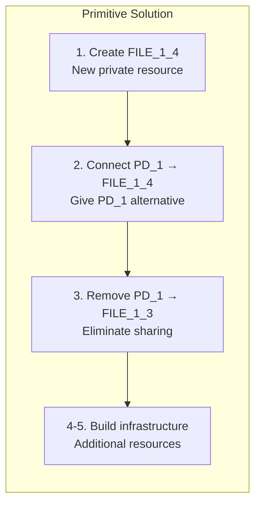
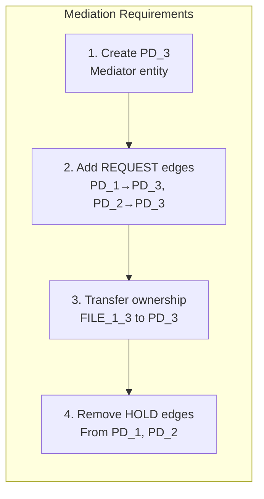
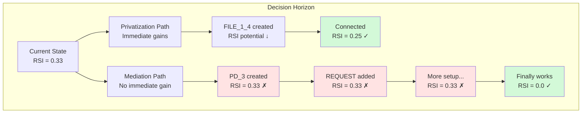

# Analysis: Why Primitives Cannot Discover the Mediation Pattern

## The Fundamental Discovery Gap

The mediator_test_primitive scenario reveals a critical limitation: **primitives cannot discover the mediation pattern** even with the same starting conditions and goals. Instead, they default to privatization - a simpler but fundamentally different architectural approach.

## What Primitives Actually Did

### Solution Path Taken (Privatization)


**Result**: RSI = 0.0 (perfect isolation through separation)

### What Mediation Would Require


## Why Primitives Cannot Discover Mediation

### 1. Lack of Architectural Vision

**Primitives operate locally**, making decisions based on immediate graph improvements. They cannot "see" that creating a mediator PD now will enable a sophisticated access control pattern later.

```python
# Primitive thinking:
add_pd() → "This adds a node with no connections. Score: 0.0"

# What's needed:
add_pd() → "This enables future REQUEST-based architecture. Score: strategic"
```

### 2. REQUEST Edge Scoring Problem

Even with our intelligent scoring system, REQUEST edges appear less valuable than direct solutions:

```python
# Scoring comparison:
add_file_resource() → 0.9  # Immediate infrastructure benefit
add_request_edge() → 0.2   # No immediate RSI improvement
remove_hold_edge() → 1.0   # Direct RSI improvement

# Mediation requires low-scoring moves before high-scoring payoff
```

### 3. Sequence Coordination Limitations

While primitives learned build→connect→cleanup for privatization, mediation requires a more complex sequence:

**Privatization Sequence** (Discovered):
```
Build (resource) → Connect (HOLD) → Cleanup (remove share)
   ↑ High score      ↑ High score     ↑ Highest score
```

**Mediation Sequence** (Not Discoverable):
```
Build (PD) → Request (edges) → Transfer (ownership) → Cleanup (HOLD)
  ↑ No score   ↑ Low score      ↑ Medium score        ↑ High score
```

### 4. The Horizon Problem

Mediation requires **4-6 coordinated moves** before showing benefit. Our algorithm evaluates each move independently, creating a horizon problem:



### 5. Missing Architectural Primitives

The current primitives lack operations that make sense for mediation:

**What we have**:
- `add_pd()` - Generic PD creation
- `add_request_edge()` - Generic authority relationship

**What mediation needs**:
- `create_mediator_pd()` - Purpose-built mediator
- `transfer_resource_ownership()` - Atomic ownership change
- `establish_mediated_access()` - Combined REQUEST + ownership

## Theoretical Solutions

### 1. Extended Lookahead
```python
def evaluate_sequence(primitives_sequence, depth=6):
    """Evaluate sequences of primitives together"""
    future_state = simulate_sequence(current_graph, primitives_sequence)
    return score_state(future_state)
```

### 2. Architectural Templates
```python
ARCHITECTURAL_PATTERNS = {
    "mediation": [
        ("add_pd", {"type": "mediator"}),
        ("add_request_edge", {"from": "$pd1", "to": "$mediator"}),
        ("add_request_edge", {"from": "$pd2", "to": "$mediator"}),
        ("transfer_ownership", {"resource": "$shared", "to": "$mediator"})
    ]
}
```

### 3. Strategic Scoring
```python
def strategic_score(operation, context):
    if operation == "add_pd" and context.has_sharing_violation:
        # Recognize potential for mediation architecture
        return 0.7  # Higher than default 0.0
```

## Implications for Security Mechanism Discovery

### What This Reveals

1. **Architectural patterns require architectural thinking** - Local optimization cannot discover global architectural solutions

2. **Multi-step transitions encode irreducible complexity** - Some patterns cannot be decomposed into independently valuable primitives

3. **The value of domain expertise** - Expert-encoded patterns (like add_mediator) capture architectural knowledge that emergence alone cannot discover

### The Privatization Bias

Primitives consistently choose privatization over mediation because:
- **Immediate gratification**: Each step improves metrics
- **Simpler sequence**: 3 steps vs 6 steps  
- **Local optimality**: Best choice at each decision point

This creates a **fundamental discovery limitation** where sophisticated architectural patterns remain hidden behind locally suboptimal choices.

## Conclusion

The failure of primitives to discover mediation demonstrates that **not all security mechanisms can emerge from simple operations**. While privatization emerges naturally from local optimization, mediation requires:

1. **Architectural vision** - Understanding the end goal
2. **Strategic patience** - Making locally suboptimal moves
3. **Complex coordination** - 6+ operations in precise sequence
4. **Domain knowledge** - Recognizing the value of indirect access

This validates the hybrid approach of IsoSearch: **primitives for emergent discovery, multi-step transitions for architectural patterns**. Some security mechanisms must be encoded, not discovered.