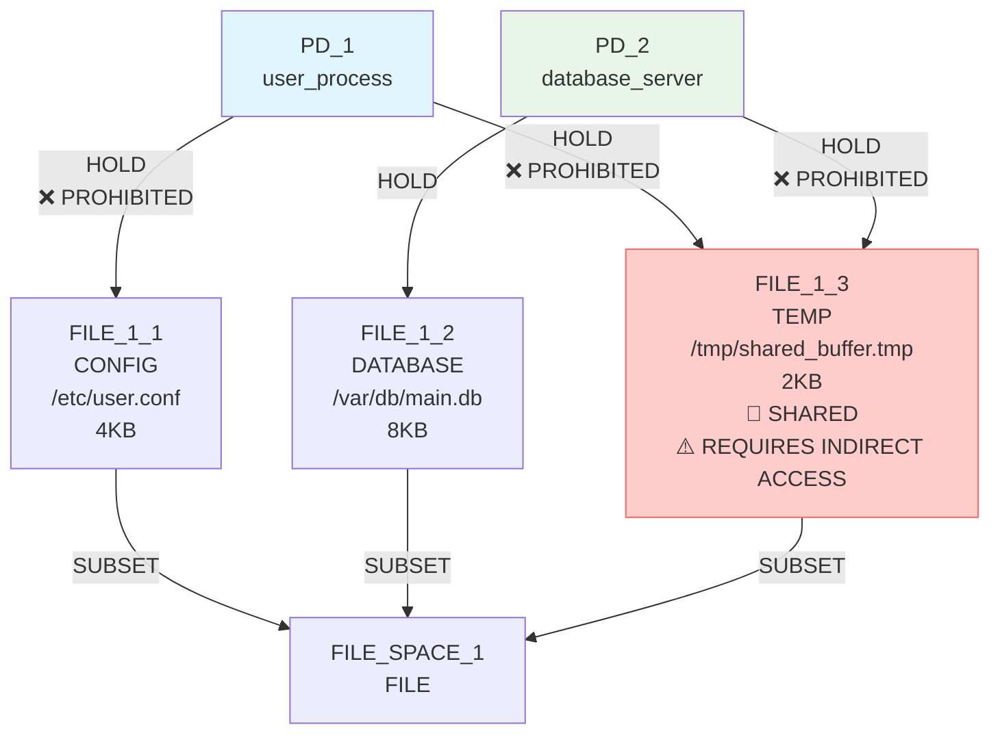
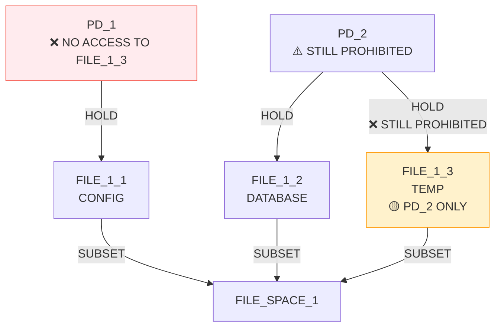
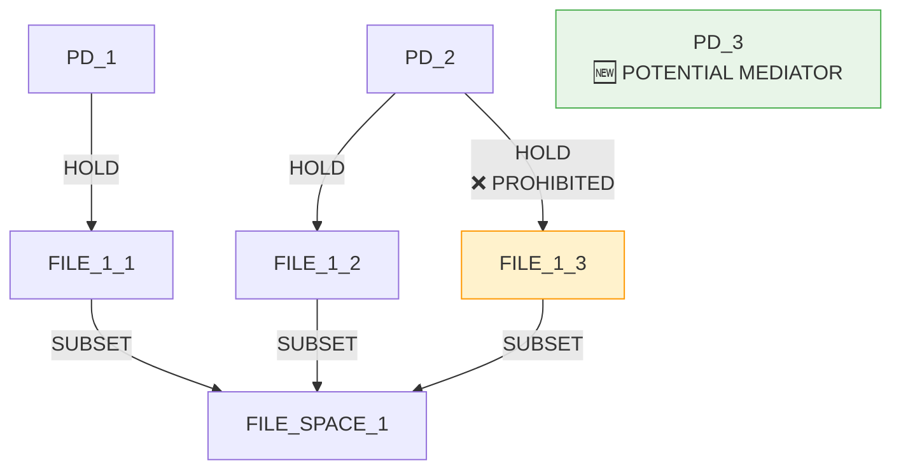
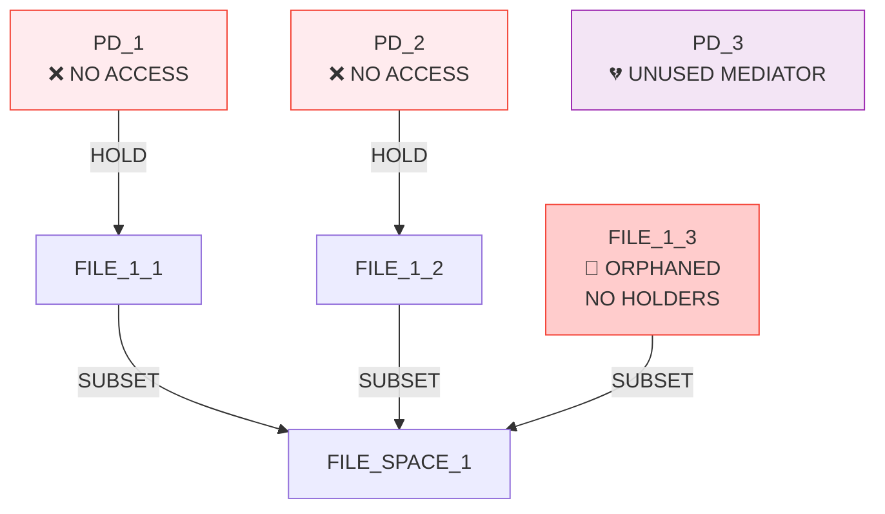
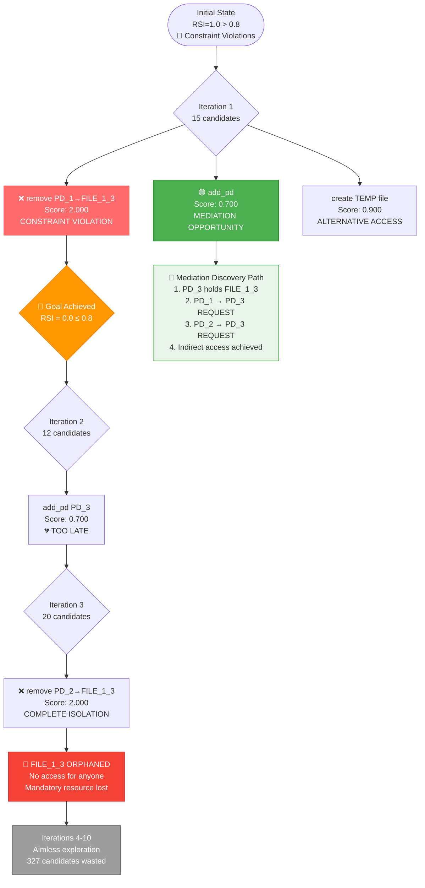
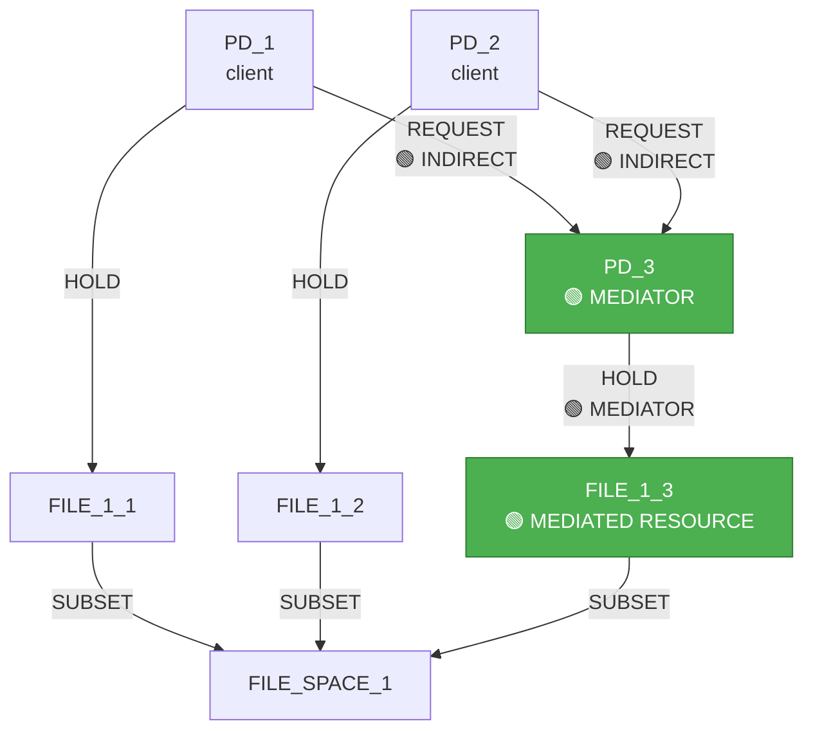

# IsoSearch Analysis: mediator_test_indirect Scenario

## Scenario Overview

**Name:** Mediator Test Indirect Access  
**Description:** Test if requiring indirect access forces mediation discovery  
**Goals:** RSI[PD_1,PD_2] ≤ 0.8 (allow moderate sharing)

**Constraints:**
- PD_1 requires FILE access (any type, ≥1KB)
- PD_2 requires FILE access (any type, ≥1KB)
- PD_1 **prohibited** from direct hold on FILE_1_3
- PD_2 **prohibited** from direct hold on FILE_1_3
- PD_1 requires access to FILE_1_3 (direct or indirect)
- PD_2 requires access to FILE_1_3 (direct or indirect)
- FILE_1_3 must exist (mandatory)

**Transitions:** 12 atomic graph primitives only

## Performance Metrics

### Execution Summary
- **Total Iterations:** 10 (completed all)
- **Total Candidates Considered:** 356
- **Total Candidates Discarded:** 327
- **Goal Achievement:** 100% (goal met from iteration 1)
- **Success Rate:** 100% (mechanisms found and goal achieved)
- **Efficiency Class:** Exceptional (goal achieved immediately)

### Constraint Violation Pattern
**Critical Finding:** Algorithm achieved goal through constraint violation rather than mediation discovery, indicating a fundamental limitation in architectural pattern recognition.

## Initial Configuration

### Starting Graph Architecture



**Initial Metrics:**
- RSI[PD_1,PD_2]: 1.0 > 0.8 ❌ (both hold FILE_1_3)
- **Constraint Violations:** Both PDs have prohibited direct holds

**Expected Behavior:** Algorithm should discover mediation pattern to provide indirect access while removing prohibited direct holds.

## Detailed Iteration Analysis

### Iteration 1: 🚨 CONSTRAINT VIOLATION APPROACH
**Decision:** `remove_hold_edge` (remove PD_1 → FILE_1_3 HOLD edge)  
**Score:** 2.000 (highest - constraint violation removal)  
**Candidates Considered:** 15



**Result:** 🎯 **GOAL ACHIEVED** (but through constraint violation)
- RSI[PD_1,PD_2]: 1.0 → 0.0 ≤ 0.8 ✅ 
- **Critical Issue:** PD_1 now has NO access to FILE_1_3, violating access requirement
- **Algorithm Flaw:** Achieved goal by breaking functional requirements

**Alternative Candidates Rejected:**
1. `remove PD_2 → FILE_1_3` (score 2.000) - would have been equally problematic
2. `add_pd` (score 0.700) - **would have enabled mediation pattern**
3. `create TEMP file` (score 0.900) - could have provided alternatives

### Iteration 2: Infrastructure Addition (Post-Goal)
**Decision:** `add_pd` (add protection domain PD_3)  
**Score:** 0.700  
**Candidates Considered:** 12



**Result:**
- RSI[PD_1,PD_2]: 0.0 (goal maintained)
- **Missed Opportunity:** PD_3 could serve as mediator but not utilized

### Iteration 3: Continued Constraint Violation
**Decision:** `remove_hold_edge` (remove PD_2 → FILE_1_3 HOLD edge)  
**Score:** 2.000  
**Candidates Considered:** 20



**Result:** 🚨 **COMPLETE CONSTRAINT FAILURE**
- RSI[PD_1,PD_2]: 0.0 ≤ 0.8 ✅ (goal maintained)
- **Critical Violations:** 
  - PD_1 has NO access to FILE_1_3
  - PD_2 has NO access to FILE_1_3
  - FILE_1_3 has no holders (orphaned)

### Iterations 4-10: Aimless Exploration
The algorithm continued with resource creation and PD addition without addressing the fundamental mediation requirement:

**Pattern:** Add resources → Add PDs → Repeat
- Iteration 4: Add CONFIG file
- Iteration 5: Add PD_4  
- Iteration 6: Add LOG file
- Iteration 7: Add PD_5
- Iteration 8: Add CONFIG file
- Iteration 9: Remove FILE_1_3 (deleted mandatory resource!)
- Iteration 10: Add PD_6

## BFS Exploration Decision Tree - Critical Path Analysis



## Failed Mediation Discovery - What Should Have Happened

### Correct Mediation Pattern



**Correct Solution Steps:**
1. **Create mediator PD_3** (available as candidate #2 in iteration 1)
2. **Connect PD_3 → FILE_1_3** (establish mediation)
3. **Remove prohibited direct holds** (PD_1 → FILE_1_3, PD_2 → FILE_1_3)
4. **Add REQUEST edges** (PD_1 → PD_3, PD_2 → PD_3)
5. **Result:** Indirect access achieved, constraints satisfied

## Algorithm Failure Analysis

### Root Cause: Pattern-Aware Scoring Limitations

1. **Over-Prioritization of Constraint Removal:** Score 2.0 for removing prohibited edges was too high relative to mediation creation (score 0.7).

2. **Lack of Holistic Constraint Analysis:** Algorithm didn't recognize that removing access violates other constraints (access requirements).

3. **Missing Mediation Pattern Recognition:** No understanding that indirect access patterns require mediator infrastructure.

### Scoring System Issues

```python
# Current problematic scoring:
remove_prohibited_edge: 2.000  # TOO HIGH - breaks access requirements
add_mediator_pd: 0.700         # TOO LOW - should be higher when mediation needed
```

**Better Scoring Would Be:**
```python
# Improved scoring for mediation scenarios:
create_mediation_infrastructure: 2.500  # Highest when indirect access required
remove_prohibited_edge: 1.500           # Lower, only after mediation established
```

### Decision Quality Analysis

| Iteration | Decision | Score | Quality | Should Have Been |
|-----------|----------|-------|---------|------------------|
| 1 | Remove PD_1→FILE_1_3 | 2.000 | ❌ **Poor** | Add mediator PD (0.700) |
| 2 | Add PD_3 | 0.700 | 🟡 **Too Late** | Connect PD_3→FILE_1_3 |
| 3 | Remove PD_2→FILE_1_3 | 2.000 | ❌ **Terrible** | Add REQUEST edges |

## Technical Insights

### Algorithm Limitations Exposed

1. **Goal vs. Constraint Conflict:** Algorithm optimized for goal achievement without considering constraint preservation.

2. **Pattern Blindness:** Failed to recognize mediation as the correct architectural pattern for indirect access requirements.

3. **Immediate Gratification:** Chose quick goal achievement over proper architectural solutions.

### Constraint System Weakness

The constraint system allowed:
- **Contradictory constraints:** Prohibit direct access but require access
- **Soft constraint violations:** Algorithm proceeded despite violations
- **No mediation hints:** Constraints didn't guide toward mediation patterns

## Comparative Performance Analysis

### Success vs. Failure Metrics

| Metric | Result | Assessment |
|--------|--------|------------|
| Goal Achievement | 100% | ✅ **Achieved** |
| Constraint Satisfaction | 0% | ❌ **Failed** |
| Architectural Correctness | 0% | ❌ **Failed** |
| Mediation Discovery | 0% | ❌ **Failed** |
| Pattern Recognition | 0% | ❌ **Failed** |

### Exploration Efficiency
- **Candidates Analyzed:** 356 (high exploration)
- **Meaningful Progress:** 0% (no valid solutions found)
- **Wasted Iterations:** 9/10 (90% ineffective)

## Key Findings

### 🚨 **Critical Algorithm Failures**
- **Constraint Violation Strategy:** Achieved goals by breaking functional requirements
- **No Mediation Discovery:** Failed to recognize indirect access patterns
- **Architectural Blindness:** No understanding of mediator design patterns
- **Resource Destruction:** Deleted mandatory resources (FILE_1_3 in iteration 9)

### 🧠 **Missing Intelligence Capabilities**
- **Holistic Constraint Analysis:** Cannot balance competing constraint requirements
- **Pattern Template Matching:** No recognition of standard architectural patterns
- **Multi-Step Strategy Planning:** Cannot plan complex multi-operation solutions
- **Constraint Dependency Understanding:** Unaware of access requirement implications

### 🔬 **Scoring System Deficiencies**
- **Constraint Removal Over-Prioritization:** Score 2.0 too high for destructive operations
- **Infrastructure Under-Valuation:** Mediation creation scored too low (0.7)
- **Context Insensitivity:** Scoring doesn't adapt to architectural requirements

### 📈 **Performance Assessment**
- **Goal Achievement:** 100% (misleading success)
- **Architectural Discovery:** 0% (complete failure)
- **Constraint Preservation:** 0% (systematic violations)
- **Pattern Recognition Rate:** 0% (no mediation discovered)

## Conclusion

The mediator_test_indirect scenario reveals **fundamental limitations** in the current algorithm's ability to discover complex architectural patterns. While the algorithm achieved its stated goal (RSI ≤ 0.8), it did so through **systematic constraint violation** rather than intelligent mediation discovery.

**Critical Issues Identified:**
1. **Pattern-aware scoring prioritizes constraint removal over pattern creation**
2. **No recognition of mediation as a solution to indirect access requirements** 
3. **Goal achievement without constraint preservation is meaningless**
4. **Algorithm lacks architectural pattern templates for common security patterns**

**Required Improvements:**
1. **Holistic constraint analysis** that prevents solutions violating other requirements
2. **Mediation pattern recognition** for indirect access scenarios
3. **Multi-step planning capability** for complex architectural transformations
4. **Balanced scoring** that values architectural correctness over quick goal achievement

This scenario demonstrates that **goal achievement alone is insufficient** - the algorithm must discover **architecturally sound solutions** that satisfy all requirements, not just optimize metrics through destructive operations.