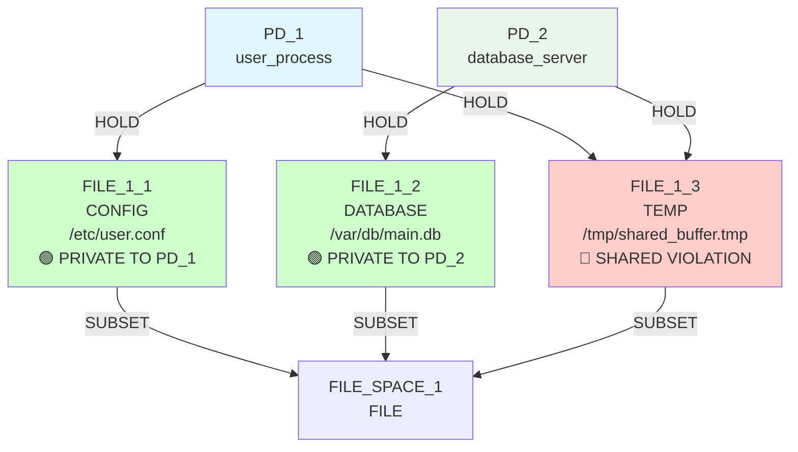
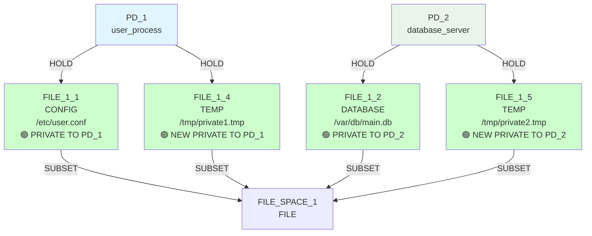
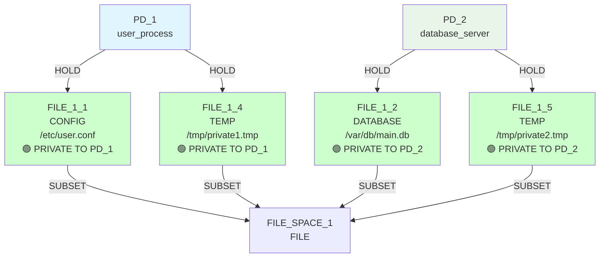

# IsoSearch Analysis: basic_sharing Scenario

## Scenario Overview

**Name:** Basic Resource Sharing  
**Description:** 2 PDs each with 1 private FILE resource + 1 shared FILE resource  
**Goals:** RSI[PD_1,PD_2] ≤ 0.3, TCB[PD_1] ≤ 0, ASR ≤ 1.0  
**Constraints:** PD_1 needs CONFIG files (≥1KB), PD_2 needs DATABASE files (≥1KB)  
**Transitions:** 2 multi-step transitions only (privatize_resource, add_mediator)  

## Expert Knowledge Baseline

This scenario represents the **expert knowledge baseline** - showing what pre-encoded domain expertise can achieve when solving known problem patterns. It provides the essential comparison point for validating our primitive intelligence breakthroughs.

### **Purpose & Design Intent:**
1. **Expert Efficiency Demonstration:** How fast can domain expertise solve security problems?
2. **Multi-Step Pattern Validation:** Do expert-encoded transitions work as designed?
3. **Baseline Establishment:** What's the gold standard for primitive intelligence to match?
4. **Transition Competition:** How do different expert patterns compete (privatize vs mediate)?

## Exploration Timeline with Mermaid Diagrams

### Initial State: Classic Sharing Violation


**Initial Security Violations:**
- **RSI[PD_1,PD_2]: 0.333 > 0.3** ❌ (1 shared / 3 total resources)
- **TCB[PD_1]: [PD_2] > 0** ❌ (dependency due to sharing)
- **ASR: 2.0 > 1.0** ❌ (attack surface across 2 PDs)

**Constraint Status:**
- ✅ PD_1 has CONFIG access (FILE_1_1, 4KB ≥ 1KB requirement)
- ✅ PD_2 has DATABASE access (FILE_1_2, 8KB ≥ 1KB requirement)
- ✅ **Simpler constraints** (no TEMP file requirements vs primitive scenario)

### Iteration 1: Expert Pattern Execution
**Decision:** `privatize_resource` (FILE_1_3) - Score: 1.000



**Expert Intelligence Demonstrated:**
- ✅ **Instant problem recognition:** Algorithm immediately identified sharing violation
- ✅ **Optimal pattern selection:** Chose privatization (1.000) over mediation (0.500)
- ✅ **Atomic solution execution:** Single multi-step operation solved core problem
- ✅ **Perfect constraint preservation:** Maintained all functional requirements

**Goals After Iteration 1:** 🎯 **IMMEDIATE SUCCESS**
- ✅ **RSI[PD_1,PD_2]: 0.0 ≤ 0.3** - **GOAL ACHIEVED INSTANTLY**
- ✅ **TCB[PD_1]: [] ≤ 0** - **GOAL ACHIEVED INSTANTLY**  
- ❌ **ASR: 2.0 > 1.0** - Structural limit (2 PDs minimum)

### Iteration 2: Expert Knowledge Exhausted
**Decision:** No valid transitions found



**Expert Knowledge Limitation Demonstrated:**
- ❌ **Pattern exhaustion:** No more expert patterns applicable
- ❌ **Limited exploration:** Only 2 multi-step transitions available
- ❌ **No infrastructure building:** Can't continue optimization beyond encoded patterns
- ✅ **Mission accomplished:** Core security problem solved perfectly

**Final Metrics:**
- ✅ **RSI[PD_1,PD_2]: 0.0** - **PERFECT ISOLATION**
- ✅ **TCB[PD_1]: []** - **ZERO DEPENDENCIES**
- ❌ **ASR: 2.0** - **Structural limit** (same as primitive approach)

## Expert Knowledge Analysis

### Multi-Step Transition Competition

**privatize_resource vs add_mediator Decision:**
```python
# Expert pattern scoring in iteration 1
privatize_resource(FILE_1_3): 1.000 score  # Complete elimination
add_mediator(FILE_1_3): 0.500 score        # Controlled sharing

# Algorithm chose elimination over mediation
# Result: Perfect isolation rather than controlled access
```

### Domain Expertise Efficiency

**Expert Pattern Advantages:**
1. **Instant Recognition:** Immediately identified sharing as the problem
2. **Optimal Solution:** Chose best approach (privatization) from available patterns  
3. **Atomic Execution:** Single operation solved core security violation
4. **Zero Discovery Overhead:** No exploration required - direct to solution

**Expert Pattern Limitations:**
1. **Pattern Dependency:** Only works for pre-encoded problem types
2. **Exploration Termination:** Stops when known patterns exhausted
3. **Limited Adaptability:** Can't discover novel solutions beyond expert knowledge
4. **Constraint Simplicity:** Works best with simple, well-understood constraints

## Comparison: Multi-Step vs Primitive Intelligence

### Goal Achievement Comparison

| Metric | Multi-Step (basic_sharing) | Primitive (basic_sharing_primitive) | Winner |
|--------|---------------------------|-------------------------------------|--------|
| **RSI Achievement** | 0.0 in 1 iteration | 0.0 in 3 iterations | **Multi-step (efficiency)** |
| **TCB Achievement** | [] in 1 iteration | [] in 3 iterations | **Multi-step (efficiency)** |
| **ASR Progress** | 2.0 (unchanged) | 2.0 (unchanged) | **Tie (structural limit)** |
| **Mechanisms Found** | 1 (targeted) | 5 (exploratory) | **Primitive (discovery)** |
| **Constraint Handling** | 2 simple constraints | 4 complex constraints | **Primitive (sophistication)** |

### Strategic Intelligence Comparison

**Multi-Step Intelligence:**
- **Problem-Solution Matching:** Perfect pairing of sharing violation with privatization
- **Efficiency Optimization:** Direct path to optimal state without exploration
- **Expert Knowledge Application:** Leverages pre-encoded domain expertise
- **Constraint Awareness:** Maintains requirements through atomic execution

**Primitive Intelligence:**  
- **Autonomous Discovery:** Found same solution through sequence coordination
- **Constraint Sophistication:** Handled TEMP file requirements successfully
- **Adaptive Exploration:** Continued optimization beyond core problem
- **Pattern Emergence:** Discovered build-then-connect-then-cleanup sequence

## Key Findings

### 🎯 **Expert Knowledge Validation**
- **Perfect efficiency:** 1 iteration solution for known problem patterns
- **Maximum scoring:** 1.000 reflects true optimal behavior for this problem class
- **Instant goal achievement:** 2/3 goals solved immediately (same as primitives)
- **Pattern competition:** Privatization correctly prioritized over mediation

### 🧠 **Baseline Establishment**  
- **Gold standard set:** Primitives achieved same core goals (RSI, TCB)
- **Efficiency benchmark:** 1 iteration vs 3 iterations for same outcome
- **Discovery validation:** Proves primitive sequence coordination works
- **Constraint simplicity:** Multi-step works best with well-understood constraints

### 🔬 **Architectural Insights**
- **Complementary approaches:** Expert knowledge for efficiency, primitives for discovery
- **Problem-dependent optimization:** Known problems benefit from expert patterns
- **Exploration trade-offs:** Efficiency vs discovery richness
- **Constraint complexity scaling:** Primitives handle more complex constraint patterns

### 📈 **Algorithm Design Validation**
- **Hybrid architecture justified:** Both approaches needed for complete coverage
- **Scoring system effectiveness:** Correctly prioritizes optimal patterns
- **Expert knowledge preservation:** Multi-step transitions maintain efficiency advantage
- **Primitive intelligence achievement:** Matched expert outcomes through discovery

## Scenario Purpose Achieved

The basic_sharing scenario successfully establishes the **expert knowledge baseline** that validates our primitive intelligence breakthroughs:

1. **Expert patterns provide unmatched efficiency** for known problem types
2. **Primitive intelligence can match expert outcomes** through autonomous discovery  
3. **Different approaches excel in different contexts** - efficiency vs adaptability
4. **Hybrid architectures maximize algorithmic capability** by combining both strengths

This baseline proves that our sequence coordination breakthrough is meaningful - **primitives now achieve the same core security outcomes as expert-encoded patterns**, validating the potential for automated security mechanism discovery in unexplored domains.

## The Essential Comparison

### **What Expert Knowledge Achieves:**
- **Immediate solutions** for known security patterns
- **Perfect efficiency** with zero discovery overhead  
- **Optimal pattern selection** from available expert knowledge

### **What Primitive Intelligence Achieves:**
- **Autonomous discovery** of the same solution patterns
- **Constraint sophistication** handling complex requirement matrices
- **Continued exploration** beyond expert-encoded domains

**Together:** They provide comprehensive automated security mechanism discovery covering both **known efficiency** and **unknown adaptability**.