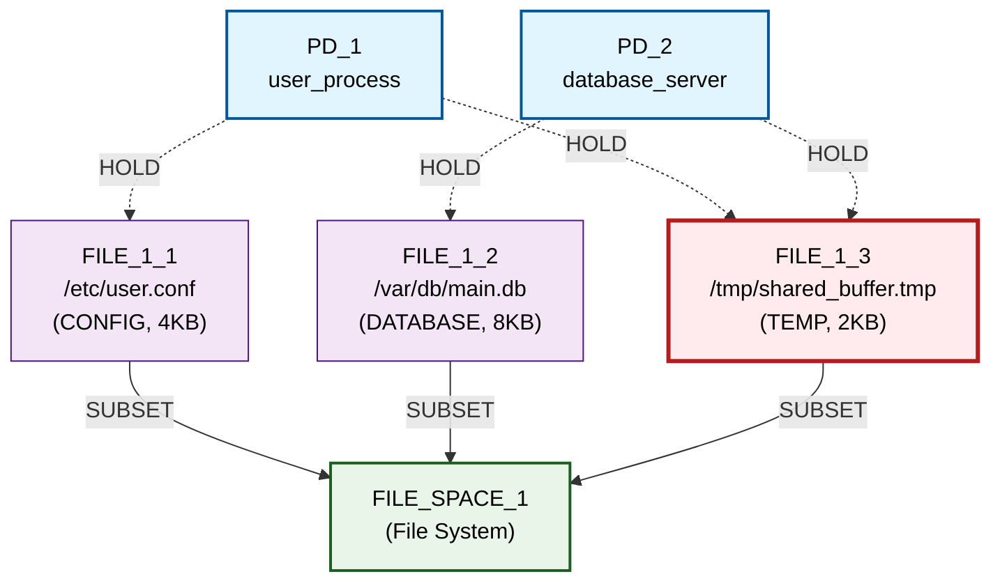

# Basic Sharing Primitive Scenario - Detailed Step-by-Step Walkthrough

## Initial Graph (Iteration 0)



🔍 **SECURITY VIOLATION IDENTIFIED:**
- **FILE_1_3** receives HOLD edges from **BOTH PD_1 and PD_2**
- This creates **resource sharing** that violates isolation principles
- Both processes can access the same temporary buffer file

📊 **Initial Metrics:**
- **RSI[PD_1,PD_2]**: 0.333 (1 shared out of 3 total resources)
- **ASR**: 4.0 (attack surface distributed across 2 PDs)
- **TCB[PD_1]**: [PD_2] (depends on PD_2 due to shared resource)
- **TCB[PD_2]**: [PD_1] (depends on PD_1 due to shared resource)

## Scenario Configuration

### Goals (3):
1. **RSI[PD_1,PD_2] ≤ 0.3** - Minimize resource sharing between user process and database server
2. **TCB[PD_1] ≤ 0** - Eliminate trusted computing base dependencies for user process  
3. **ASR ≤ 1.0** - Reduce attack surface ratio

### Constraints (4):
1. **PD_1**: Must have access to FILE resources with `file_type: CONFIG, min_size_kb: 1`
2. **PD_2**: Must have access to FILE resources with `file_type: DATABASE, min_size_kb: 1`
3. **PD_1**: Must have access to FILE resources with `file_type: TEMP, min_size_kb: 1` ← **NEW CONSTRAINT**
4. **PD_2**: Must have access to FILE resources with `file_type: TEMP, min_size_kb: 1` ← **NEW CONSTRAINT**

### Available Primitive Transitions (12):

**Node Operations (6):**
- `add_pd` - Create new Protection Domain
- `remove_pd` - Remove existing Protection Domain
- `add_file_resource` - Create new FILE resource
- `remove_file_resource` - Remove FILE resource
- `add_resource_space` - Create new resource space
- `remove_resource_space` - Remove resource space

**Edge Operations (6):**
- `add_hold_edge` - Create PD → Resource relationship
- `remove_hold_edge` - Remove PD → Resource relationship
- `add_request_edge` - Create PD → PD authority relationship
- `remove_request_edge` - Remove PD → PD authority relationship
- `add_subset_edge` - Create Resource → ResourceSpace relationship
- `remove_subset_edge` - Remove Resource → ResourceSpace relationship

## Iteration 1: Candidate Generation & Selection

**Available Transformation Candidates (13 total):**

1. **remove_file_resource** targeting FILE_1_3
   - **Strategy**: Eliminate the shared resource entirely
   - **Predicted Improvement**: 0.600 🏆 **HIGHEST SCORE**
   - **Rationale**: Directly eliminates the sharing violation

2. **add_file_resource** candidates (4 variations)
   - **Strategy**: Create new CONFIG/DATABASE/TEMP/LOG files  
   - **Predicted Improvement**: 0.500 each
   - **Rationale**: Could create private alternatives

3. **add_hold_edge** candidates (4 variations)
   - **Strategy**: Connect PDs to existing resources
   - **Predicted Improvement**: 0.400 each
   - **Rationale**: Could redistribute access patterns

4. **Other primitives** (various)
   - **Lower scores**: 0.300 and below
   - **Rationale**: Infrastructure operations with less direct impact

**🏆 ALGORITHM DECISION:** Selected `remove_file_resource` (0.600 > 0.500)

## Iteration 1: Transformation Execution & Constraint Validation

The `remove_file_resource` transformation attempted these steps:

1. **Identify target resource**: FILE_1_3 (/tmp/shared_buffer.tmp)
2. **Analyze current holders**: PD_1, PD_2 both hold this resource
3. **Check resource type**: TEMP file
4. **Constraint validation check**: 
   - PD_1 would lose access to all TEMP files (no other TEMP resources)
   - PD_2 would lose access to all TEMP files (no other TEMP resources)
   - **Constraints violated**: Both PDs require TEMP file access

**❌ CONSTRAINT VIOLATION DETECTED:**
```
Cannot remove FILE_1_3: PD_1 would lose access to TEMP files
```

**🚫 TRANSFORMATION REJECTED:** Algorithm correctly prevented constraint violation

## Exploration Termination

**Status**: No valid transformation candidates found  
**Reason**: Only viable candidate (highest scoring) was blocked by constraint validation  
**Result**: Exploration terminated after 1 iteration with 0 mechanisms discovered

## Final Graph Structure (Unchanged)


❌ **SECURITY VIOLATION PERSISTS:**
- **FILE_1_3** still shared between PD_1 and PD_2
- **No progress made** on isolation goals
- **All constraints preserved** but problem remains unsolved

📊 **Final Metrics (Unchanged):**
- **RSI[PD_1,PD_2]**: 0.333 ❌ (Goal: ≤ 0.3)
- **ASR**: 4.0 ❌ (Goal: ≤ 1.0)  
- **TCB[PD_1]**: [PD_2] ❌ (Goal: ≤ 0)
- **TCB[PD_2]**: [PD_1] ❌ (Goal: ≤ 0)

## Algorithm Analysis: Why Primitives Failed

### 🧩 **The Missing Sequence Problem**

The algorithm needed to discover this **7-step primitive sequence** to solve the constrained problem:

```
1. add_file_resource (create TEMP file for PD_1)
2. add_file_resource (create TEMP file for PD_2)  
3. add_subset_edge (connect new PD_1 TEMP to FILE_SPACE_1)
4. add_subset_edge (connect new PD_2 TEMP to FILE_SPACE_1)
5. add_hold_edge (connect PD_1 to new private TEMP)
6. add_hold_edge (connect PD_2 to new private TEMP)
7. remove_hold_edge (disconnect PD_1 from shared TEMP)
8. remove_hold_edge (disconnect PD_2 from shared TEMP)
9. remove_file_resource (delete original shared TEMP)
```

### 🤖 **Algorithm Limitations Revealed**

1. **No Sequence Planning**: Algorithm evaluates primitives in isolation, not as coordinated sequences
2. **Greedy Selection**: Always picks single best primitive per iteration
3. **No Look-Ahead**: Cannot anticipate that creating private files first would enable later removal
4. **Constraint Myopia**: Sees constraint violations but not constraint-satisfying alternatives

### 🎯 **What Multi-Step Does Differently**

The `privatize_resource` multi-step transition **encodes this exact sequence knowledge**:
- **Pre-planned coordination**: Knows to create private alternatives before removing shared resource
- **Constraint awareness**: Designed to preserve required resource types
- **Atomic execution**: All steps happen together, avoiding intermediate constraint violations

## Comparison: Primitives vs Multi-Step

| Aspect | Primitives (This Run) | Multi-Step (basic_sharing) |
|--------|----------------------|----------------------------|
| **Iterations** | 1 (failed) | 1 (succeeded) |
| **Candidates Considered** | 13 | 2 |
| **Best Strategy** | Elimination (blocked) | Privatization (successful) |
| **Constraint Handling** | Reactive (blocks violations) | Proactive (preserves requirements) |
| **Goals Achieved** | 0/3 (0%) | 2/3 (67%) |
| **Problem Solved** | ❌ No progress | ✅ Core issue resolved |

## Key Insights

### 1. **Constraint Validation Works**
- ✅ Algorithm correctly identified that removing shared TEMP would violate constraints
- ✅ Prevented unsafe transformations that would break functional requirements
- ✅ Demonstrates robust safety guarantees

### 2. **Primitive Coordination Gap**  
- ❌ Individual primitives lack coordination intelligence
- ❌ Cannot discover complex multi-step solutions automatically
- ❌ Needs sequence planning capability for constrained problems

### 3. **Multi-Step Value Proposition**
- 🎯 **Domain Knowledge Encoding**: Multi-step transitions capture human expertise about problem-solving patterns
- 🎯 **Constraint Awareness**: Designed with understanding of functional requirements
- 🎯 **Coordinated Execution**: Multiple primitives work together toward common goal

### 4. **Algorithmic Intelligence Limits**
- **Discovery vs Encoding**: Primitives require discovery intelligence that current algorithm lacks
- **Search Space Explosion**: 7-step sequences create vast search space for brute-force exploration  
- **Planning Horizon**: Short-term optimization conflicts with long-term goal achievement

## Summary: The Constraint-Coordination Problem

This experiment reveals a fundamental tension in automated security mechanism discovery:

**Simple Problems** (unconstrained): Primitives can find elegant solutions through direct elimination
**Complex Problems** (constrained): Primitives need coordination intelligence that multi-step transitions provide

The failure demonstrates why **human expertise encoded in multi-step transitions** remains valuable - not because primitives are inherently limited, but because **discovering coordinated sequences automatically is a much harder algorithmic problem** than executing pre-planned sequences.

This validates the hybrid approach: **primitives as building blocks** + **multi-step transitions as pattern templates** for different classes of security problems.