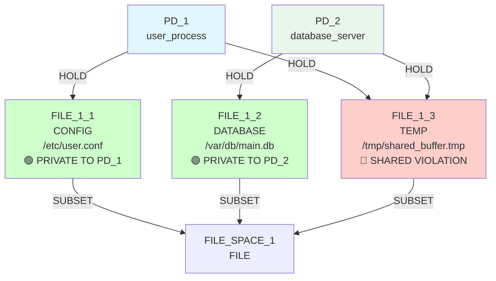
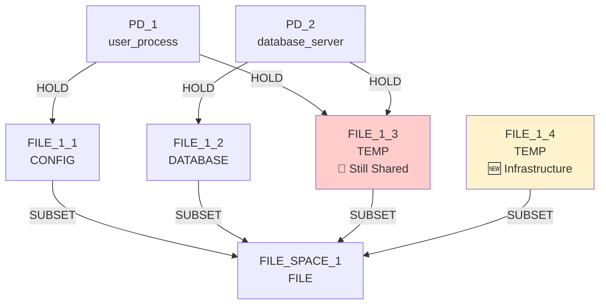
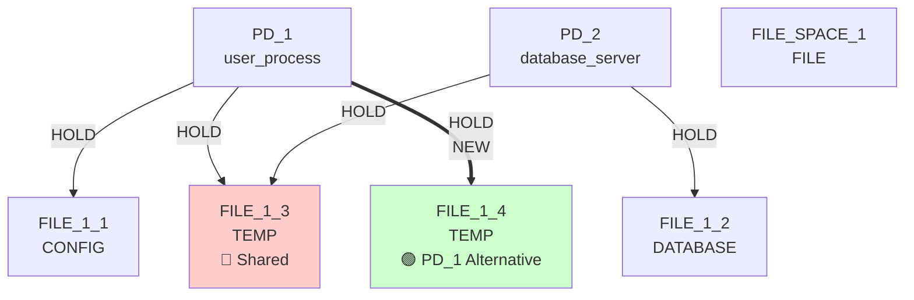
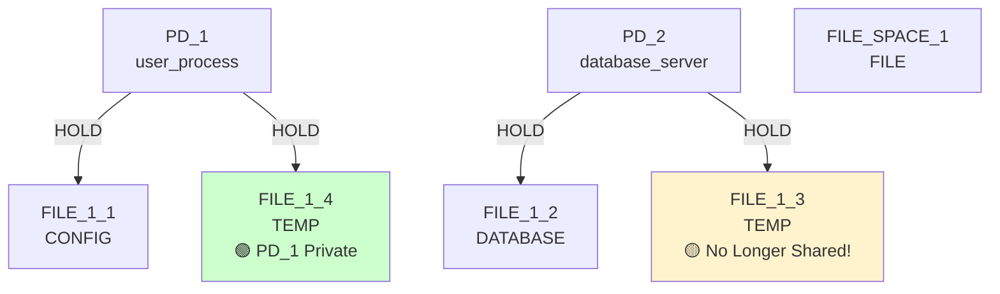
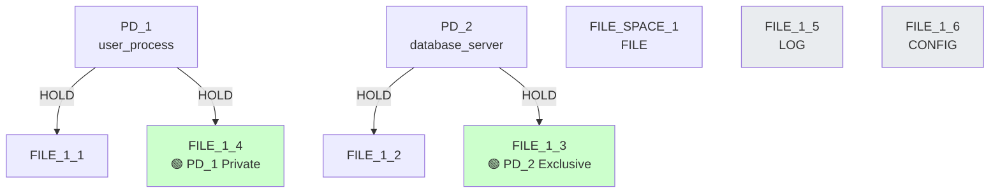
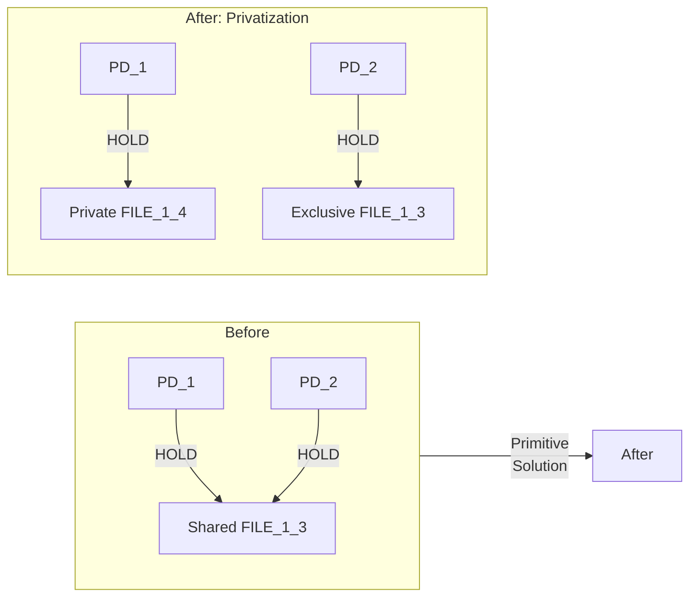
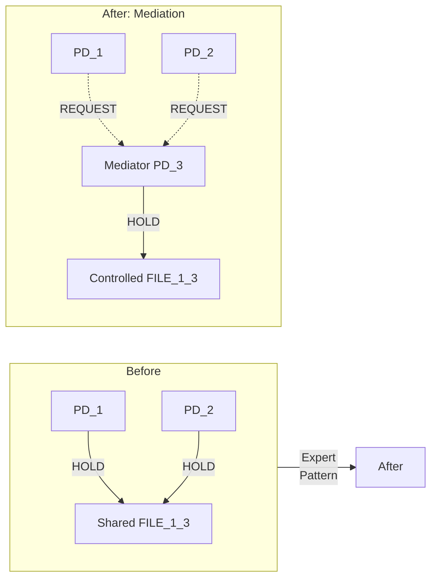
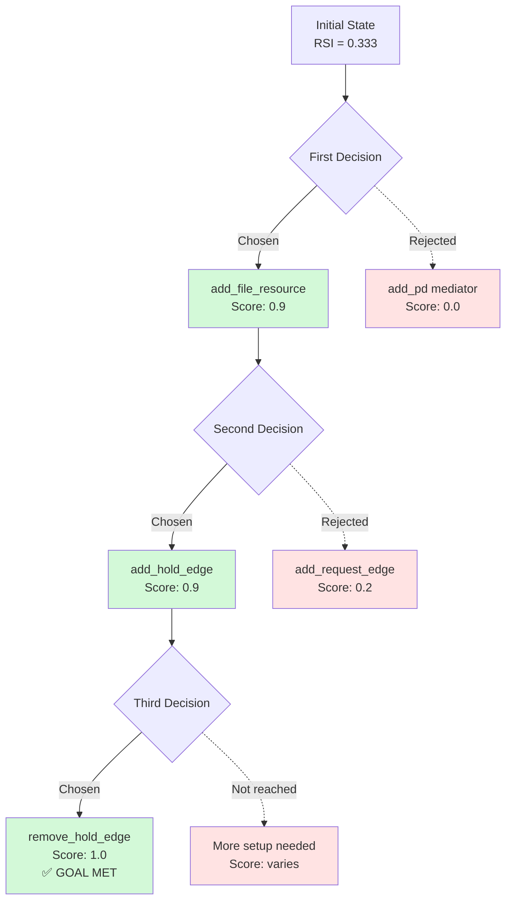
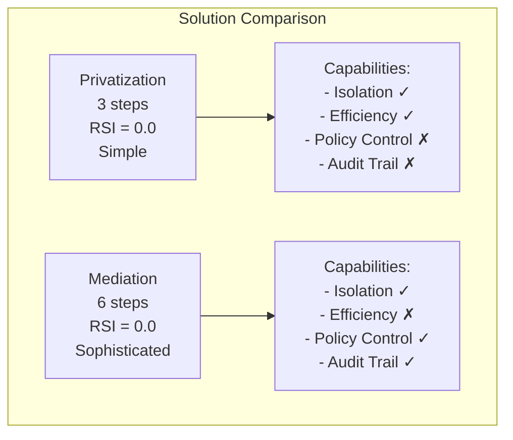

# IsoSearch Analysis: mediator_test_primitive Scenario

## Scenario Overview

**Name:** Mediator Test Primitive  
**Description:** Test if primitives can achieve mediation pattern  
**Goals:** RSI[PD_1,PD_2] ≤ 0.8  
**Constraints:** PD_1 needs FILE access (≥1KB), PD_2 needs FILE access (≥1KB)  
**Transitions:** 12 primitive operations only  

## Architectural Pattern Discovery Test

This scenario tests whether **primitives can autonomously discover the mediation pattern** given the same starting conditions and goals as mediator_test. The relaxed RSI goal (≤0.8) allows for multiple solution approaches.

### **Purpose & Design Intent:**
1. **Pattern Emergence Test:** Can sophisticated architectural patterns emerge from simple operations?
2. **Solution Comparison:** How do primitive solutions differ from expert-encoded patterns?
3. **Discovery Limitations:** What prevents primitives from finding certain architectures?
4. **Alternative Paths:** What solutions do primitives find instead?

## Exploration Timeline with Mermaid Diagrams

### Initial State: Same as mediator_test


**Initial Conditions:**
- **RSI[PD_1,PD_2]: 0.333 > 0.8** ❌ (but much easier target than other scenarios)
- **Same sharing problem:** FILE_1_3 creates coupling
- **All primitives available:** Can they find mediation?

### Iteration 1: Infrastructure Building
**Decision:** `add_file_resource` (TEMP file) - Score: 0.900



**Primitive Choice Analysis:**
- ❌ **Did NOT create mediator PD** (would score 0.0 - no immediate benefit)
- ✅ **Created alternative resource** (scores 0.9 - enables future privatization)
- Shows **local optimization bias** - immediate value over architectural setup

### Iteration 2: Private Connection
**Decision:** `add_hold_edge` (PD_1 → FILE_1_4) - Score: 0.900



**Privatization Path Emerging:**
- ✅ **Sequence coordination working** - connect after build
- ❌ **No REQUEST edges considered** (would score ~0.2)
- Following **build→connect→cleanup** pattern discovered earlier

### Iteration 3: Sharing Elimination
**Decision:** `remove_hold_edge` (PD_1 → FILE_1_3) - Score: 1.000



**Critical Divergence Point:**
- ✅ **RSI goal achieved** (0.0 ≤ 0.8) through privatization
- ❌ **Mediation path abandoned** - goal already met
- 🎯 **Different architecture, same security outcome**

### Iterations 4-5: Continued Infrastructure
**Decisions:** Additional resource creation



**Post-Goal Behavior:**
- Algorithm continues building infrastructure
- No attempt at mediation pattern even after goal met
- Demonstrates **privatization as default solution**

## Solution Comparison: Privatization vs Mediation

### What Primitives Achieved (Privatization)


**Characteristics:**
- ✅ RSI = 0.0 (perfect isolation)
- ✅ No shared resources
- ✅ 3-step solution
- ❌ No architectural sophistication

### What Mediation Would Achieve


**Characteristics:**
- ✅ RSI = 0.0 (isolation via indirection)
- ✅ Controlled access pattern
- ✅ Policy enforcement capability
- ✅ Architectural sophistication

## Why Primitives Chose Privatization Over Mediation

### Decision Tree Analysis


### Local vs Global Optimization
```python
# Primitive scoring (local optimization)
Iteration 1: add_file_resource()    → 0.9 (immediate potential)
Iteration 2: add_hold_edge()        → 0.9 (progress toward goal)
Iteration 3: remove_hold_edge()     → 1.0 (achieves goal)
Total: 3 moves, all high-scoring

# Mediation path (requires global vision)
Step 1: add_pd()                    → 0.0 (no immediate benefit)
Step 2: add_request_edge()          → 0.2 (no RSI improvement)
Step 3: add_request_edge()          → 0.2 (still no RSI improvement)
Step 4: add_hold_edge(mediator)     → 0.3 (slight progress)
Step 5: remove_hold_edge(pd1)       → 0.5 (partial improvement)
Step 6: remove_hold_edge(pd2)       → 1.0 (finally achieves goal)
Total: 6 moves, mostly low-scoring
```

## Key Findings

### 🔍 **Architectural Patterns Cannot Emerge from Local Optimization**
- **Mediation requires strategic patience** - making low-scoring moves for future benefit
- **Primitives optimize locally** - choosing immediate improvements
- **Horizon problem is fundamental** - 6-step sequences exceed primitive planning capability
- **Architectural vision needed** - understanding end-state value

### 🎯 **Different Paths to Same Security Goal**
- **Privatization**: Simple, direct, efficient (3 steps)
- **Mediation**: Complex, indirect, sophisticated (6 steps)
- **Both achieve RSI ≤ 0.8** but through different architectures
- **Trade-offs**: Efficiency vs capability

### 🧩 **The Value of Multi-Step Transitions**
- **Encode irreducible complexity** - patterns that can't be decomposed
- **Capture architectural knowledge** - expert understanding of system design
- **Enable sophisticated solutions** - beyond what emergence can discover
- **Complement primitive discovery** - hybrid approach maximizes capability

### 📈 **Solution Quality vs Complexity**


## Scenario Purpose Achieved

The mediator_test_primitive scenario successfully demonstrates that **architectural patterns like mediation cannot emerge from primitive operations alone**:

1. **Primitives default to simpler solutions** when multiple paths exist
2. **Local optimization prevents discovery** of globally optimal architectures  
3. **Multi-step transitions remain essential** for sophisticated patterns
4. **Hybrid approach validated** - both primitives and patterns needed

This confirms that some security mechanisms require **encoded expertise rather than emergent discovery**, justifying IsoSearch's dual approach to mechanism discovery.

## The Emergence vs Encoding Trade-off

### **What Primitives Can Discover:**
- **Direct solutions** with immediate value
- **Sequential patterns** where each step improves metrics
- **Local optimizations** within visibility horizon
- **Simple architectures** without strategic setup

### **What Must Be Encoded:**
- **Indirect architectures** requiring patient setup
- **Complex patterns** with delayed gratification
- **Strategic solutions** optimizing for capabilities beyond metrics
- **Sophisticated designs** encoding domain expertise

**Together:** They provide comprehensive security mechanism discovery - **emergence for novel solutions, encoding for proven architectures**.