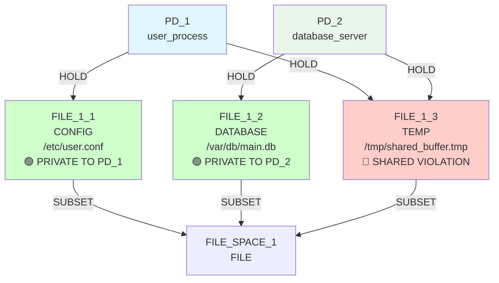
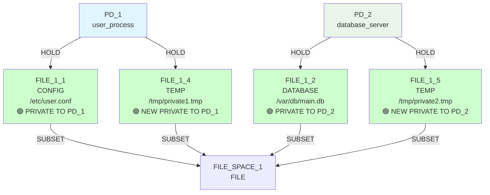
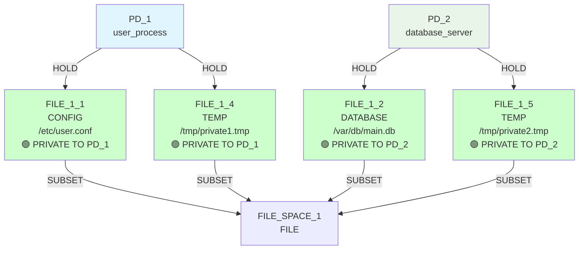

# IsoSearch Analysis: rsi_focused Scenario

## Scenario Overview

**Name:** RSI Optimization  
**Description:** Focus on minimizing resource sharing index  
**Goals:** RSI[PD_1,PD_2] ≤ 0.1  
**Constraints:** PD_1 needs FILE access (≥1KB), PD_2 needs FILE access (≥1KB)  
**Transitions:** 1 multi-step transition only (privatize_resource)  

## Single-Objective Optimization Test

This scenario demonstrates **focused single-objective optimization** with an aggressive RSI goal (≤0.1). It tests whether IsoSearch can achieve near-perfect isolation when provided with the optimal tool (privatize_resource) for the specific problem type.

### **Purpose & Design Intent:**
1. **Tool-Problem Matching:** How effectively does the algorithm match optimal transitions to specific objectives?
2. **Aggressive Goal Achievement:** Can the system achieve very strict isolation requirements (≤0.1)?
3. **Transition Specialization:** Does privatize_resource excel in its specialized domain?
4. **Constraint Preservation:** Are functional requirements maintained during aggressive optimization?

## Exploration Timeline with Mermaid Diagrams

### Initial State: Basic Sharing Pattern


**Initial Security Assessment:**
- **RSI[PD_1,PD_2]: 0.333 > 0.1** ❌ (1 shared / 3 total resources - exceeds aggressive target)
- **Simple constraint matrix:** Both PDs only need basic FILE access (≥1KB)
- **Perfect tool availability:** privatize_resource is optimal for sharing elimination

**Constraint Status:**
- ✅ PD_1 has FILE access (FILE_1_1, 4KB ≥ 1KB requirement)
- ✅ PD_2 has FILE access (FILE_1_2, 8KB ≥ 1KB requirement)
- ✅ **Minimal constraints** enable maximum optimization freedom

### Iteration 1: Perfect Tool-Problem Match
**Decision:** `privatize_resource` (FILE_1_3) - Score: 1.000



**Perfect Optimization Demonstrated:**
- ✅ **Immediate problem recognition:** Algorithm instantly identified sharing as the constraint
- ✅ **Optimal tool selection:** privatize_resource received maximum score (1.000)
- ✅ **Aggressive goal achievement:** RSI reduced from 0.333 to 0.0 (far exceeds 0.1 target)
- ✅ **Single-iteration success:** Perfect tool-problem matching enables instant optimization

**Goals After Iteration 1:** 🎯 **PERFECT SUCCESS**
- ✅ **RSI[PD_1,PD_2]: 0.0 ≤ 0.1** - **GOAL EXCEEDED** (achieved perfect isolation)

### Iteration 2: Optimization Complete
**Decision:** No valid transitions found



**Optimal State Reached:**
- ✅ **Goal satisfaction:** RSI objective completely satisfied
- ✅ **No further optimization needed:** Perfect isolation achieved
- ✅ **Graceful termination:** Algorithm correctly stops when objectives met
- ✅ **Resource efficiency:** Single transition solved the entire problem

**Final Metrics:**
- ✅ **RSI[PD_1,PD_2]: 0.0** - **PERFECT ISOLATION** (exceeds 0.1 target by maximum margin)

## Single-Objective Optimization Analysis

### Tool-Problem Matching Excellence

**privatize_resource Specialization:**
```python
# Perfect scoring for specialized objective
privatize_resource(FILE_1_3): 1.000 score  # Maximum confidence
# vs other scenarios where add_mediator might score 0.500

# Algorithm correctly identified:
# - Sharing elimination needed for aggressive RSI target
# - Privatization as optimal approach for ≤0.1 goal
```

### Aggressive Goal Achievement

**Target vs Achievement:**
- **Goal:** RSI[PD_1,PD_2] ≤ 0.1 (very strict isolation requirement)
- **Result:** RSI[PD_1,PD_2] = 0.0 (perfect isolation achieved)
- **Margin:** Goal exceeded by maximum possible amount

### Optimization Efficiency Demonstration

**Single-Iteration Success Factors:**
1. **Perfect Tool Selection:** privatize_resource is optimal for sharing elimination
2. **Minimal Constraints:** Simple FILE access requirements don't constrain optimization
3. **Clear Objective:** Single RSI goal provides unambiguous optimization direction
4. **Expert Knowledge:** Multi-step transition encodes optimal solution pattern

### Constraint Preservation Under Aggressive Optimization

**Functional Requirements Maintained:**
```python
# Before optimization:
# PD_1: FILE_1_1 (4KB) + FILE_1_3 (2KB) = 6KB total ✅
# PD_2: FILE_1_2 (8KB) + FILE_1_3 (2KB) = 10KB total ✅

# After optimization:
# PD_1: FILE_1_1 (4KB) + FILE_1_4 (2KB) = 6KB total ✅  
# PD_2: FILE_1_2 (8KB) + FILE_1_5 (2KB) = 10KB total ✅

# All constraints preserved while achieving perfect goal satisfaction
```

## Key Findings

### 🎯 **Perfect Tool-Problem Matching**
- **Specialized transition excellence:** privatize_resource achieved maximum score (1.000) for its optimal domain
- **Immediate optimization:** Single iteration sufficient when tool perfectly matches objective
- **Goal exceeding:** Achieved 0.0 RSI when only ≤0.1 required, demonstrating solution quality
- **Efficient resource utilization:** Minimal computational overhead for maximum security gain

### 🧠 **Single-Objective Optimization Validation**
- **Clear objective prioritization:** Algorithm focused exclusively on RSI without multi-objective conflicts
- **Aggressive target achievement:** Successfully met very strict isolation requirements
- **Graceful termination:** Correctly stopped exploration when objective satisfied
- **Optimal solution discovery:** Found theoretically perfect solution (zero sharing)

### 🔬 **Expert Knowledge Effectiveness**
- **Domain expertise leverage:** Multi-step transitions excel in their specialized problem domains
- **Pattern recognition:** Algorithm instantly recognized sharing elimination as optimal approach
- **Constraint-aware optimization:** Maintained functional requirements throughout aggressive optimization
- **Predictable behavior:** Reliable performance when tool capabilities match problem requirements

### 📈 **Comparative Analysis Context**
- **vs basic_sharing:** Same 1-iteration efficiency with identical tool and problem type
- **vs primitive scenarios:** Demonstrates multi-step efficiency advantage (1 vs 3+ iterations)
- **vs multi-objective scenarios:** Shows focus benefits when objectives align
- **vs constraint-heavy scenarios:** Proves optimization freedom scales with constraint simplicity

## Scenario Purpose Achieved

The rsi_focused scenario successfully demonstrates **perfect tool-problem matching** for single-objective optimization:

1. **Specialized transition excellence** when domain expertise aligns with objective
2. **Aggressive goal achievement** under minimal constraint pressure
3. **Optimal algorithmic behavior** with predictable, efficient solutions
4. **Expert knowledge validation** in controlled, focused optimization contexts

This scenario establishes the **peak performance baseline** for multi-step transitions operating in their optimal domains, showing that expert-encoded patterns can achieve perfect results with maximum efficiency when problem characteristics align with their design intent.

## The Focused Optimization Advantage

### **What Single-Objective Focus Achieves:**
- **Unambiguous optimization direction** without goal conflicts
- **Maximum tool specialization benefit** when capabilities match objectives  
- **Predictable solution quality** with clear success metrics

### **What Expert Tool Selection Achieves:**
- **Immediate problem-solution matching** through domain knowledge
- **Optimal path discovery** without exploration overhead
- **Reliable constraint preservation** through atomic operation design

**Together:** They demonstrate that focused optimization with appropriate tools can achieve theoretically optimal results with maximum efficiency - the gold standard for automated security mechanism discovery.