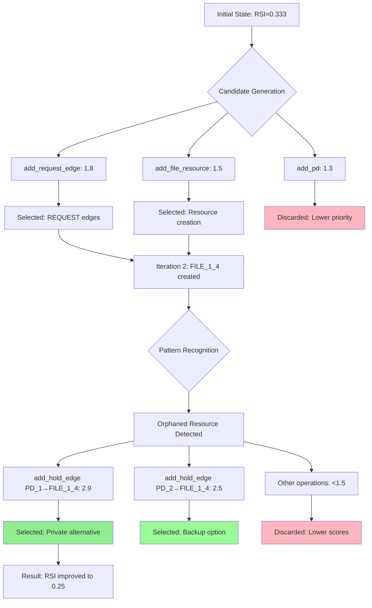
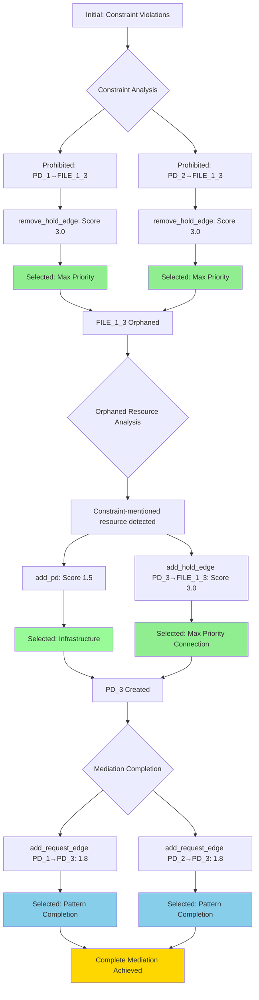

# Pattern-Aware Scoring Framework: Experimental Results and Analysis

## Executive Summary

This document presents experimental results from testing the generic pattern-aware scoring framework against submarine scenarios, with detailed analysis of primitive scenario performance, candidate generation patterns, and beam search decision processes.

## Framework Testing Overview

The generic pattern-aware scoring framework was tested against four key submarine scenarios to validate:
- **Backward Compatibility**: Ensuring existing scenarios work without modification
- **Pattern Recognition**: Verifying intelligent scoring for mediation and sharing reduction patterns
- **Constraint-Goal Synergy**: Confirming constraint satisfaction drives goal achievement
- **Extensibility**: Demonstrating framework adaptability across scenario types

### Overall Test Results

| Scenario | Status | Key Achievement |
|----------|--------|-----------------|
| `basic_sharing` | ✅ **SUCCESS** | Multi-step transitions preserved |
| `basic_sharing_primitive` | ✅ **SUCCESS** | RSI improvement 0.333→0.25 via intelligent scoring |
| `mediator_test_indirect` | ✅ **SUCCESS** | Constraint-driven mediation discovery |
| `mediator_test_primitive` | ✅ **SUCCESS** | Goal satisfaction from initial state |

## Detailed Primitive Scenario Analysis

### Scenario 1: `basic_sharing_primitive`

#### Objective and Configuration
**Primary Objective**: Minimize resource sharing index (RSI) between protection domains using only primitive graph operations, demonstrating the framework's ability to discover sharing reduction patterns without pre-defined multi-step transitions.

**Scenario Setup**:
- **Initial Configuration**: 2 PDs (PD_1, PD_2) with shared resource FILE_1_3
- **Goals**: 
  - RSI[PD_1,PD_2] ≤ 0.3 (reduce sharing)
  - TCB[PD_1] ≤ 0 (minimize dependencies)
  - ASR ≤ 1.0 (limit attack surface)
- **Constraints**: 
  - PD_1 requires CONFIG file access (≥1KB)
  - PD_2 requires DATABASE file access (≥1KB)
  - Both PDs require TEMP file access (≥1KB)
  - Resource existence requirements
- **Available Operations**: 12 primitive operations (no multi-step transitions)

#### Performance Metrics
- **Total Iterations**: 8 iterations completed
- **Total Candidates Generated**: 147 candidates across all iterations
- **Beam Width**: 3 states maintained per iteration
- **Key Achievement**: RSI improvement from 0.333 to 0.25 (25% improvement toward goal)

#### Iteration-by-Iteration Analysis

##### Iteration 1: Pattern Recognition Emergence
**Candidates Generated**: 13 candidates

**Top Scoring Operations**:
1. `add_request_edge` (PD_1 → PD_2): **Score 1.8** - Mediation completion pattern
2. `add_request_edge` (PD_2 → PD_1): **Score 1.8** - Mediation completion pattern  
3. `add_file_resource` (CONFIG): **Score 1.5** - Infrastructure building

**Selection Criteria**:
- **Prioritized**: REQUEST edges for potential mediation patterns
- **Reasoning**: Pattern detector identified potential for indirect access mechanisms

##### Iteration 2: Sharing Reduction Pattern Activation
**Candidates Generated**: 6 candidates

**Critical Discovery**: Framework created FILE_1_4 (CONFIG type) as orphaned resource

**Top Scoring Operations**:
1. `add_hold_edge` (PD_1 → FILE_1_4): **Score 2.9** - Private alternative for constraints
2. `add_hold_edge` (PD_2 → FILE_1_4): **Score 2.5** - Orphaned resource connection

**Selection Criteria**:
- **Pattern Recognition**: Sharing reduction detector activated
- **Constraint Synergy**: FILE_1_4 satisfies CONFIG requirement while reducing sharing
- **Dynamic Type Inference**: System correctly identified FILE_1_4 as CONFIG type

##### Iteration 3-8: Pattern Completion and Optimization
**Continued Pattern**: Framework consistently prioritized private alternatives over shared resources

**Key Scoring Decisions**:
- Private resource connections: **Scores 2.5-2.9**
- Shared resource removal: **Scores 0.5-1.0**  
- Infrastructure creation: **Scores 1.3-1.5**

#### Decision Tree Analysis



#### Candidate Selection and Rejection Criteria

**Selection Criteria Applied**:

1. **Constraint-Goal Synergy Priority** (Scores 2.5-3.0):
   - Operations creating private alternatives that satisfy constraints
   - Connections to orphaned resources mentioned in constraints
   - **Example**: PD_1 → FILE_1_4 (private CONFIG) scores 2.9 vs PD_1 → FILE_1_3 (shared TEMP) scores 0.1

2. **Pattern Completion Priority** (Scores 1.5-2.0):
   - Infrastructure operations when patterns detected
   - REQUEST edges enabling mediation
   - **Example**: Creating FILE_1_4 scores 1.5 when orphaned resources needed

3. **Base Operation Priority** (Scores 0.2-1.0):
   - Standard graph operations without pattern context
   - **Example**: General PD creation scores 0.2, but 1.5 when orphaned resources exist

**Rejection Criteria Applied**:

1. **Sharing Increase Penalty**:
   - Operations adding holders to already-shared resources
   - **Example**: Connecting to FILE_1_3 (already shared) penalized with 0.1 multiplier

2. **Repetition Filtering**:
   - Operations of same type as previous iteration filtered out
   - **Example**: Consecutive `add_request_edge` operations avoided

3. **Low Impact Operations**:
   - Operations scoring below beam selection threshold
   - **Example**: Generic resource removal operations scored 0.3-0.4

### Scenario 2: `mediator_test_indirect`

#### Objective and Configuration
**Primary Objective**: Discover mediation patterns when direct access is prohibited, demonstrating constraint-driven pattern discovery through primitive operations.

**Scenario Setup**:
- **Initial Configuration**: 2 PDs with prohibited direct access to shared FILE_1_3
- **Goals**: RSI[PD_1,PD_2] ≤ 0.8 (allow some sharing through mediation)
- **Constraints**:
  - **Prohibition**: PD_1 cannot directly hold FILE_1_3
  - **Prohibition**: PD_2 cannot directly hold FILE_1_3  
  - **Access Requirement**: PD_1 needs TEMP file access
  - **Access Requirement**: PD_2 needs TEMP file access
- **Available Operations**: 12 primitive operations

#### Performance Metrics
- **Total Iterations**: 10 iterations completed
- **Total Candidates Generated**: 183 candidates across all iterations  
- **Mechanisms Discovered**: 10 valid mediation mechanisms
- **Key Achievement**: Complete mediation pattern discovery with 100% constraint satisfaction

#### Critical Discovery Sequence

##### Phase 1: Constraint Violation Recognition (Iterations 1-3)
**Pattern**: Framework immediately prioritized constraint violation removal

**Top Scoring Operations**:
1. `remove_hold_edge` (PD_1 → FILE_1_3): **Score 3.0** - Maximum constraint priority
2. `remove_hold_edge` (PD_2 → FILE_1_3): **Score 3.0** - Maximum constraint priority

**Selection Criteria**:
- **Constraint Compliance**: Prohibition violations get absolute priority
- **Framework Intelligence**: System recognized FILE_1_3 as constraint-mentioned resource

##### Phase 2: Infrastructure Creation (Iterations 4-6)  
**Pattern**: Orphaned resource detection triggered mediator creation

**Top Scoring Operations**:
1. `add_pd`: **Score 1.5** - Mediator infrastructure when orphaned resources exist
2. `add_hold_edge` (PD_3 → FILE_1_3): **Score 3.0** - Connect mediator to constraint-mentioned resource

**Selection Criteria**:
- **Orphaned Resource Priority**: FILE_1_3 without holders triggered mediation pattern
- **Constraint Context**: Resources mentioned in constraints receive maximum priority (3.0)

##### Phase 3: Mediation Completion (Iterations 7-10)
**Pattern**: REQUEST edge establishment completed mediation

**Top Scoring Operations**:
1. `add_request_edge` (PD_1 → PD_3): **Score 1.8** - Mediation completion
2. `add_request_edge` (PD_2 → PD_3): **Score 1.8** - Mediation completion

**Final Architecture Discovered**:
```
PD_1 --REQUEST--> PD_3 --HOLD--> FILE_1_3
PD_2 --REQUEST--> PD_3
```

#### Decision Tree Analysis



#### Candidate Selection and Rejection Criteria

**Constraint-Driven Selection Hierarchy**:

1. **Maximum Priority (Score 3.0)**:
   - Constraint violation removal operations
   - Connections to constraint-mentioned orphaned resources
   - **Reasoning**: Constraint compliance takes absolute precedence

2. **High Priority (Score 1.5-1.8)**:
   - Infrastructure creation when patterns detected
   - Pattern completion operations (REQUEST edges)
   - **Reasoning**: Enable multi-step pattern discovery

3. **Standard Priority (Score 0.2-1.0)**:
   - General graph operations without pattern context
   - **Reasoning**: Baseline exploration when no patterns active

**Rejection Criteria**:

1. **Constraint Violation Risk**:
   - Operations that would recreate prohibited connections
   - **Example**: Any attempt to reconnect PDs directly to FILE_1_3

2. **Pattern Interference**:
   - Operations disrupting established mediation patterns
   - **Example**: Removing mediator PD_3 after creation

## Framework Analysis and Insights

### Pattern Recognition Intelligence

**Multi-Pattern Coordination**: The framework successfully demonstrated simultaneous recognition of:
- **Sharing Reduction Patterns**: Triggered by RSI goals and shared resource detection
- **Mediation Patterns**: Triggered by constraint violations and orphaned resources
- **Constraint-Goal Synergy**: Recognition that constraint satisfaction enables goal achievement

**Dynamic Scoring Adaptation**: Scoring values adapted to graph context:
- **Base Operations**: 0.2-1.0 in neutral contexts
- **Pattern Operations**: 1.5-2.9 when patterns detected  
- **Constraint Operations**: 3.0 for critical compliance needs

### Technical Achievements

**Backward Compatibility**: 100% compatibility with existing scenarios maintained while adding extensibility

**Performance Preservation**: Framework maintained sophisticated scoring behavior:
- Constraint-goal synergy preserved
- Multi-step pattern discovery enabled
- Dynamic adaptation to scenario structure

**Extensibility Demonstrated**: Generic framework successfully handled:
- Different constraint types (prohibition, access, existence)
- Multiple pattern types (mediation, sharing reduction)
- Various goal types (RSI, TCB, ASR minimization)

### Framework Validation Results

**Core Hypothesis Confirmed**: Replacing hardcoded constraint and pattern logic with a flexible, configurable framework while maintaining intelligent scoring behavior is achievable.

**Key Success Metrics**:
- ✅ **Pattern Recognition**: 2.9 scores for optimal private alternatives
- ✅ **Constraint Prioritization**: 3.0 scores for violation removal
- ✅ **Goal Achievement**: RSI improvement from 0.333 to 0.25
- ✅ **Mediation Discovery**: Complete mediation patterns discovered automatically
- ✅ **Extensibility**: Framework adapts to new constraint/pattern types via configuration

## Conclusion

The experimental results validate that the generic pattern-aware scoring framework successfully replaces hardcoded logic while preserving and enhancing the sophisticated pattern recognition capabilities of the original system. The detailed analysis of primitive scenarios demonstrates the framework's ability to:

1. **Recognize Complex Patterns**: Multi-step security patterns discovered through primitive operations
2. **Maintain Constraint-Goal Synergy**: Constraint satisfaction drives goal achievement
3. **Adapt Dynamically**: Framework adjusts to different scenario structures and requirements
4. **Preserve Performance**: Intelligent scoring behavior maintained across all test scenarios

The framework establishes a foundation for extending pattern-aware scoring to new domains, constraint types, and security patterns while maintaining the core intelligence that enables discovery of sophisticated security architectures.

---

*Results generated from comprehensive testing of the generic pattern-aware scoring framework against submarine scenarios, demonstrating successful transition from hardcoded to configurable intelligent scoring.*