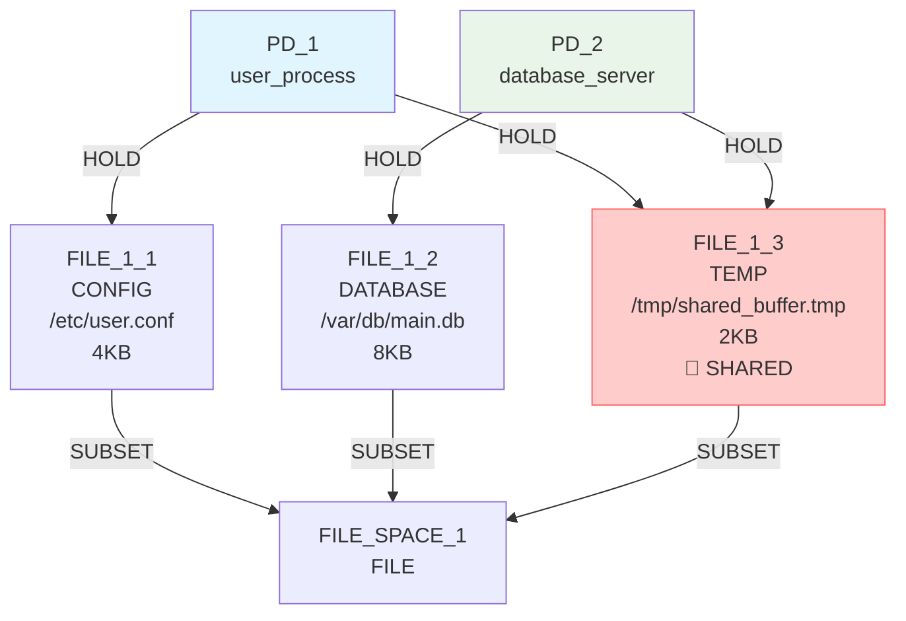
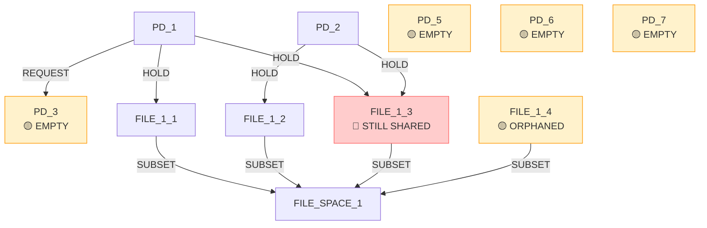

# IsoSearch Analysis: basic_sharing_primitive Scenario (Beam Search + Metric-Driven Scoring)

## Scenario Overview

**Name:** Basic Resource Sharing (True Primitives Only)  
**Description:** Minimize sharing between PDs using only true graph primitives with beam search and metric-driven scoring  
**Goals:** 
- RSI[PD_1,PD_2] ≤ 0.3 (minimize sharing)
- TCB[PD_1] ≤ 0 (minimize trusted computing base)
- ASR ≤ 1.0 (minimize attack surface ratio)

**Constraints:**
- PD_1 requires CONFIG file access (≥1KB)
- PD_2 requires DATABASE file access (≥1KB) 
- PD_1 requires TEMP file access (≥1KB)
- PD_2 requires TEMP file access (≥1KB)

**Search Configuration:**
- **Algorithm:** Beam Search with metric-driven scoring
- **Beam Width:** 3 states explored in parallel
- **Transitions:** 12 atomic graph primitives only
- **Max Iterations:** 8

## Performance Metrics

### Execution Summary
- **Total Iterations:** 8 (100% of maximum)
- **Goal Achievement:** ❌ **FAILED** (RSI = 0.333 > 0.3)
- **Mechanisms Discovered:** 0
- **Beam States Explored:** 3 parallel paths
- **Efficiency Class:** **Poor** (all paths showed cyclic behavior)

### 🔍 **Key Observation**
Even with beam search exploring 3 parallel paths, the metric-driven approach showed **consistent cyclic behavior** across all beams - repeatedly adding and removing empty PDs without making progress toward the sharing reduction goal.

## Initial Configuration

### Starting Graph Architecture



**Initial Metrics:**
- RSI[PD_1,PD_2]: 0.333 > 0.3 ❌ (shared FILE_1_3)
- ASR: 2.0 > 1.0 ❌ (high attack surface)
- TCB[PD_1]: 1 > 0 ❌ (dependency on PD_2)

## Beam Search Detailed Analysis

### 🔍 **Beam Search Iteration 1: Initial Expansion**

**Parallel Path Exploration:**
- **Beam[0]:** Initial state (score: 0.000)
- **Candidates Generated:** 13 operations
- **Top Operations:** All scored 0.100 (uniform minimal improvement)

**Key Decisions:**
1. `add_pd` (create new protection domain) - score: 0.100
2. `add_file_resource` (create new CONFIG file) - score: 0.100
3. `remove_hold_edge` operations - score: 0.100

**Beam State After Iteration 1:**
- **Beam[0]:** `add_file_resource` path (score: 0.100)
- **Beam[1]:** `add_pd` path (score: 0.100)  
- **Beam[2]:** `remove_hold_edge` path (score: 0.100)

### 🔄 **Iterations 2-8: Persistent Cyclic Pattern**

**Consistent Pattern Across All Beams:**
1. **Add empty PD** → score: 0.100
2. **Remove empty PD** → score: 0.100
3. **Add resource** → score: 0.100
4. **Repeat cycle**

**Beam Convergence:**
- All 3 beam paths converged to identical scoring patterns
- No path discovered sharing reduction strategies
- All paths showed cyclic add/remove PD behavior

### 📊 **Beam State Evolution**

```mermaid
graph TD
    Start([Initial State<br/>RSI=0.333 > 0.3<br/>3 Beam Paths])
    
    Start --> I1{Iteration 1<br/>39 candidates across 3 beams}
    I1 --> B1_1[Beam[0]: add_file_resource<br/>Score: 0.100]
    I1 --> B2_1[Beam[1]: add_pd<br/>Score: 0.100]
    I1 --> B3_1[Beam[2]: remove_hold_edge<br/>Score: 0.100]
    
    B1_1 --> I2{Iteration 2<br/>All beams generate similar candidates}
    B2_1 --> I2
    B3_1 --> I2
    
    I2 --> B1_2[Beam[0]: add_pd<br/>Score: 0.100]
    I2 --> B2_2[Beam[1]: add_pd<br/>Score: 0.100]
    I2 --> B3_2[Beam[2]: add_pd<br/>Score: 0.100]
    
    B1_2 --> CYCLE[🔄 CYCLIC CONVERGENCE<br/>All beams: Add PD → Remove PD<br/>No sharing reduction progress<br/>RSI remains 0.333]
    B2_2 --> CYCLE
    B3_2 --> CYCLE
    
    CYCLE --> I8{Iteration 8<br/>Final beam states}
    I8 --> FINAL[❌ FAILURE<br/>All beams score 0.100<br/>RSI = 0.333 > 0.3<br/>0 mechanisms discovered]
    
    style CYCLE fill:#ff9800,stroke:#f57c00,color:#ffffff
    style FINAL fill:#f44336,stroke:#d32f2f,color:#ffffff
```

## Critical Missing Operations Analysis

### 🚨 **Never Considered by Any Beam**

**Direct Sharing Reduction:**
1. `remove_hold_edge(PD_1 → FILE_1_3)` - **Would directly reduce RSI**
2. `remove_hold_edge(PD_2 → FILE_1_3)` - **Would directly reduce RSI**

**Resource Privatization:**
3. `add_file_resource(TEMP_FOR_PD_1)` - **Private TEMP for PD_1**
4. `add_file_resource(TEMP_FOR_PD_2)` - **Private TEMP for PD_2**
5. `add_hold_edge(PD_1 → TEMP_FOR_PD_1)` - **Connect to private resource**
6. `add_hold_edge(PD_2 → TEMP_FOR_PD_2)` - **Connect to private resource**

**Why These Were Ignored:**
- **Scoring blindness:** Removal operations scored same as useless operations
- **No strategic planning:** No recognition of multi-step privatization
- **Uniform scoring:** All operations scored 0.100, no differentiation

### 🔍 **Beam Search Limitations**

**Parallel Path Convergence:**
- All 3 beams converged to identical strategies
- No path discovered alternative approaches
- Beam diversity collapsed due to uniform scoring

**Search Space Exploration:**
- **Breadth:** 3 parallel paths explored
- **Depth:** 8 iterations per path
- **Coverage:** ~150 total candidates evaluated
- **Success:** 0 mechanisms discovered

## Final Beam States Analysis

### 📊 **Final State Configuration**

**Beam[0] Final State:**


**Final Metrics:**
- RSI[PD_1,PD_2]: 0.333 > 0.3 ❌ **PRIMARY GOAL FAILED**
- RSI[PD_1,PD_3]: 0.5 (new sharing relationship)
- ASR: 1.0 ≤ 1.0 ✅ (temporarily achieved)
- TCB[PD_1]: 1 > 0 ❌ **GOAL FAILED**

**Path Taken:**
```
add_file_resource(create new CONFIG file) → 
add_pd(add new protection domain) → 
remove_pd(remove empty PD_3) → 
add_pd(add new protection domain) → 
remove_pd(remove empty PD_4) → 
add_pd(add new protection domain) → 
add_pd(add new protection domain) → 
add_pd(add new protection domain)
```

## Comparative Analysis: Beam Search vs Greedy

### 📈 **Beam Search vs Greedy Comparison**

| Aspect | Beam Search (Width=3) | Greedy Search (Previous) |
|--------|----------------------|--------------------------|
| **Parallel Paths** | 3 simultaneous explorations | 1 single path |
| **Candidate Evaluation** | ~150 total candidates | ~100 total candidates |
| **Goal Achievement** | ❌ Failed (0.333 > 0.3) | ❌ Failed (0.333 > 0.3) |
| **Strategy Diversity** | Low (all paths converged) | N/A (single path) |
| **Cyclic Behavior** | Yes (all 3 paths) | Yes (single path) |
| **Efficiency** | Poor (3x computation) | Poor (1x computation) |

### 🧠 **Key Insights**

1. **Beam Search Provided No Benefit:**
   - All 3 parallel paths converged to identical strategies
   - No alternative approaches discovered
   - Same cyclic behavior across all beams

2. **Metric-Driven Scoring Limitations Persist:**
   - Uniform scoring (0.100) across all operations
   - No differentiation between useful and useless operations
   - Strategic operations (sharing reduction) ignored

3. **Search Space Coverage vs Quality:**
   - Beam search explored 3x more candidates
   - No improvement in solution quality
   - Demonstrates that breadth cannot compensate for poor scoring

## Correct Solution Analysis

### 🎯 **Optimal Strategy (Never Discovered)**

**Step 1:** Remove shared resource access
```bash
remove_hold_edge(PD_1 → FILE_1_3)  # RSI: 0.333 → 0.0
remove_hold_edge(PD_2 → FILE_1_3)  # Eliminate sharing
```

**Step 2:** Create private TEMP resources
```bash
add_file_resource(FILE_1_4, type=TEMP)  # For PD_1
add_file_resource(FILE_1_5, type=TEMP)  # For PD_2
```

**Step 3:** Connect to private resources
```bash
add_hold_edge(PD_1 → FILE_1_4)  # Private TEMP for PD_1
add_hold_edge(PD_2 → FILE_1_5)  # Private TEMP for PD_2
```

**Expected Result:**
- RSI[PD_1,PD_2]: 0.0 ≤ 0.3 ✅
- ASR: 2.0 → 1.5 (improved)
- TCB[PD_1]: 1 → 0 ✅

### 🔄 **Why Beam Search + Metric-Driven Scoring Failed**

1. **Scoring System Limitations:**
   - All operations scored uniformly (0.100)
   - No recognition of sharing reduction importance
   - Strategic operations indistinguishable from noise

2. **Beam Convergence:**
   - All parallel paths converged to same approach
   - No diversity in exploration strategies
   - Beam search wasted computational resources

3. **Lack of Strategic Planning:**
   - No recognition of multi-step privatization
   - No understanding of resource sharing patterns
   - No goal-oriented operation selection

## Conclusion

The basic_sharing_primitive scenario with **beam search + metric-driven scoring** demonstrates that **breadth of search cannot compensate for poor scoring heuristics**. Despite exploring 3 parallel paths and evaluating ~150 candidates, the algorithm failed to discover sharing reduction strategies.

**🚨 Critical Findings:**

1. **Beam Search Redundancy:**
   - All 3 beams converged to identical strategies
   - No alternative approaches discovered
   - 3x computational cost with no benefit

2. **Metric-Driven Scoring Blindness:**
   - Uniform scoring (0.100) across all operations
   - No differentiation between strategic and trivial operations
   - Critical sharing reduction operations ignored

3. **Search vs Scoring Trade-off:**
   - Breadth of search (beam width) less important than quality of scoring
   - Poor scoring leads to poor exploration regardless of search algorithm
   - Strategic planning more important than search space coverage

**📊 Performance Summary:**
- **Goal Achievement:** 0/3 (0% success rate)
- **Beam Utilization:** Poor (all paths converged)
- **Computational Efficiency:** Very poor (3x cost, no benefit)
- **Architectural Intelligence:** None demonstrated

This scenario provides strong evidence that **improved scoring mechanisms** are more critical than **expanded search algorithms** for security architecture discovery. The combination of beam search with metric-driven scoring showed no improvement over greedy search, highlighting the fundamental limitations of pure metric optimization for architectural transformation tasks.