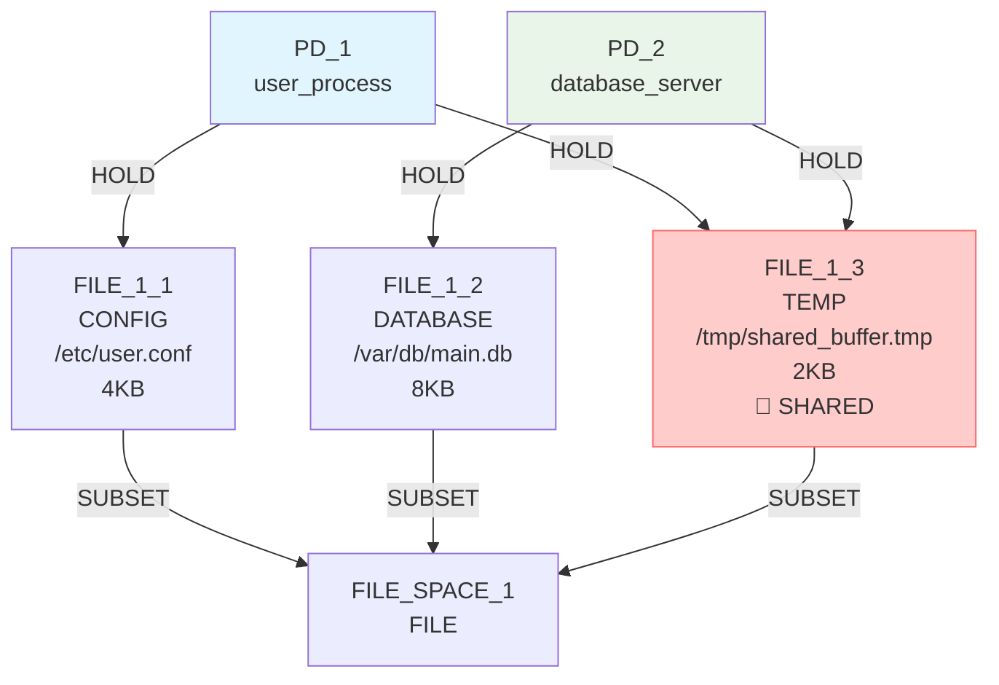
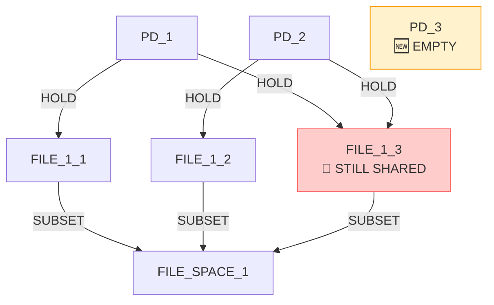
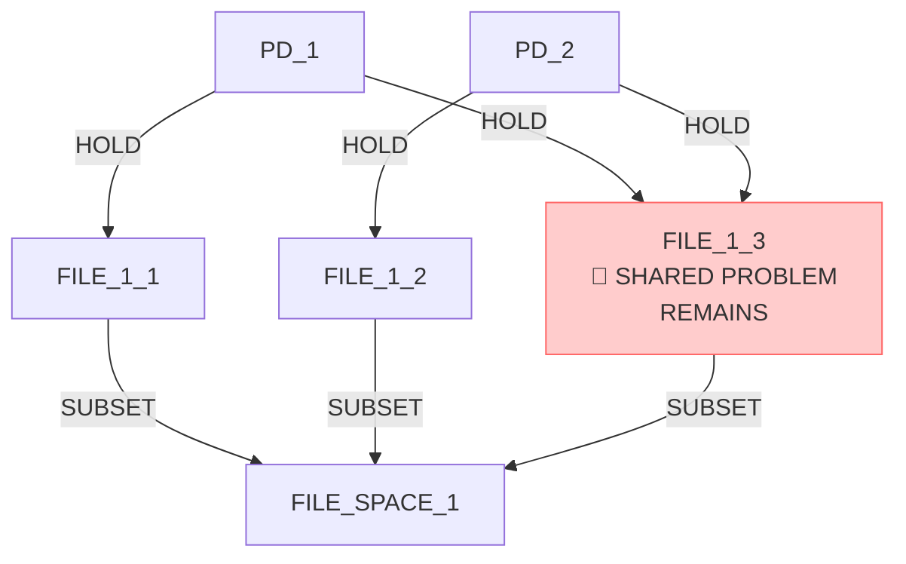
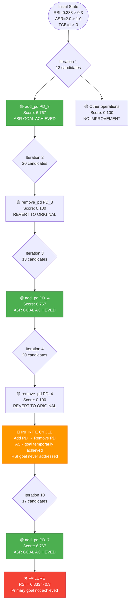
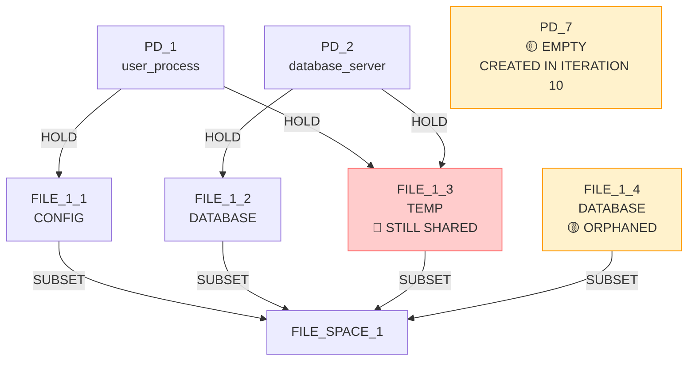

# IsoSearch Analysis: basic_sharing_primitive Scenario (Metric-Driven Scoring)

## Scenario Overview

**Name:** Basic Resource Sharing (True Primitives Only)  
**Description:** Minimize sharing between PDs using only true graph primitives with pure metric optimization  
**Goals:** 
- RSI[PD_1,PD_2] ≤ 0.3 (minimize sharing)
- TCB[PD_1] ≤ 0 (minimize trusted computing base)
- ASR ≤ 1.0 (minimize attack surface ratio)

**Constraints:**
- PD_1 requires CONFIG file access (≥1KB)
- PD_2 requires DATABASE file access (≥1KB) 
- PD_1 requires TEMP file access (≥1KB)
- PD_2 requires TEMP file access (≥1KB)

**Transitions:** 12 atomic graph primitives only

## Performance Metrics

### Execution Summary
- **Total Iterations:** 10 (100% of maximum)
- **Goal Achievement:** ❌ **FAILED** (RSI = 0.333 > 0.3)
- **Scoring Method:** Pure metric-driven optimization
- **Efficiency Class:** **Poor** (repeated ineffective operations)

### 🔍 **Key Observation**
The metric-driven approach showed **cyclic behavior** - repeatedly adding and removing empty PDs without making progress toward the sharing reduction goal.

## Initial Configuration

### Starting Graph Architecture



**Initial Metrics:**
- RSI[PD_1,PD_2]: 0.333 > 0.3 ❌ (shared FILE_1_3)
- ASR: 2.0 > 1.0 ❌ (high attack surface)
- TCB[PD_1]: 1 > 0 ❌ (dependency on PD_2)

## Detailed Iteration Analysis

### 🔄 **Iteration 1: PD Creation (Score: 6.767)**
**Decision:** `add_pd` (create PD_3)  
**Predicted Improvement:** 6.767 (🚀 **HIGHEST SCORE**)  
**Actual Result:** RSI unchanged, ASR improved (2.0 → 1.333)



**Metric Analysis:**
- RSI[PD_1,PD_2]: 0.333 (unchanged) ❌
- ASR: 2.0 → 1.333 ✅ (goal achieved)
- TCB[PD_1]: 1 → 1 ❌ (no change)

### 🔄 **Iteration 2: PD Removal (Score: 0.100)**
**Decision:** `remove_pd` (remove empty PD_3)  
**Predicted Improvement:** 0.100 (⚠️ **MINIMAL SCORE**)  
**Actual Result:** Reverted to original state



**Metric Analysis:**
- RSI[PD_1,PD_2]: 0.333 (unchanged) ❌
- ASR: 1.333 → 2.0 ❌ (goal lost)
- TCB[PD_1]: 1 → 1 ❌ (no change)

### 🔄 **Iterations 3-10: Cyclic Pattern**
**Pattern:** Alternating between:
1. **Add PD** (score: 6.767) → temporarily achieve ASR goal
2. **Remove PD** (score: 0.100) → revert to original state
3. **Add resource** (score: 0.100) → no metric improvement

**Key Iterations:**
- **Iteration 3:** Add PD_4 (score: 6.767)
- **Iteration 4:** Remove PD_4 (score: 0.100)
- **Iteration 5:** Add PD_5 (score: 6.767)
- **Iteration 6:** Remove PD_5 (score: 0.100)
- **Iteration 7:** Add FILE_1_4 (score: 0.100)
- **Iteration 8:** Add PD_6 (score: 6.767)
- **Iteration 9:** Remove PD_6 (score: 0.100)
- **Iteration 10:** Add PD_7 (score: 6.767)

## Exploration Decision Tree - Cyclic Behavior Analysis



## Metric-Driven Scoring Analysis

### 🔍 **Scoring Pattern Analysis**

**High-Score Operations (6.767):**
- `add_pd` operations consistently scored highest
- Reason: ASR improvement (2.0 → 1.333) provided large metric gain
- **Problem:** Temporary and reversible improvement

**Low-Score Operations (0.100):**
- `remove_pd` operations scored lowest
- `add_file_resource` operations scored lowest  
- Reason: No direct metric improvement detected

**Missing Operations:**
- `remove_hold_edge` on FILE_1_3 **NEVER SELECTED**
- This operation would directly address RSI goal
- **Critical Flaw:** Algorithm couldn't identify sharing reduction strategy

### 🚨 **Critical Algorithm Limitations**

1. **Myopic Optimization:**
   - Focused on easiest metric improvement (ASR)
   - Ignored primary goal (RSI reduction)
   - No understanding of sharing reduction strategies

2. **Cyclic Behavior:**
   - Repeated add/remove PD cycle
   - No learning from previous iterations
   - Inefficient exploration pattern

3. **Missing Strategic Operations:**
   - Never considered `remove_hold_edge PD_1 → FILE_1_3`
   - Never considered `remove_hold_edge PD_2 → FILE_1_3`
   - Never explored resource privatization

## Correct Solution Analysis

### 🎯 **Optimal Strategy (Not Discovered)**

**Step 1:** Remove shared resource access
```bash
remove_hold_edge(PD_1 → FILE_1_3)  # RSI: 0.333 → 0.0
```

**Step 2:** Create private TEMP resources
```bash
add_file_resource(FILE_1_4, type=TEMP)  # For PD_1
add_file_resource(FILE_1_5, type=TEMP)  # For PD_2
```

**Step 3:** Connect PDs to private resources
```bash
add_hold_edge(PD_1 → FILE_1_4)
add_hold_edge(PD_2 → FILE_1_5)
```

**Expected Result:**
- RSI[PD_1,PD_2]: 0.0 ≤ 0.3 ✅
- ASR: 2.0 → 1.5 (improved)
- TCB[PD_1]: 1 → 0 ✅

### 🔄 **Why Metric-Driven Scoring Failed**

1. **Immediate vs. Strategic Thinking:**
   - Chose operations with immediate metric improvement
   - Ignored multi-step strategic solutions
   - Could not plan resource privatization sequence

2. **Goal Priority Confusion:**
   - Prioritized ASR improvement over RSI improvement
   - ASR had larger numerical improvement (1.0 vs 0.033)
   - No understanding of goal importance hierarchy

3. **Operation Simulation Limitations:**
   - Correctly simulated individual operations
   - Failed to chain operations into strategies
   - No anticipation of constraint satisfaction patterns

## Final State Analysis

### 📊 **End State Metrics**



**Final Metrics:**
- RSI[PD_1,PD_2]: 0.333 > 0.3 ❌ **PRIMARY GOAL FAILED**
- ASR: 1.333 ≤ 1.0 ❌ (temporarily achieved in iteration 10)
- TCB[PD_1]: 1 > 0 ❌ **GOAL FAILED**

**Artifacts Created:**
- 1 empty PD (PD_7)
- 1 orphaned file resource (FILE_1_4)
- **Core sharing problem unsolved**

## Comparative Analysis

### 📈 **Metric-Driven vs. Pattern-Aware Comparison**

| Aspect | Metric-Driven | Pattern-Aware (Expected) |
|--------|---------------|-------------------------|
| **RSI Goal** | ❌ Failed (0.333 > 0.3) | ✅ Would succeed (0.0 ≤ 0.3) |
| **Strategy** | Myopic optimization | Strategic planning |
| **Operations** | Add/remove PDs | Remove shared edges |
| **Efficiency** | Very poor (cyclic) | High (direct) |
| **Understanding** | Metric-only | Pattern recognition |

### 🧠 **Key Insights**

1. **Pure Metric Optimization Limitations:**
   - Cannot discover multi-step strategies
   - Gets trapped in local optima
   - Lacks architectural understanding

2. **Need for Strategic Thinking:**
   - Sharing reduction requires edge removal
   - Resource privatization needs planning
   - Goal hierarchy understanding crucial

3. **Simulation vs. Planning:**
   - Operation simulation worked correctly
   - Missing strategic planning capability
   - No anticipation of solution patterns

## Conclusion

The basic_sharing_primitive scenario with **metric-driven scoring** demonstrates the **fundamental limitations** of pure metric optimization for architectural discovery. While the algorithm correctly computed metrics and selected operations with positive scores, it failed to:

1. **Identify the core problem** (shared FILE_1_3 access)
2. **Develop a strategic solution** (resource privatization)
3. **Avoid cyclic behavior** (repeated PD creation/removal)

**🔍 Critical Finding:**
Metric-driven scoring alone is **insufficient** for architectural discovery. The algorithm needs either:
- **Pattern recognition** to identify sharing reduction patterns
- **Strategic planning** to chain operations into solutions
- **Goal hierarchy understanding** to prioritize objectives correctly

**🚨 Fundamental Limitation:**
The **sharing reduction problem** is inherently architectural and requires understanding of resource access patterns, which pure metric optimization cannot provide. This scenario highlights the need for hybrid approaches that combine metric optimization with pattern-aware heuristics.

**📊 Performance Summary:**
- **Goal Achievement:** 0/3 (0% success rate)
- **Exploration Efficiency:** Very poor (cyclic)
- **Architectural Intelligence:** None demonstrated
- **Strategic Planning:** Completely absent

This failure case provides valuable insights into the limitations of purely metric-driven approaches for security architecture discovery.