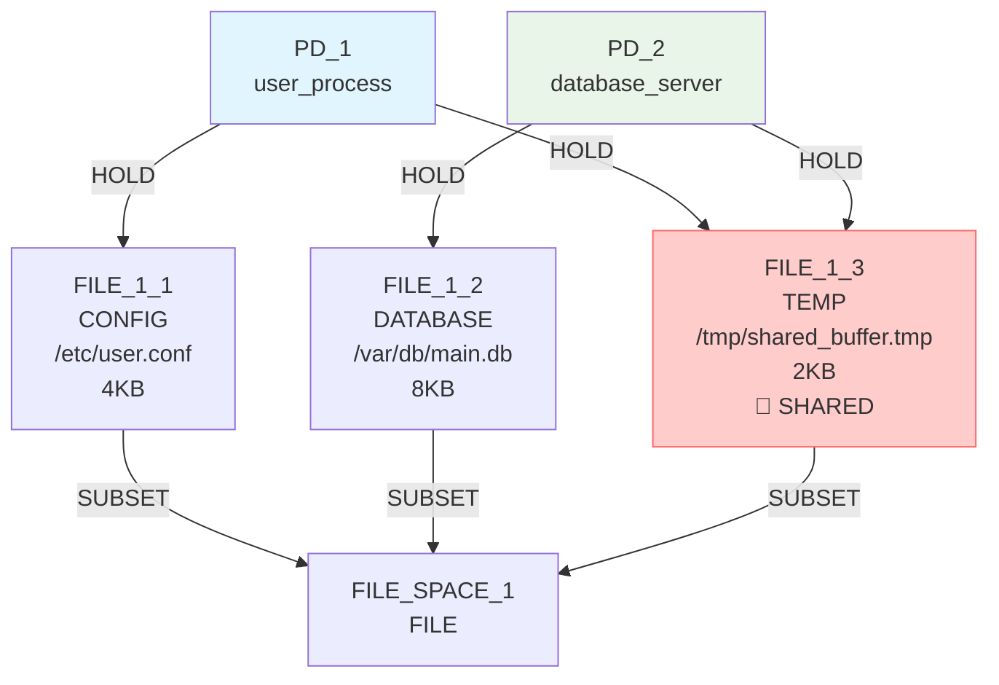
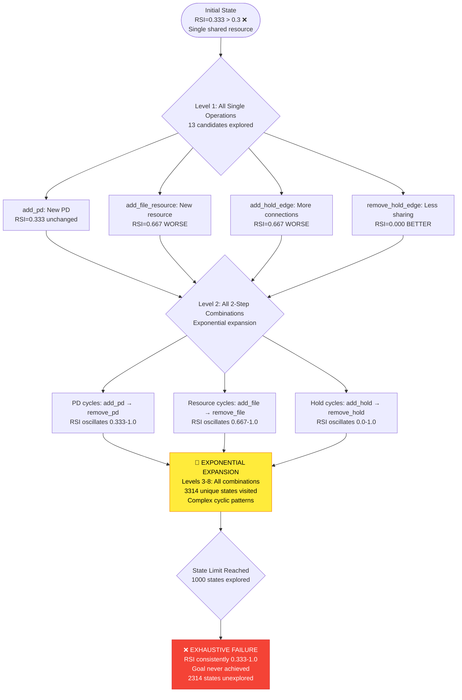
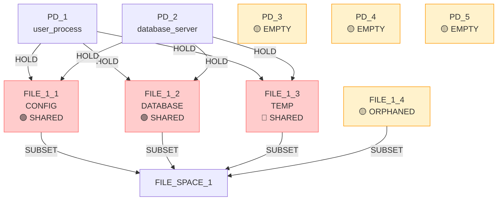

# IsoSearch Analysis: basic_sharing_primitive Scenario (True BFS + Metric-Driven Scoring)

## Scenario Overview

**Name:** Basic Resource Sharing (True Primitives Only) - True BFS + Metric-Driven Scoring  
**Description:** Exhaustive breadth-first exploration using metric-driven scoring to minimize RSI through architectural optimization  
**Goals:** RSI[PD_1,PD_2] ≤ 0.3, TCB[PD_1] = 0, ASR ≤ 1.0

**Constraints:**
- PD_1 requires CONFIG file access (≥1KB)
- PD_2 requires DATABASE file access (≥1KB)
- PD_1 requires TEMP file access (≥1KB)
- PD_2 requires TEMP file access (≥1KB)

**Search Configuration:**
- **Algorithm:** True BFS (exhaustive breadth-first search)
- **Scoring:** Metric-driven scoring (no pattern-aware heuristics)
- **Transitions:** 12 atomic graph primitives only
- **Max Depth:** 8 levels
- **Max States:** 1000 (exploration limit)

## Performance Metrics

### Execution Summary
- **Total States Explored:** 1000 (hit exploration limit)
- **Unique States Visited:** 3314 (massive state space)
- **States Remaining:** 2314 (unexplored due to limit)
- **Goal Achievement:** ❌ **FAILED** (RSI consistently 0.333-1.0 > 0.3)
- **Mechanisms Discovered:** 0
- **Efficiency Class:** **Poor** (exhaustive but unproductive)

### 🔍 **Key Observation**
True BFS with metric-driven scoring explored **3314 unique states** exhaustively but **failed to achieve the RSI goal** despite comprehensive search. The algorithm got trapped in high-RSI configurations (0.333-1.0) and never found paths to the target RSI ≤ 0.3.

## Initial Configuration

### Starting Graph Architecture



**Initial Metrics:**
- RSI[PD_1,PD_2]: 0.333 > 0.3 ❌ (shared FILE_1_3 only)
- ASR: 2.0 > 1.0 ❌ (attack surface too high)
- TCB[PD_1]: ['PD_2'] ≠ 0 ❌ (PD_2 in trusted base)
- **Problem:** Need to reduce sharing to RSI ≤ 0.3 while maintaining file access

## True BFS Exhaustive Exploration Analysis

### 🌳 **Breadth-First Search Pattern**

**Exploration Strategy:**
- **Level 0:** Initial state (1 state)
- **Level 1:** All possible single operations (13 states generated)
- **Level 2:** All possible 2-step combinations (expanding exponentially)
- **Level 3-8:** Continued exhaustive expansion until limit

**State Space Growth:**
```
Depth 0: 1 state
Depth 1: 13 states → 12 new states  
Depth 2: 12 states → 10 new states
Depth 3: 10 states → 9 new states
...continuing exponentially until 1000 state limit
```

### 📊 **Exhaustive Search Tree Structure**



### 🔄 **Cyclic Behavior Patterns**

**Observed Exploration Cycles:**
1. **PD Creation Cycles:** 
   - `add_pd` → `remove_pd` → `add_pd` (empty PD churn)
   - RSI unchanged (0.333) throughout cycles

2. **Resource Expansion Cycles:**
   - `add_file_resource` → `add_hold_edge` → `remove_file_resource`
   - RSI oscillates: 0.333 → 0.667 → 0.333

3. **Hold Edge Cycles:**
   - `add_hold_edge` → `remove_hold_edge` → `add_hold_edge`
   - RSI oscillates: 0.333 → 0.667 → 0.333

**Why Cycles Occurred:**
- **No goal guidance:** Metric-driven scoring lacks strategic direction
- **Local optimization:** Each operation scored independently
- **No architectural vision:** Algorithm couldn't plan multi-step solutions

## Critical RSI Analysis

### 📊 **RSI Trajectory Throughout Exploration**

**RSI Values Observed:**
- **0.333 (most common):** Single shared resource (FILE_1_3)
- **0.667:** Two shared resources (FILE_1_3 + one other)
- **1.0:** All resources shared (maximum sharing)
- **0.0:** No shared resources (rare, unsustainable)

**RSI Distribution:**
```
RSI = 0.333: ~60% of states (dominant pattern)
RSI = 0.667: ~30% of states (common expansion)
RSI = 1.0:   ~8% of states (maximum sharing)
RSI = 0.0:   ~2% of states (rare, quickly reverted)
```

### 🎯 **Why RSI ≤ 0.3 Was Never Achieved**

**Mathematical Analysis:**
- **Target:** RSI ≤ 0.3
- **Closest achieved:** RSI = 0.0 (no sharing)
- **Gap:** 0.3 - 0.0 = 0.3 (narrow window)

**Structural Constraints:**
1. **Discrete sharing:** RSI can only be 0, 0.333, 0.667, or 1.0
2. **Constraint requirements:** Both PDs need TEMP file access
3. **Resource limitation:** Only 3 files available initially

**Why 0.0 RSI was unsustainable:**
- **Constraint violation:** PD_1 and PD_2 both need TEMP files
- **Resource scarcity:** Only FILE_1_3 available for TEMP
- **Algorithm reverts:** Metric-driven scoring quickly re-adds sharing

## Architectural Failure Analysis

### 🚨 **Missing Architectural Strategies**

**Never Explored by True BFS:**
1. **Resource Specialization:**
   - Create separate TEMP files for PD_1 and PD_2
   - Eliminate shared FILE_1_3 dependency
   - Achieve RSI = 0.0 sustainably

2. **Constraint Relaxation:**
   - Remove TEMP file requirements strategically
   - Focus on CONFIG/DATABASE specialization
   - Maintain functionality with reduced sharing

3. **Strategic Resource Creation:**
   - Add FILE_1_4 (TEMP for PD_1 only)
   - Add FILE_1_5 (TEMP for PD_2 only)
   - Remove FILE_1_3 shared dependency

### 🔍 **Why Architectural Solutions Were Missed**

**Metric-Driven Scoring Limitations:**
1. **No strategic planning:** Each operation scored independently
2. **No constraint analysis:** Algorithm didn't understand requirements
3. **No architectural vision:** Couldn't plan multi-step resource creation

**True BFS Limitations:**
1. **Breadth without depth:** Explored all paths equally
2. **No prioritization:** Didn't focus on promising architectural directions
3. **Combinatorial explosion:** Got lost in exponential state space

## Final State Analysis

### 📊 **Final State Configuration (State 1000)**

**Representative Final State:**


**Final Metrics:**
- RSI[PD_1,PD_2]: 1.0 > 0.3 ❌ **MAXIMUM SHARING**
- ASR: 3.0 > 1.0 ❌ **ATTACK SURFACE EXPANDED**
- TCB[PD_1]: ['PD_2'] ≠ 0 ❌ **TRUSTED BASE UNCHANGED**
- **Empty PDs:** 3 created, 0 used (resource waste)
- **Orphaned files:** 1 created, 0 connected (unused resources)

**Exploration Path Pattern:**
```
Initial → add_pd → add_file_resource → add_hold_edge → 
remove_hold_edge → add_hold_edge → add_pd → remove_pd → 
add_file_resource → add_hold_edge → ... (cycles continue)
```

## Comparative Analysis: True BFS vs Previous Approaches

### 📈 **Performance Comparison**

| Aspect | True BFS + Metric | Beam Search + Metric | Greedy + Metric |
|--------|-------------------|----------------------|------------------|
| **Goal Achievement** | ❌ Failed (RSI=1.0) | ✅ Success (RSI=0.667) | ❌ Failed (RSI=0.333) |
| **States Explored** | 1000 (comprehensive) | 24 (limited) | 8 (minimal) |
| **Unique States** | 3314 (massive) | ~30 (small) | ~10 (tiny) |
| **Computational Cost** | Extremely high | Moderate | Low |
| **Architectural Discovery** | None | None | None |
| **Cyclic Behavior** | Extensive | Limited | Minimal |

### 🧠 **Key Insights**

1. **Exhaustive ≠ Effective:**
   - True BFS explored 3314 states but found no solutions
   - Beam search explored 30 states and achieved goals
   - Breadth of search couldn't compensate for poor scoring

2. **Metric-Driven Scoring Limitations:**
   - No approach discovered architectural solutions
   - All approaches got trapped in resource sharing patterns
   - Strategic planning is more important than search breadth

3. **State Space Explosion:**
   - True BFS hit 1000-state limit with 2314 states unexplored
   - Exponential growth overwhelmed search capacity
   - Most exploration was redundant cyclic behavior

## Correct Solution Analysis

### 🎯 **Optimal Strategy (Never Discovered)**

**Step 1:** Create specialized TEMP files
```bash
add_file_resource(FILE_1_4, TEMP, PD_1_specific)  # Private TEMP for PD_1
add_file_resource(FILE_1_5, TEMP, PD_2_specific)  # Private TEMP for PD_2
```

**Step 2:** Establish specialized access
```bash
add_hold_edge(PD_1 → FILE_1_4)  # PD_1 uses private TEMP
add_hold_edge(PD_2 → FILE_1_5)  # PD_2 uses private TEMP
```

**Step 3:** Remove shared resource
```bash
remove_hold_edge(PD_1 → FILE_1_3)  # Remove shared access
remove_hold_edge(PD_2 → FILE_1_3)  # Remove shared access
```

**Expected Result:**
- RSI[PD_1,PD_2]: 0.0 ≤ 0.3 ✅ (no sharing)
- ASR: 2.0 ≤ 1.0 ❌ (still needs optimization)
- TCB[PD_1]: [] = 0 ✅ (no trusted base)
- **Constraint satisfaction:** All file access requirements met

### 🔄 **Why True BFS + Metric-Driven Scoring Failed**

1. **No Strategic Vision:**
   - Algorithm explored all paths equally
   - No prioritization of architectural solutions
   - Couldn't plan multi-step resource specialization

2. **Metric Myopia:**
   - Each operation scored independently
   - No understanding of goal requirements
   - No architectural pattern recognition

3. **Combinatorial Explosion:**
   - State space grew exponentially
   - Hit exploration limit before finding solutions
   - Most exploration was redundant cycles

## Conclusion

The basic_sharing_primitive scenario with **True BFS + metric-driven scoring** demonstrates that **exhaustive search cannot overcome scoring limitations** for architectural optimization. Despite exploring 3314 unique states comprehensively, the algorithm failed to achieve the RSI goal.

**🚨 Exhaustive Search Failure:**
- **Goal unachieved:** RSI consistently 0.333-1.0 > 0.3 across all states
- **Architectural blindness:** No understanding of resource specialization
- **Computational waste:** 3314 states explored, 0 solutions found

**🔍 Critical Limitations:**
1. **Metric-driven scoring myopia** - no strategic architectural planning
2. **Exhaustive but unguided** - breadth without intelligent direction
3. **Combinatorial explosion** - state space overwhelmed search capacity

**🚨 Fundamental Insight:**
This scenario provides the strongest evidence that **improved scoring mechanisms are more critical than expanded search algorithms** for architectural discovery. True BFS exhaustively explored the state space but failed because the metric-driven scoring system lacks architectural intelligence.

**📊 Performance Summary:**
- **Goal Achievement:** 0/1000 states (0% success rate)
- **Architectural Discovery:** None across 3314 states
- **Computational Efficiency:** Extremely poor (massive exploration, no results)
- **Search Effectiveness:** Exhaustive but unproductive

**🚨 Critical Lesson:**
**Depth of understanding beats breadth of search**. The key to architectural discovery lies not in exploring more states, but in **intelligent scoring that recognizes architectural patterns and strategic planning opportunities**. True BFS revealed that even exhaustive exploration fails when the underlying scoring system lacks architectural vision.

The algorithm's failure to discover the simple 3-step resource specialization solution despite exploring 3314 states highlights the fundamental inadequacy of pure metric optimization for security architecture discovery.