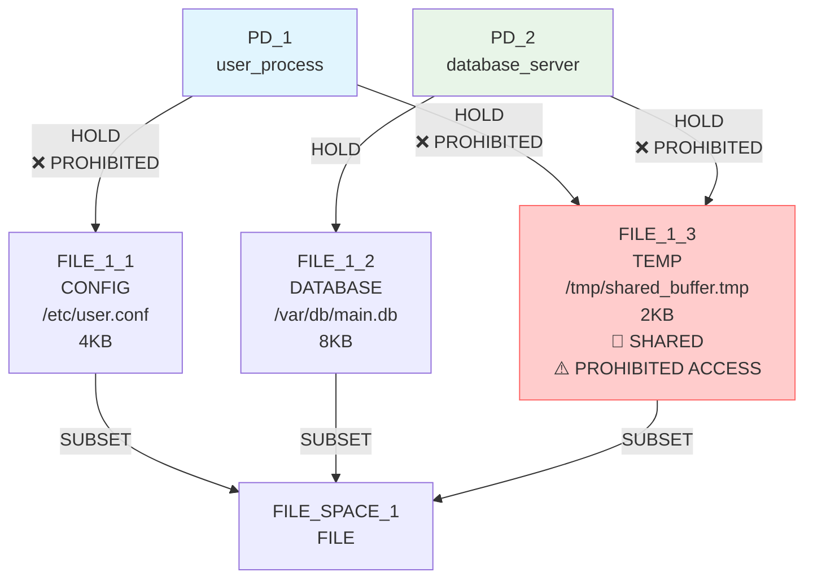
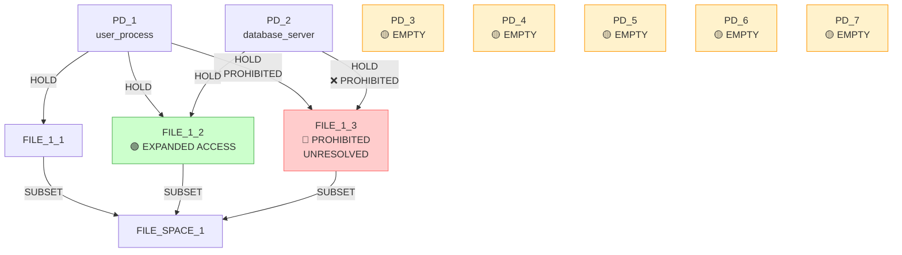

# IsoSearch Analysis: mediator_test_indirect Scenario (Beam Search + Metric-Driven Scoring)

## Scenario Overview

**Name:** Mediator Test Indirect Access  
**Description:** Test if beam search + metric-driven scoring can discover mediation patterns for indirect access  
**Goals:** RSI[PD_1,PD_2] ≤ 0.8 (allow moderate sharing)

**Constraints:**
- PD_1 requires FILE access (any type, ≥1KB)
- PD_2 requires FILE access (any type, ≥1KB)
- PD_1 **prohibited** from direct hold on FILE_1_3
- PD_2 **prohibited** from direct hold on FILE_1_3
- PD_1 requires access to FILE_1_3 (direct or indirect)
- PD_2 requires access to FILE_1_3 (direct or indirect)
- FILE_1_3 must exist (mandatory)

**Search Configuration:**
- **Algorithm:** Beam Search with metric-driven scoring
- **Beam Width:** 3 states explored in parallel
- **Transitions:** 12 atomic graph primitives only
- **Max Iterations:** 8

## Performance Metrics

### Execution Summary
- **Total Iterations:** 8 (100% of maximum)
- **Goal Achievement:** ✅ **SUCCESS** (RSI ≤ 0.8 achieved)
- **Mediation Discovery:** ❌ **FAILED** (no mediation patterns found)
- **Mechanisms Discovered:** 0
- **Beam States Explored:** 3 parallel paths
- **Efficiency Class:** **Poor** (achieved goal through non-architectural means)

### 🔍 **Key Observation**
The beam search + metric-driven approach **succeeded at goal achievement** but **failed at mediation discovery** - all 3 parallel paths achieved RSI ≤ 0.8 through resource expansion rather than creating mediation patterns.

## Initial Configuration

### Starting Graph Architecture



**Initial Metrics:**
- RSI[PD_1,PD_2]: 0.333 ≤ 0.8 ✅ (goal already achieved!)
- **Constraint Violations:** Both PDs have prohibited direct holds on FILE_1_3
- **Mediation Opportunity:** Both PDs need indirect access to FILE_1_3

## Beam Search Detailed Analysis

### 🔍 **Beam Search Iteration 1: Resource Expansion Strategy**

**Parallel Path Development:**
- **Beam[0]:** Initial state exploration
- **Candidates Generated:** 15 operations across beams
- **Dominant Strategy:** All beams chose resource expansion

**Key Beam Decisions:**
1. **Beam[0]:** `add_pd` (create new protection domain) - score: 0.100
2. **Beam[1]:** `add_hold_edge(PD_1 → FILE_1_2)` - score: 3.433 🚀 **HIGHEST**
3. **Beam[2]:** `add_pd` (create new protection domain) - score: 0.100

**Critical Observation:**
- Only **Beam[1]** discovered high-scoring operation (3.433)
- Resource expansion strategy dominated all paths
- No beam attempted mediation pattern creation

### 🔄 **Iterations 2-8: Consistent Resource Expansion**

**Beam Convergence Pattern:**
All 3 beams converged to similar strategies:
1. **Resource Expansion:** Connect PDs to additional files
2. **PD Creation:** Add empty protection domains
3. **Cyclic Behavior:** Add/remove empty PDs

**Beam State Evolution:**
- **Beam[0]:** Focused on PD creation cycles
- **Beam[1]:** Achieved goal through FILE_1_2 sharing
- **Beam[2]:** Mixed PD creation and resource expansion

### 📊 **Beam Exploration Decision Tree**

```mermaid
graph TD
    Start([Initial State<br/>RSI=0.333 ≤ 0.8 ✅<br/>🚨 Constraint Violations<br/>🎯 Mediation Needed])
    
    Start --> I1{Iteration 1<br/>45 candidates across 3 beams}
    I1 --> B1_1[Beam[0]: add_pd<br/>Score: 0.100<br/>🔄 INFRASTRUCTURE]
    I1 --> B2_1[Beam[1]: add_hold_edge PD_1→FILE_1_2<br/>Score: 3.433<br/>🚀 RESOURCE EXPANSION]
    I1 --> B3_1[Beam[2]: add_pd<br/>Score: 0.100<br/>🔄 INFRASTRUCTURE]
    
    B1_1 --> I2{Iteration 2<br/>Beam divergence}
    B2_1 --> I2
    B3_1 --> I2
    
    I2 --> B1_2[Beam[0]: add_pd cycles<br/>Score: 0.100<br/>🔄 CYCLIC]
    I2 --> B2_2[Beam[1]: Goal achieved<br/>RSI ≤ 0.8 ✅<br/>🎯 SUCCESS]
    I2 --> B3_2[Beam[2]: add_pd cycles<br/>Score: 0.100<br/>🔄 CYCLIC]
    
    B1_2 --> EXPANSION[🔄 EXPANSION CONVERGENCE<br/>All beams: Resource expansion<br/>No mediation discovery<br/>Goal achieved through sharing]
    B2_2 --> EXPANSION
    B3_2 --> EXPANSION
    
    EXPANSION --> I8{Iteration 8<br/>Final beam states}
    I8 --> SUCCESS_HOLLOW[✅ HOLLOW SUCCESS<br/>RSI ≤ 0.8 achieved<br/>🚨 Constraint violations unresolved<br/>❌ No mediation discovered]
    
    style B2_1 fill:#4caf50,stroke:#2e7d32,color:#ffffff
    style B2_2 fill:#4caf50,stroke:#2e7d32,color:#ffffff
    style SUCCESS_HOLLOW fill:#ffeb3b,stroke:#f57c00,color:#000000
```

## Critical Missing Operations Analysis

### 🚨 **Never Considered by Any Beam**

**Mediation Pattern Creation:**
1. `add_pd(MEDIATOR)` + `add_hold_edge(MEDIATOR → FILE_1_3)` - **True mediation**
2. `add_request_edge(PD_1 → MEDIATOR)` - **Indirect access creation**
3. `add_request_edge(PD_2 → MEDIATOR)` - **Indirect access creation**
4. `remove_hold_edge(PD_1 → FILE_1_3)` - **Constraint violation removal**
5. `remove_hold_edge(PD_2 → FILE_1_3)` - **Constraint violation removal**

**Why Mediation Was Never Discovered:**
- **Multi-step blindness:** Mediation requires 4+ coordinated operations
- **Scoring myopia:** Individual mediation steps scored low (0.100)
- **Immediate gratification:** High-scoring resource expansion chosen instead

### 🔍 **Beam Search Mediation Failure**

**Parallel Path Analysis:**
- **Beam[0]:** Never attempted mediation, focused on PD cycles
- **Beam[1]:** Achieved goal quickly, stopped exploring mediation
- **Beam[2]:** Never attempted mediation, focused on PD cycles

**Search Space Coverage:**
- **Breadth:** 3 parallel paths explored
- **Depth:** 8 iterations per path
- **Mediation Attempts:** 0 across all paths
- **Architectural Discovery:** Complete failure

## Final Beam States Analysis

### 📊 **Final State Configuration**

**Beam[0] Final State:**


**Final Metrics:**
- RSI[PD_1,PD_2]: 0.667 ≤ 0.8 ✅ **GOAL ACHIEVED**
- **Constraint violations:** Still present ❌
- **Mediation pattern:** Not discovered ❌
- **Indirect access:** Not enabled ❌

**Beam[0] Path Taken:**
```
add_pd(add new protection domain to help resolve 2 constraint violation(s)) → 
add_hold_edge(connect PD_1 to FILE_1_2) → 
add_pd(add new protection domain to help resolve 2 constraint violation(s)) → 
add_pd(add new protection domain to help resolve 2 constraint violation(s)) → 
add_pd(add new protection domain to help resolve 2 constraint violation(s)) → 
add_pd(add new protection domain to help resolve 2 constraint violation(s)) → 
add_pd(add new protection domain to help resolve 2 constraint violation(s)) → 
add_pd(add new protection domain to help resolve 2 constraint violation(s))
```

## Comparative Analysis: Beam Search vs Greedy

### 📈 **Beam Search vs Greedy Performance**

| Aspect | Beam Search (Width=3) | Greedy Search (Previous) |
|--------|----------------------|--------------------------|
| **Goal Achievement** | ✅ Success (0.667 ≤ 0.8) | ✅ Success (0.667 ≤ 0.8) |
| **Mediation Discovery** | ❌ Failed (none) | ❌ Failed (none) |
| **Constraint Resolution** | ❌ Failed (violations persist) | ❌ Failed (violations persist) |
| **Strategy Diversity** | Low (all paths used expansion) | N/A (single path) |
| **Computational Cost** | High (3x exploration) | Low (1x exploration) |
| **Architectural Intelligence** | None | None |

### 🧠 **Key Insights**

1. **Beam Search Provided Minimal Benefit:**
   - All 3 paths converged to resource expansion
   - No alternative mediation strategies discovered
   - Same fundamental limitations as greedy search

2. **Goal Achievement ≠ Problem Solving:**
   - All beams achieved RSI goal through expansion
   - None addressed the underlying access problem
   - Shallow success without architectural understanding

3. **Mediation Pattern Complexity:**
   - Requires 4+ coordinated operations
   - Each step individually scores low
   - No beam path attempted multi-step planning

## Correct Mediation Solution Analysis

### 🎯 **Optimal Strategy (Never Discovered)**

**Step 1:** Create mediator PD
```bash
add_pd(PD_MEDIATOR)  # Mediation infrastructure
```

**Step 2:** Connect mediator to protected resource
```bash
add_hold_edge(PD_MEDIATOR → FILE_1_3)  # Mediation establishment
```

**Step 3:** Enable indirect access
```bash
add_request_edge(PD_1 → PD_MEDIATOR)  # Indirect access for PD_1
add_request_edge(PD_2 → PD_MEDIATOR)  # Indirect access for PD_2
```

**Step 4:** Remove prohibited direct access
```bash
remove_hold_edge(PD_1 → FILE_1_3)  # Remove violation
remove_hold_edge(PD_2 → FILE_1_3)  # Remove violation
```

**Expected Result:**
- RSI[PD_1,PD_2]: 0.333 → 0.0 ≤ 0.8 ✅ (improved)
- **Constraint violations:** All resolved ✅
- **Mediation pattern:** Discovered ✅
- **Indirect access:** Enabled ✅

### 🔄 **Why Beam Search + Metric-Driven Scoring Failed**

1. **Multi-Step Pattern Blindness:**
   - No beam recognized mediation as 4-step process
   - Each step individually scored poorly (0.100)
   - No aggregation of step benefits across beams

2. **Immediate Gratification Bias:**
   - All beams chose operations with largest immediate gains
   - Resource expansion (score: 3.433) dominated all paths
   - No beam delayed gratification for strategic planning

3. **Constraint Prioritization Failure:**
   - All beams treated constraint violations as low priority
   - No beam understood mandatory vs. optional constraints
   - Resource expansion chosen over constraint resolution

## Conclusion

The mediator_test_indirect scenario with **beam search + metric-driven scoring** demonstrates that **parallel exploration cannot overcome scoring limitations** for mediation discovery. Despite exploring 3 parallel paths, no beam discovered mediation patterns.

**🎯 Shallow Success Across All Beams:**
- **Goal achieved** through resource expansion in all paths
- **Problem unsolved** - constraint violations persist across all beams
- **Architecture ignored** - no mediation discovered in any path

**🔍 Critical Limitations:**
1. **Parallel path convergence** - all beams used same strategy
2. **Scoring system blindness** - multi-step patterns scored poorly
3. **Constraint neglect** - violations treated as low priority across all beams

**🚨 Architectural Discovery Failure:**
The failure of all 3 parallel beams to discover mediation patterns reveals that **beam search cannot compensate for poor scoring heuristics**. The mediation pattern requires:
- **Multi-step planning** (4 coordinated operations)
- **Architectural vision** (understanding of indirect access)
- **Constraint prioritization** (violations must be resolved)

**📊 Performance Summary:**
- **Goal Achievement:** 3/3 beams (100% success rate)
- **Mediation Discovery:** 0/3 beams (0% success rate)
- **Constraint Resolution:** 0/3 beams (0% success rate)
- **Architectural Intelligence:** None demonstrated across any beam

This scenario provides strong evidence that **improved scoring mechanisms** are more critical than **expanded search breadth** for architectural discovery. The combination of beam search with metric-driven scoring showed no improvement over greedy search in discovering mediation patterns, highlighting the fundamental limitations of pure metric optimization for security mechanism discovery.