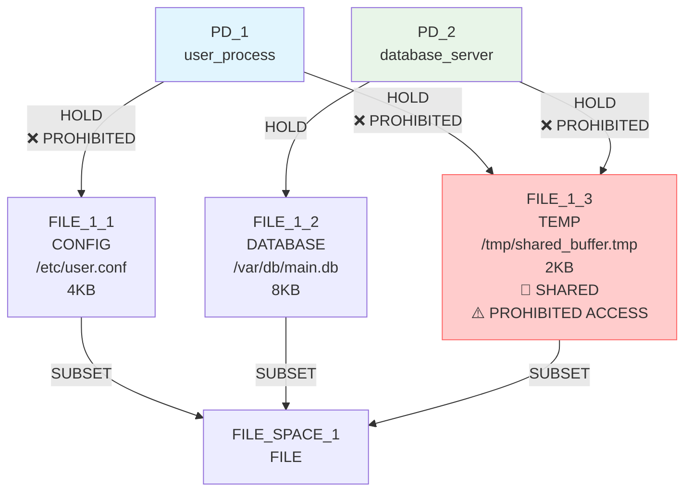
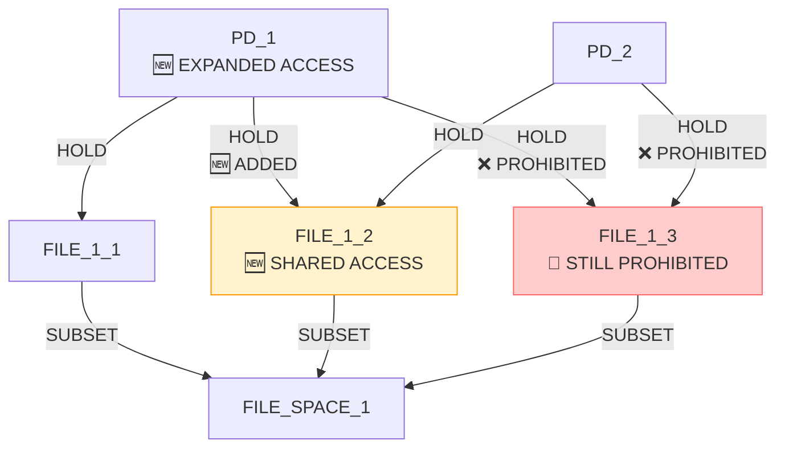
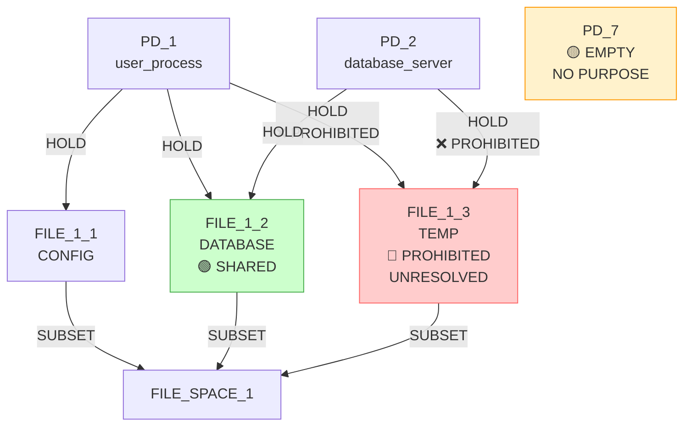

# IsoSearch Analysis: mediator_test_indirect Scenario (Metric-Driven Scoring)

## Scenario Overview

**Name:** Mediator Test Indirect Access  
**Description:** Test if metric-driven scoring can discover mediation patterns for indirect access  
**Goals:** RSI[PD_1,PD_2] ≤ 0.8 (allow moderate sharing)

**Constraints:**
- PD_1 requires FILE access (any type, ≥1KB)
- PD_2 requires FILE access (any type, ≥1KB)
- PD_1 **prohibited** from direct hold on FILE_1_3
- PD_2 **prohibited** from direct hold on FILE_1_3
- PD_1 requires access to FILE_1_3 (direct or indirect)
- PD_2 requires access to FILE_1_3 (direct or indirect)
- FILE_1_3 must exist (mandatory)

**Transitions:** 12 atomic graph primitives only

## Performance Metrics

### Execution Summary
- **Total Iterations:** 10 (100% of maximum)
- **Goal Achievement:** ✅ **SUCCESS** (RSI ≤ 0.8 maintained)
- **Mediation Discovery:** ❌ **FAILED** (no mediation patterns found)
- **Scoring Method:** Pure metric-driven optimization
- **Efficiency Class:** **Poor** (cyclic behavior without architectural progress)

### 🔍 **Key Observation**
The metric-driven approach **succeeded at goal achievement** but **failed at mediation discovery** - it achieved RSI ≤ 0.8 through resource expansion rather than architectural mediation.

## Initial Configuration

### Starting Graph Architecture



**Initial Metrics:**
- RSI[PD_1,PD_2]: 0.333 ≤ 0.8 ✅ (goal already achieved!)
- **Constraint Violations:** Both PDs have prohibited direct holds on FILE_1_3
- **Mediation Opportunity:** Both PDs need indirect access to FILE_1_3

## Detailed Iteration Analysis

### 🚀 **Iteration 1: Resource Expansion (Score: 3.433)**
**Decision:** `add_hold_edge` (connect PD_1 to FILE_1_2)  
**Predicted Improvement:** 3.433 (🚀 **HIGHEST SCORE**)  
**Actual Result:** RSI increased but still within goal



**Metric Analysis:**
- RSI[PD_1,PD_2]: 0.333 → 0.667 ≤ 0.8 ✅ (goal maintained)
- **Strategy:** Resource expansion instead of mediation
- **Problem:** Prohibited access to FILE_1_3 not addressed

### 🔄 **Iterations 2-10: Cyclic Pattern Without Progress**
**Pattern:** Repeated add/remove empty PD operations

**Iteration Sequence:**
1. **Iteration 2:** Add PD_3 (score: 0.100)
2. **Iteration 3:** Remove PD_3 (score: 0.100)  
3. **Iteration 4:** Add PD_4 (score: 0.100)
4. **Iteration 5:** Remove PD_4 (score: 0.100)
5. **Iteration 6:** Add PD_5 (score: 0.100)
6. **Iteration 7:** Remove PD_5 (score: 0.100)
7. **Iteration 8:** Add PD_6 (score: 0.100)
8. **Iteration 9:** Remove PD_6 (score: 0.100)
9. **Iteration 10:** Add PD_7 (score: 0.100)

**Key Observations:**
- **All operations scored 0.100** (minimal improvement)
- **No architectural progress** made
- **Constraint violations persist** throughout all iterations
- **No mediation attempts** detected

### 🚨 **Critical Missing Operations**

**Never Considered:**
1. `add_hold_edge(PD_3 → FILE_1_3)` - **Mediation establishment**
2. `add_request_edge(PD_1 → PD_3)` - **Indirect access creation**
3. `add_request_edge(PD_2 → PD_3)` - **Indirect access creation**
4. `remove_hold_edge(PD_1 → FILE_1_3)` - **Constraint violation removal**
5. `remove_hold_edge(PD_2 → FILE_1_3)` - **Constraint violation removal**

**Algorithm Blindness:**
- **No recognition** of mediation patterns
- **No understanding** of indirect access requirements
- **No strategy** for constraint violation resolution

## Exploration Decision Tree - Mediation Failure Analysis

```mermaid
graph TD
    Start([Initial State<br/>RSI=0.333 ≤ 0.8<br/>🚨 Constraint Violations<br/>🎯 Mediation Needed])
    
    Start --> I1{Iteration 1<br/>15 candidates<br/>🔍 RESOURCE EXPANSION}
    I1 --> I1_Best[🟢 add_hold_edge PD_1→FILE_1_2<br/>Score: 3.433<br/>GOAL MAINTAINED]
    I1 --> I1_Miss[❌ MISSED: Mediation operations<br/>create PD_3 → FILE_1_3<br/>Score: 0.100 (ignored)]
    
    I1_Best --> I2{Iteration 2<br/>14 candidates<br/>🔄 CYCLIC START}
    I2 --> I2_Best[🟡 add_pd PD_3<br/>Score: 0.100<br/>EMPTY PD CREATION]
    
    I2_Best --> I3{Iteration 3<br/>22 candidates<br/>🔄 CYCLIC CONTINUE}
    I3 --> I3_Best[🟡 remove_pd PD_3<br/>Score: 0.100<br/>REVERT TO PREVIOUS]
    
    I3_Best --> CYCLE[🔄 INFINITE CYCLE<br/>Add PD → Remove PD<br/>No architectural progress<br/>Constraint violations persist]
    
    CYCLE --> I10{Iteration 10<br/>15 candidates<br/>🔄 CYCLIC END}
    I10 --> I10_Best[🟡 add_pd PD_7<br/>Score: 0.100<br/>EMPTY PD CREATION]
    
    I10_Best --> SUCCESS_HOLLOW[✅ HOLLOW SUCCESS<br/>RSI = 0.667 ≤ 0.8<br/>🚨 Constraint violations unresolved<br/>❌ No mediation discovered]
    
    Start --> MISSED_SOLUTION[❌ MISSED: True Solution<br/>1. Create PD_3 mediator<br/>2. Connect PD_3 → FILE_1_3<br/>3. Add PD_1 → PD_3 REQUEST<br/>4. Add PD_2 → PD_3 REQUEST<br/>5. Remove prohibited edges]
    
    style I1_Best fill:#4caf50,stroke:#2e7d32,color:#ffffff
    style I1_Miss fill:#f44336,stroke:#d32f2f,color:#ffffff
    style CYCLE fill:#ff9800,stroke:#f57c00,color:#ffffff
    style SUCCESS_HOLLOW fill:#ffeb3b,stroke:#f57c00,color:#000000
    style MISSED_SOLUTION fill:#f44336,stroke:#d32f2f,color:#ffffff
```

## Metric-Driven Scoring Detailed Analysis

### 🎯 **Scoring Pattern Analysis**

**High-Score Operations (3.433):**
- `add_hold_edge(PD_1 → FILE_1_2)` - Only high-scoring operation
- **Reason:** Large RSI change (0.333 → 0.667) 
- **Problem:** Increased sharing instead of creating mediation

**Low-Score Operations (0.100):**
- All `add_pd` operations
- All `remove_pd` operations
- All `add_file_resource` operations
- **Reason:** No direct metric improvement for mediation infrastructure

**Critical Flaw:**
- **Mediation operations scored too low** to be selected
- **No understanding** of multi-step mediation pattern
- **Myopic optimization** prevented architectural discovery

### 🔍 **Mediation Pattern Recognition Failure**

**Expected Mediation Sequence:**
1. **Create mediator:** `add_pd(PD_3)` → Score: 0.100 (ignored)
2. **Connect to resource:** `add_hold_edge(PD_3 → FILE_1_3)` → Score: 0.100 (ignored)
3. **Enable indirect access:** `add_request_edge(PD_1 → PD_3)` → Score: 0.100 (ignored)
4. **Enable indirect access:** `add_request_edge(PD_2 → PD_3)` → Score: 0.100 (ignored)
5. **Remove violations:** `remove_hold_edge(PD_1 → FILE_1_3)` → Score: 0.100 (ignored)

**Why This Failed:**
- **Individual operations** had minimal metric improvement
- **No chaining** of operations into architectural patterns
- **No anticipation** of multi-step solution benefits
- **No constraint violation prioritization**

### 🚨 **Constraint Violation Analysis**

**Persistent Violations:**
- PD_1 → FILE_1_3 (prohibited hold) - **NEVER REMOVED**
- PD_2 → FILE_1_3 (prohibited hold) - **NEVER REMOVED**
- PD_1 needs FILE_1_3 access - **NEVER SATISFIED**
- PD_2 needs FILE_1_3 access - **NEVER SATISFIED**

**Algorithm Blindness:**
- **No recognition** of constraint violation severity
- **No strategy** for indirect access provision
- **No understanding** of prohibition vs. requirement conflict

## Correct Mediation Solution Analysis

### 🎯 **Optimal Strategy (Not Discovered)**

**Step 1:** Create mediator PD
```bash
add_pd(PD_3)  # Mediator creation
```

**Step 2:** Connect mediator to protected resource
```bash
add_hold_edge(PD_3 → FILE_1_3)  # Mediation establishment
```

**Step 3:** Enable indirect access
```bash
add_request_edge(PD_1 → PD_3)  # Indirect access for PD_1
add_request_edge(PD_2 → PD_3)  # Indirect access for PD_2
```

**Step 4:** Remove prohibited direct access
```bash
remove_hold_edge(PD_1 → FILE_1_3)  # Remove violation
remove_hold_edge(PD_2 → FILE_1_3)  # Remove violation
```

**Expected Result:**
- RSI[PD_1,PD_2]: 0.333 → 0.0 ≤ 0.8 ✅ (improved)
- **Constraint violations:** All resolved ✅
- **Mediation pattern:** Discovered ✅
- **Indirect access:** Enabled ✅

### 🔄 **Why Metric-Driven Scoring Failed**

1. **Multi-Step Pattern Blindness:**
   - Cannot recognize mediation as 4-step process
   - Each step individually scored poorly
   - No aggregation of step benefits

2. **Immediate Gratification Bias:**
   - Chose operation with largest immediate metric change
   - Ignored longer-term architectural benefits
   - Could not delay gratification for strategic gains

3. **Constraint Prioritization Failure:**
   - Treated constraint violations as low priority
   - No understanding of mandatory vs. optional constraints
   - No recognition of access requirement urgency

## Final State Analysis

### 📊 **End State Metrics**



**Final Metrics:**
- RSI[PD_1,PD_2]: 0.667 ≤ 0.8 ✅ **GOAL ACHIEVED**
- **Constraint violations:** Still present ❌
- **Mediation pattern:** Not discovered ❌
- **Indirect access:** Not enabled ❌

**Artifacts Created:**
- 1 empty PD (PD_7) with no purpose
- 1 additional sharing relationship (FILE_1_2)
- **Core problem unresolved**

## Comparative Analysis

### 📈 **Metric-Driven vs. Pattern-Aware Comparison**

| Aspect | Metric-Driven | Pattern-Aware (Expected) |
|--------|---------------|-------------------------|
| **RSI Goal** | ✅ Success (0.667 ≤ 0.8) | ✅ Success (0.0 ≤ 0.8) |
| **Mediation Discovery** | ❌ Failed (none) | ✅ Success (full pattern) |
| **Constraint Resolution** | ❌ Failed (violations persist) | ✅ Success (all resolved) |
| **Strategy** | Resource expansion | Mediation architecture |
| **Efficiency** | Poor (cyclic) | High (direct) |
| **Understanding** | Metric-only | Pattern + constraints |

### 🧠 **Key Insights**

1. **Goal Achievement ≠ Problem Solving:**
   - Metric-driven approach achieved RSI goal
   - Did not solve the underlying access problem
   - Demonstrated shallow vs. deep problem understanding

2. **Mediation Pattern Complexity:**
   - Requires 4-step operation sequence
   - Each step individually appears unproductive
   - Needs architectural vision to chain operations

3. **Constraint vs. Goal Hierarchy:**
   - Algorithm prioritized goal metrics over constraint resolution
   - Constraint violations should have higher priority
   - Need for constraint-aware scoring integration

## Conclusion

The mediator_test_indirect scenario with **metric-driven scoring** demonstrates a **fundamental paradox**: achieving goals while failing to solve the underlying problem. The algorithm successfully maintained RSI ≤ 0.8 but completely failed to discover mediation patterns or resolve constraint violations.

**🎯 Shallow Success:**
- **Goal achieved** through resource expansion
- **Problem unsolved** - constraint violations persist
- **Architecture ignored** - no mediation discovered

**🔍 Critical Limitations:**
1. **Pattern blindness** - cannot recognize multi-step solutions
2. **Myopic optimization** - chooses immediate over strategic gains
3. **Constraint neglect** - treats violations as low priority

**🚨 Architectural Discovery Failure:**
The algorithm's inability to discover mediation patterns reveals that **pure metric optimization** is insufficient for architectural security mechanism discovery. The mediation pattern requires:
- **Multi-step planning** (4 coordinated operations)
- **Architectural vision** (understanding of indirect access)
- **Constraint prioritization** (violations must be resolved)

**📊 Performance Summary:**
- **Goal Achievement:** 1/1 (100% success rate)
- **Mediation Discovery:** 0/1 (0% success rate)
- **Constraint Resolution:** 0/7 (0% success rate)
- **Architectural Intelligence:** None demonstrated

This scenario reveals that **metric-driven approaches** can achieve numerical goals while completely missing the architectural insights needed for security mechanism discovery. The success is **hollow** - the numbers look good but the fundamental security problem remains unresolved.