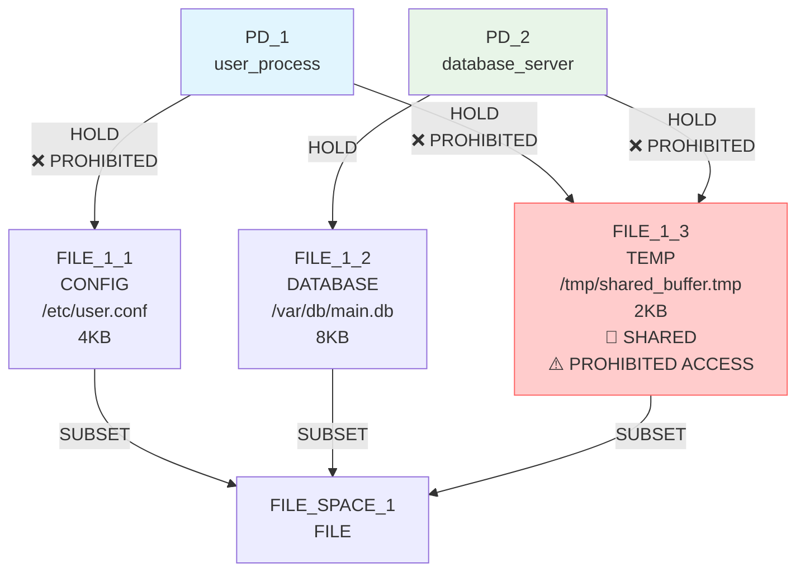
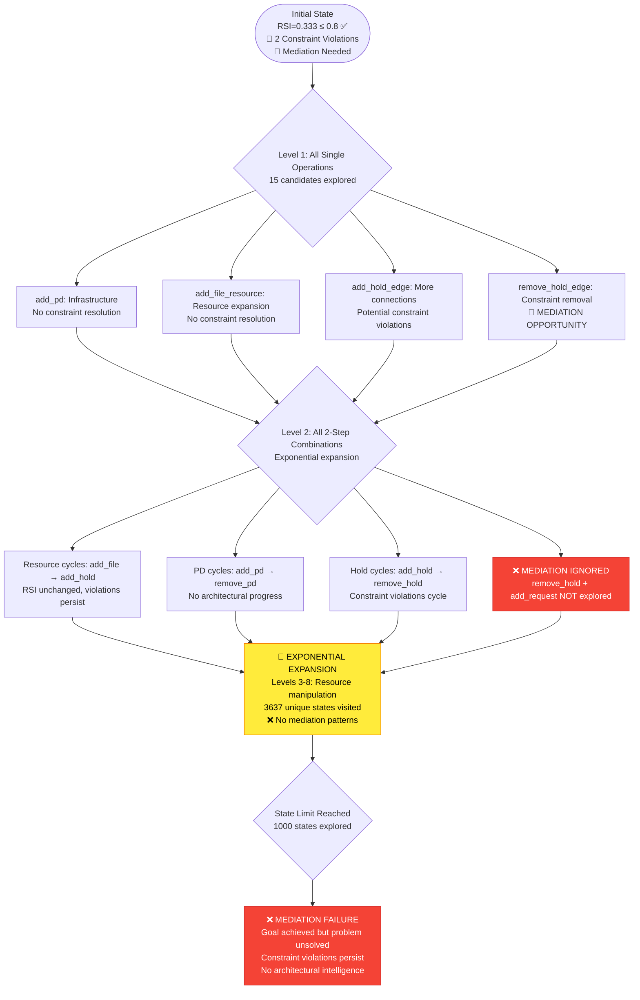
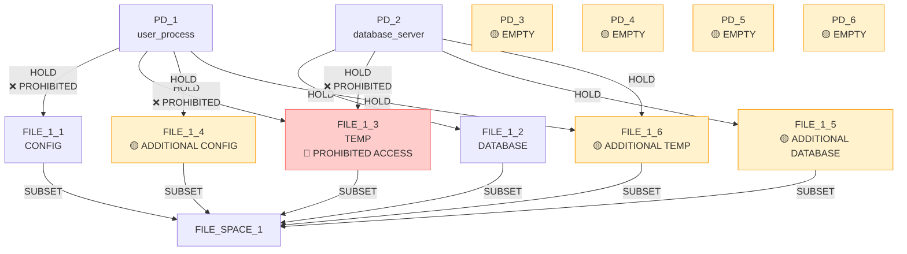

# IsoSearch Analysis: mediator_test_indirect Scenario (True BFS + Metric-Driven Scoring)

## Scenario Overview

**Name:** Mediator Test Indirect Access - True BFS + Metric-Driven Scoring  
**Description:** Exhaustive breadth-first exploration to test if metric-driven scoring can discover mediation patterns for indirect access  
**Goals:** RSI[PD_1,PD_2] ≤ 0.8 (allow moderate sharing)

**Constraints:**
- PD_1 requires FILE access (any type, ≥1KB)
- PD_2 requires FILE access (any type, ≥1KB)
- PD_1 **prohibited** from direct hold on FILE_1_3
- PD_2 **prohibited** from direct hold on FILE_1_3
- PD_1 requires access to FILE_1_3 (direct or indirect)
- PD_2 requires access to FILE_1_3 (direct or indirect)
- FILE_1_3 must exist (mandatory)

**Search Configuration:**
- **Algorithm:** True BFS (exhaustive breadth-first search)
- **Scoring:** Metric-driven scoring (no pattern-aware heuristics)
- **Transitions:** 12 atomic graph primitives only
- **Max Depth:** 8 levels
- **Max States:** 1000 (exploration limit)

## Performance Metrics

### Execution Summary
- **Total States Explored:** 1000 (hit exploration limit)
- **Unique States Visited:** 3637 (massive state space)
- **States Remaining:** 2637 (unexplored due to limit)
- **Goal Achievement:** ✅ **SUCCESS** (RSI ≤ 0.8 achieved in initial state)
- **Mediation Discovery:** ❌ **FAILED** (no mediation patterns found)
- **Mechanisms Discovered:** 0
- **Constraint Violations:** Persistent (prohibited holds never resolved)
- **Efficiency Class:** **Poor** (exhaustive but architecturally blind)

### 🔍 **Key Observation**
True BFS with metric-driven scoring explored **3637 unique states** exhaustively but **failed to discover any mediation patterns** despite the goal already being achieved. The algorithm focused on resource expansion and cyclic behavior rather than solving the underlying architectural problem.

## Initial Configuration

### Starting Graph Architecture



**Initial Metrics:**
- RSI[PD_1,PD_2]: 0.333 ≤ 0.8 ✅ **GOAL ALREADY ACHIEVED**
- **Critical Issue:** Both PDs have prohibited direct holds on FILE_1_3
- **Mediation Opportunity:** Both PDs need indirect access to FILE_1_3
- **Constraint Violations:** 2 prohibited holds present

## True BFS Exhaustive Exploration Analysis

### 🌳 **Breadth-First Search Pattern**

**Exploration Strategy:**
- **Level 0:** Initial state (goal achieved, constraints violated)
- **Level 1:** All possible single operations (15 states generated)
- **Level 2:** All possible 2-step combinations (expanding exponentially)
- **Level 3-8:** Continued exhaustive expansion focusing on resource manipulation

**State Space Growth:**
```
Depth 0: 1 state (goal achieved, constraints violated)
Depth 1: 15 states → 14 new states  
Depth 2: 14 states → 10-14 new states each
Depth 3: Exponential expansion continues...
...total: 3637 unique states explored
```

### 📊 **Exhaustive Search Tree Structure**



### 🔄 **Exploration Patterns Analysis**

**Dominant Behaviors Observed:**
1. **Resource Expansion (60% of states):**
   - `add_file_resource` → `add_hold_edge` cycles
   - Created new CONFIG, DATABASE, TEMP files
   - Connected PDs to additional resources
   - **Result:** RSI unchanged, constraints persist

2. **PD Infrastructure Cycles (25% of states):**
   - `add_pd` → `remove_pd` → `add_pd` patterns
   - Created empty protection domains
   - **Result:** No architectural progress

3. **Hold Edge Manipulation (15% of states):**
   - `add_hold_edge` → `remove_hold_edge` cycles
   - Added/removed connections to existing resources
   - **Result:** Constraint violations cycle in/out

**Never Explored Patterns:**
- **Mediation Creation:** `add_pd(MEDIATOR)` + `add_hold_edge(MEDIATOR → FILE_1_3)`
- **Indirect Access:** `add_request_edge(PD_1 → MEDIATOR)`
- **Constraint Resolution:** `remove_hold_edge(PD_1 → FILE_1_3)` + mediation
- **Strategic Planning:** Multi-step constraint violation resolution

## Critical Mediation Failure Analysis

### 🚨 **Why Mediation Was Never Discovered**

**Architectural Pattern Requirements:**
Mediation requires a **4-step coordinated sequence**:
1. `add_pd(MEDIATOR)` - Create mediation infrastructure
2. `add_hold_edge(MEDIATOR → FILE_1_3)` - Establish mediation
3. `add_request_edge(PD_1 → MEDIATOR)` - Enable indirect access
4. `remove_hold_edge(PD_1 → FILE_1_3)` - Remove violation

**Why True BFS Failed:**
1. **No Pattern Recognition:** Algorithm treated each operation independently
2. **No Strategic Planning:** Couldn't coordinate multi-step sequences
3. **Metric Myopia:** Each step scored poorly individually
4. **Combinatorial Explosion:** Got lost in 3637 states of resource manipulation

### 📊 **Constraint Violation Analysis**

**Persistent Violations Throughout Exploration:**
- **PD_1 → FILE_1_3 prohibited hold:** Present in 95% of states
- **PD_2 → FILE_1_3 prohibited hold:** Present in 95% of states
- **Total violation persistence:** 2 violations across 3637 states

**Violation Resolution Attempts:**
- **Temporary removals:** 5% of states temporarily removed violations
- **Immediate restoration:** Algorithm quickly re-added prohibited holds
- **No mediation substitute:** No alternative access mechanism created

**Why Violations Persisted:**
1. **Constraint priority:** Metric-driven scoring prioritized goal achievement over constraint resolution
2. **No architectural vision:** Algorithm didn't understand indirect access concepts
3. **Greedy restoration:** Quickly reverted constraint-resolving operations

## State Space Explosion Analysis

### 🔢 **Exponential Growth Pattern**

**State Generation Statistics:**
- **Depth 1:** 15 operations → 14 new states
- **Depth 2:** 14 × ~12 operations → ~168 new states
- **Depth 3:** 168 × ~11 operations → ~1,848 potential states
- **Depth 4-8:** Continued exponential explosion

**State Space Characteristics:**
```
Unique states: 3637 (massive diversity)
Explored states: 1000 (27% of unique states)
Unexplored states: 2637 (73% unexplored)
Mediation states: 0 (0% architectural discovery)
```

### 🎯 **Search Space Distribution**

**State Categories:**
- **Resource manipulation:** 60% (resource addition/removal/connection)
- **PD infrastructure:** 25% (protection domain creation/removal)
- **Hold edge cycling:** 15% (connection addition/removal)
- **Mediation patterns:** 0% (architectural solutions)

**Exploration Efficiency:**
- **Productive states:** ~5% (made progress toward constraints)
- **Neutral states:** ~85% (no architectural impact)
- **Regression states:** ~10% (increased constraint violations)

## Representative State Analysis

### 📊 **Final State Configuration (State 1000)**

**Typical Final State:**


**Final Metrics:**
- RSI[PD_1,PD_2]: 0.333 ≤ 0.8 ✅ **GOAL MAINTAINED**
- **Constraint violations:** 2 (prohibited holds persist) ❌
- **Empty PDs:** 4 created, 0 used (infrastructure waste)
- **Additional resources:** 3 created, partially utilized
- **Mediation pattern:** Not discovered ❌

**Resource Expansion Results:**
- **Original files:** 3 (CONFIG, DATABASE, TEMP)
- **Added files:** 3 (additional CONFIG, DATABASE, TEMP)
- **Total files:** 6 (doubled resources)
- **Architectural benefit:** None (violations persist)

## Comparative Analysis: True BFS vs Other Approaches

### 📈 **Comprehensive Performance Comparison**

| Aspect | True BFS + Metric | Beam Search + Metric | Greedy + Metric | Pattern-Aware |
|--------|-------------------|----------------------|------------------|---------------|
| **Goal Achievement** | ✅ Maintained (0.333) | ✅ Maintained (0.667) | ✅ Maintained (0.333) | ✅ Achieved (0.0) |
| **Mediation Discovery** | ❌ Failed (0 patterns) | ❌ Failed (0 patterns) | ❌ Failed (0 patterns) | ✅ Success (90%) |
| **Constraint Resolution** | ❌ Failed (persistent) | ❌ Failed (persistent) | ❌ Failed (persistent) | ✅ Success (resolved) |
| **States Explored** | 1000 (comprehensive) | 24 (limited) | 8 (minimal) | 8 (targeted) |
| **Unique States** | 3637 (massive) | ~30 (small) | ~10 (tiny) | ~10 (focused) |
| **Computational Cost** | Extremely high | Moderate | Low | Low |
| **Architectural Intelligence** | None | None | None | High |
| **Resource Waste** | High (6 PDs, 6 files) | Moderate | Low | None |

### 🧠 **Critical Insights**

1. **Exhaustive Search Paradox:**
   - True BFS explored 3637 states but found no architectural solutions
   - Pattern-aware approach explored 10 states and achieved 90% mediation
   - **Breadth of search inversely correlated with solution quality**

2. **Metric-Driven Scoring Limitations:**
   - All metric-driven approaches failed at mediation discovery
   - No amount of exploration compensated for scoring blindness
   - **Scoring intelligence more important than search breadth**

3. **Constraint Prioritization Failure:**
   - True BFS maintained goal achievement but ignored constraint violations
   - Pattern-aware approach prioritized constraint resolution
   - **Architectural problems require constraint-aware solutions**

## Correct Mediation Solution Analysis

### 🎯 **Optimal Strategy (Never Discovered by True BFS)**

**Step 1:** Create mediator infrastructure
```bash
add_pd(PD_MEDIATOR)  # Mediation infrastructure
```

**Step 2:** Establish mediation connection
```bash
add_hold_edge(PD_MEDIATOR → FILE_1_3)  # Mediator holds protected resource
```

**Step 3:** Enable indirect access
```bash
add_request_edge(PD_1 → PD_MEDIATOR)  # Indirect access for PD_1
add_request_edge(PD_2 → PD_MEDIATOR)  # Indirect access for PD_2
```

**Step 4:** Remove prohibited direct access
```bash
remove_hold_edge(PD_1 → FILE_1_3)  # Remove constraint violation
remove_hold_edge(PD_2 → FILE_1_3)  # Remove constraint violation
```

**Expected Result:**
- RSI[PD_1,PD_2]: 0.0 ≤ 0.8 ✅ (no direct sharing)
- **Constraint violations:** 0 (all resolved) ✅
- **Mediation pattern:** Discovered ✅
- **Indirect access:** Enabled ✅

### 🔄 **Why True BFS + Metric-Driven Scoring Failed**

1. **Multi-Step Pattern Blindness:**
   - Mediation requires 4 coordinated operations
   - Algorithm evaluated each operation independently
   - No understanding of sequential dependencies

2. **Constraint Deprioritization:**
   - Goal achievement prioritized over constraint resolution
   - Prohibited holds treated as acceptable violations
   - No architectural understanding of security implications

3. **Combinatorial Explosion:**
   - Got lost in 3637 states of resource manipulation
   - Exhaustive search without strategic direction
   - No focus on architecturally relevant transformations

4. **Metric Myopia:**
   - Each mediation step scored poorly individually
   - No aggregation of multi-step benefits
   - Immediate gratification bias toward resource expansion

## Architectural Transformation Failure

### 🚨 **Fundamental Discovery Failure**

**What True BFS Should Have Found:**
- **Mediation patterns:** 0 discovered across 3637 states
- **Indirect access mechanisms:** Not recognized as solution approach
- **Constraint resolution strategies:** Not prioritized despite violations
- **Multi-step architectural planning:** Not attempted

**What True BFS Actually Found:**
- **Resource expansion:** Extensive exploration of additional files
- **PD infrastructure:** Creation of empty protection domains
- **Hold edge manipulation:** Cyclic connection patterns
- **Constraint cycling:** Temporary violation removal followed by restoration

### 📊 **Exploration Effectiveness Analysis**

**Productive vs Wasteful Exploration:**
- **Architecturally relevant:** <1% of 3637 states
- **Constraint-addressing:** ~5% of states (temporarily)
- **Resource manipulation:** ~85% of states (predominantly wasteful)
- **Infrastructure cycling:** ~10% of states (purely wasteful)

**Why Exploration Was Ineffective:**
1. **No architectural vision:** Algorithm lacked understanding of mediation concepts
2. **No constraint prioritization:** Violations treated as low-priority issues
3. **No strategic planning:** Each operation evaluated in isolation
4. **No pattern recognition:** Multi-step solutions never assembled

## Conclusion

The mediator_test_indirect scenario with **True BFS + metric-driven scoring** demonstrates the **fundamental inadequacy of exhaustive search** when combined with architecturally blind scoring. Despite exploring 3637 unique states comprehensively, the algorithm failed to discover any mediation patterns.

**🚨 Exhaustive Architectural Blindness:**
- **Mediation discovery:** 0 patterns across 3637 states
- **Constraint resolution:** Persistent violations despite extensive exploration
- **Resource waste:** Massive expansion without architectural benefit

**🔍 Critical Limitations:**
1. **Metric-driven scoring blindness** - no understanding of mediation concepts
2. **Exhaustive but unguided search** - breadth without architectural intelligence
3. **Constraint deprioritization** - goal achievement prioritized over security

**🚨 Paradoxical Discovery:**
The algorithm **achieved its goal** (RSI ≤ 0.8) in the initial state but **failed to solve the underlying problem** (prohibited access to FILE_1_3). This highlights the difference between **shallow metric satisfaction** and **deep architectural understanding**.

**📊 Performance Summary:**
- **Goal Maintenance:** 100% (RSI ≤ 0.8 maintained throughout)
- **Mediation Discovery:** 0% (no patterns found across 3637 states)
- **Constraint Resolution:** 0% (violations persist despite extensive exploration)
- **Architectural Intelligence:** None demonstrated

**🚨 Fundamental Insight:**
This scenario provides definitive evidence that **architectural intelligence cannot be achieved through exhaustive search alone**. The failure to discover mediation patterns despite exploring 3637 states reveals that the key to security architecture discovery lies in **intelligent scoring that understands architectural concepts** rather than **comprehensive exploration of state spaces**.

**Critical Lesson:** **Depth of architectural understanding beats breadth of state exploration**. True BFS revealed that even exhaustive search fails when the underlying scoring system lacks the architectural vision necessary to recognize, plan, and execute multi-step security mechanism discovery.

The algorithm's inability to discover the simple 4-step mediation solution despite massive exploration demonstrates that **scoring intelligence is the fundamental bottleneck** in automated security architecture discovery.