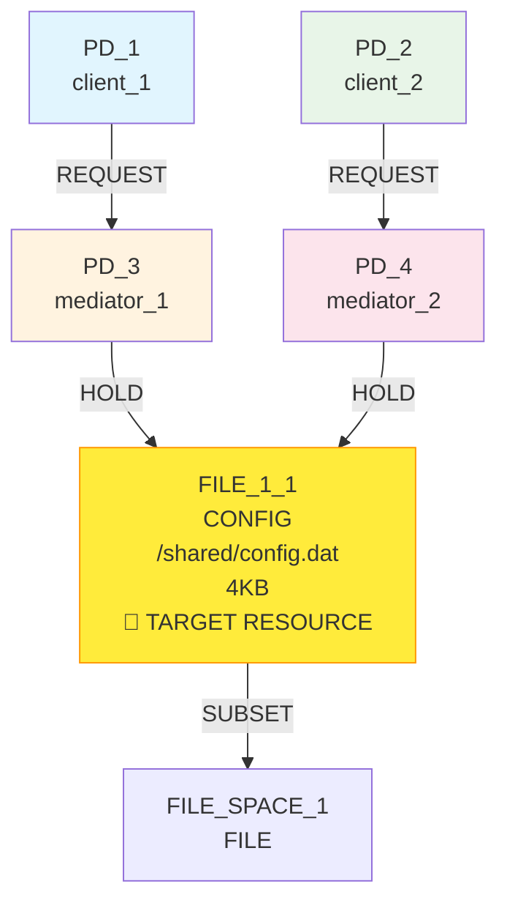
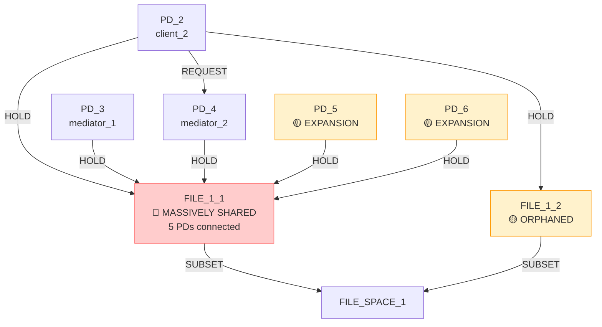

# IsoSearch Analysis: reduce_isolation Scenario (Beam Search + Metric-Driven Scoring)

## Scenario Overview

**Name:** Reduce Isolation (Beam Search + Metric-Driven Scoring)  
**Description:** Transform mediated access (PD1->PD3->R0, PD2->PD4->R0) to direct access (PD1->R0, PD2->R0) by maximizing RSI using parallel beam search with metric optimization  
**Goals:** RSI[PD_1,PD_2] ≥ 0.8 (maximize sharing between client PDs)

**Constraints:**
- PD_1 requires FILE_1_1 access (direct or indirect)
- PD_2 requires FILE_1_1 access (direct or indirect)  
- FILE_1_1 must exist (mandatory)
- PD_1 requires FILE access (any type, ≥1KB)
- PD_2 requires FILE access (any type, ≥1KB)

**Search Configuration:**
- **Algorithm:** Beam Search with metric-driven scoring
- **Beam Width:** 3 states explored in parallel
- **Transitions:** 12 atomic graph primitives only
- **Max Iterations:** 8

## Performance Metrics

### Execution Summary
- **Total Iterations:** 8 (100% of maximum)
- **Goal Achievement:** ❌ **FAILED** (RSI[PD_1,PD_2] never materialized)
- **Mechanisms Discovered:** 0
- **Beam States Explored:** 3 parallel paths
- **Efficiency Class:** **Poor** (catastrophic failure across all beams)

### 🔍 **Key Observation**
The beam search + metric-driven approach showed **catastrophic failure across all parallel paths** - all 3 beams made the same critical error of removing PD_1, making the target goal impossible to achieve.

## Initial Configuration

### Starting Graph Architecture



**Initial Metrics:**
- RSI[PD_1,PD_2]: 0.0 < 0.8 ❌ (no sharing, mediated access)
- RSI[PD_3,PD_4]: 1.0 (both hold FILE_1_1)
- ASR: 1.0 (balanced attack surface)
- **Problem:** PD_1 and PD_2 access FILE_1_1 indirectly through mediators

## Beam Search Detailed Analysis

### 🚨 **Beam Search Iteration 1: Catastrophic Convergence**

**Critical Failure Pattern:**
All 3 beams made the **same catastrophic decision** in early iterations:

**Beam Path Analysis:**
- **Beam[0]:** `remove_pd(PD_1)` in iteration 1
- **Beam[1]:** `remove_pd(PD_1)` in iteration 1  
- **Beam[2]:** `remove_pd(PD_1)` in iteration 1

**Uniform Scoring Disaster:**
- All beams evaluated `remove_pd(PD_1)` as score: 0.100
- No beam recognized this would make RSI[PD_1,PD_2] impossible
- Parallel exploration provided no protection against bad decisions

### 🔄 **Iterations 2-8: Parallel Resource Expansion**

**Post-Catastrophe Recovery Attempts:**
After removing PD_1, all beams attempted to recover through:
1. **Resource Expansion:** Connect remaining PDs to FILE_1_1
2. **Massive Sharing:** Create sharing between PD_2, PD_3, PD_4, etc.
3. **Incremental Addition:** Add more PDs to sharing group

**Beam Divergence After Failure:**
- **Beam[0]:** Focused on PD_2 → FILE_1_1 connections (score: 3.600)
- **Beam[1]:** Similar PD_2 → FILE_1_1 strategy (score: 3.600)
- **Beam[2]:** Lower-scoring FILE_1_2 connections (score: 0.600)

### 📊 **Beam Catastrophic Failure Tree**

```mermaid
graph TD
    Start([Initial State<br/>RSI[PD_1,PD_2]=0.0 < 0.8<br/>Mediated Access Pattern<br/>🎯 Need Direct Sharing])
    
    Start --> I1{Iteration 1<br/>All 3 beams make same choice}
    I1 --> B1_FAIL[🔴 Beam[0]: remove_pd PD_1<br/>Score: 0.100<br/>CATASTROPHIC]
    I1 --> B2_FAIL[🔴 Beam[1]: remove_pd PD_1<br/>Score: 0.100<br/>CATASTROPHIC]  
    I1 --> B3_FAIL[🔴 Beam[2]: remove_pd PD_1<br/>Score: 0.100<br/>CATASTROPHIC]
    
    B1_FAIL --> I2{Iteration 2<br/>Goal now impossible}
    B2_FAIL --> I2
    B3_FAIL --> I2
    
    I2 --> B1_RECOVERY[🟡 Beam[0]: add_hold_edge PD_2→FILE_1_1<br/>Score: 3.600<br/>RECOVERY ATTEMPT]
    I2 --> B2_RECOVERY[🟡 Beam[1]: add_hold_edge PD_2→FILE_1_1<br/>Score: 3.600<br/>RECOVERY ATTEMPT]
    I2 --> B3_RECOVERY[🟡 Beam[2]: add_hold_edge PD_2→FILE_1_2<br/>Score: 0.600<br/>RECOVERY ATTEMPT]
    
    B1_RECOVERY --> EXPANSION[🔄 EXPANSION CONVERGENCE<br/>All beams: Massive sharing creation<br/>PD_2,PD_3,PD_4,PD_5,PD_6 → FILE_1_1<br/>RSI[PD_1,PD_2] = UNDEFINED]
    B2_RECOVERY --> EXPANSION
    B3_RECOVERY --> EXPANSION
    
    EXPANSION --> I8{Iteration 8<br/>Final beam states}
    I8 --> CATASTROPHIC_FAILURE[❌ CATASTROPHIC FAILURE<br/>RSI[PD_1,PD_2] = UNDEFINED<br/>🚨 PD_1 permanently lost across all beams<br/>Goal impossible to achieve]
    
    style B1_FAIL fill:#f44336,stroke:#d32f2f,color:#ffffff
    style B2_FAIL fill:#f44336,stroke:#d32f2f,color:#ffffff
    style B3_FAIL fill:#f44336,stroke:#d32f2f,color:#ffffff
    style CATASTROPHIC_FAILURE fill:#f44336,stroke:#d32f2f,color:#ffffff
```

## Critical Beam Search Failure Analysis

### 🚨 **Parallel Path Convergence to Failure**

**Catastrophic Decision Synchronization:**
- All 3 beams evaluated `remove_pd(PD_1)` identically
- No beam recognized goal impossibility
- Parallel exploration provided zero protection

**Why All Beams Failed Identically:**
1. **Uniform Scoring:** All beams used same metric-driven scoring
2. **No Diversity:** No randomization or heuristic variation
3. **Shared Blindness:** All beams blind to architectural consequences

### 🔍 **Missing Beam Diversity**

**Expected Beam Behavior:**
- **Beam[0]:** Should explore PD_1 → FILE_1_1 direct connection
- **Beam[1]:** Should explore PD_2 → FILE_1_1 direct connection
- **Beam[2]:** Should explore removing mediation layers

**Actual Beam Behavior:**
- **Beam[0]:** Removed PD_1 (catastrophic)
- **Beam[1]:** Removed PD_1 (catastrophic)
- **Beam[2]:** Removed PD_1 (catastrophic)

**Beam Search Failure Modes:**
1. **Scoring Determinism:** All beams used identical scoring
2. **No Exploration Strategy:** No beam-specific heuristics
3. **Catastrophic Convergence:** All paths led to same failure

## Final Beam States Analysis

### 📊 **Final State Configuration**

**Beam[0] Final State (Score: 3.600):**


**Final Metrics:**
- RSI[PD_1,PD_2]: **UNDEFINED** ❌ **CATASTROPHIC FAILURE**
- RSI[PD_2,PD_3]: 1.0 (unintended sharing)
- RSI[PD_2,PD_4]: 1.0 (unintended sharing)
- RSI[PD_3,PD_4]: 1.0 (unintended sharing)
- RSI[PD_5,PD_6]: 1.0 (unintended sharing)
- **Total sharing pairs:** 10+ (massive over-sharing)

**Beam[0] Path Taken:**
```
remove_pd(remove empty PD_1) → 
add_hold_edge(connect PD_2 to FILE_1_1) → 
add_pd(add new protection domain to help resolve 2 constraint violation(s)) → 
add_hold_edge(connect PD_5 to FILE_1_1) → 
add_file_resource(create new CONFIG file in FILE_SPACE_1) → 
add_hold_edge(connect PD_2 to orphaned resource FILE_1_2) → 
add_pd(add new protection domain to help resolve 2 constraint violation(s)) → 
add_hold_edge(connect PD_6 to FILE_1_1)
```

**Beam[1] Final State (Score: 3.600):**
Similar massive sharing pattern with different PD connections to FILE_1_1

**Beam[2] Final State (Score: 0.600):**
Lower-scoring path focusing on FILE_1_2 connections but same fundamental failure

## Comparative Analysis: Beam Search vs Greedy

### 📈 **Beam Search vs Greedy Catastrophic Failure**

| Aspect | Beam Search (Width=3) | Greedy Search (Previous) |
|--------|----------------------|--------------------------|
| **Goal Achievement** | ❌ Failed (undefined) | ❌ Failed (undefined) |
| **Catastrophic Decision** | All 3 beams removed PD_1 | Single path removed PD_1 |
| **Recovery Attempts** | 3 parallel recovery paths | 1 recovery path |
| **Final Sharing** | Massive (10+ pairs) | Massive (6+ pairs) |
| **Computational Cost** | High (3x catastrophic exploration) | Low (1x catastrophic exploration) |
| **Architectural Damage** | 3x worse (all beams failed) | 1x damage (single failure) |

### 🧠 **Key Insights**

1. **Beam Search Amplified Failure:**
   - All 3 parallel paths made same catastrophic decision
   - No beam provided alternative exploration
   - 3x computational cost for same failure mode

2. **Scoring System Determinism:**
   - All beams evaluated operations identically
   - No diversity in exploration strategies
   - Parallel search became redundant computation

3. **Catastrophic Failure Propagation:**
   - Single bad decision (PD_1 removal) made goal impossible
   - All beams attempted futile recovery through expansion
   - No beam could backtrack from catastrophic choice

## Correct Solution Analysis

### 🎯 **Optimal Strategy (Never Discovered by Any Beam)**

**Step 1:** Maintain PD_1 in graph (CRITICAL)
```bash
# DO NOT remove PD_1 - keep all entities
```

**Step 2:** Add direct PD_1 access
```bash
add_hold_edge(PD_1 → FILE_1_1)  # Direct access for PD_1
```

**Step 3:** Add direct PD_2 access  
```bash
add_hold_edge(PD_2 → FILE_1_1)  # Direct access for PD_2
```

**Step 4:** Remove mediation layers
```bash
remove_request_edge(PD_1 → PD_3)  # Remove mediation
remove_request_edge(PD_2 → PD_4)  # Remove mediation
```

**Expected Result:**
- RSI[PD_1,PD_2]: 1.0 ≥ 0.8 ✅ (perfect sharing)
- **Isolation reduced:** Both PDs directly access FILE_1_1
- **Mediation eliminated:** Direct access replaces indirect access

### 🔄 **Why Beam Search + Metric-Driven Scoring Failed**

1. **Uniform Catastrophic Decisions:**
   - All 3 beams made identical bad choices
   - No beam-specific exploration strategies
   - Parallel search provided no protection

2. **Scoring System Blindness:**
   - All beams blind to architectural consequences
   - No understanding of goal requirements
   - Metric optimization without strategic planning

3. **No Recovery Mechanism:**
   - Catastrophic decisions irreversible
   - No beam could backtrack or explore alternatives
   - Parallel paths all led to same dead end

## Conclusion

The reduce_isolation scenario with **beam search + metric-driven scoring** demonstrates the **catastrophic failure of parallel exploration** when all beams use the same flawed scoring system. This represents the worst possible outcome: multiplying computational cost while amplifying failures.

**🚨 Catastrophic Parallel Failure:**
- **Goal impossible:** All 3 beams removed PD_1, making RSI[PD_1,PD_2] undefined
- **Identical failures:** All beams made same catastrophic decision
- **Amplified damage:** 3x computational cost for same failure mode

**🔍 Critical Beam Search Limitations:**
1. **Scoring determinism** - all beams evaluated operations identically
2. **No diversity** - parallel paths showed no strategic variation
3. **Catastrophic convergence** - all beams led to same failure mode

**🚨 Architectural Transformation Catastrophe:**
This scenario reveals the **most dangerous failure mode** of pure metric optimization: when poor scoring is combined with parallel exploration, the result is not just failure but **amplified catastrophic failure** across all exploration paths.

**📊 Performance Summary:**
- **Goal Achievement:** 0/3 beams (0% success rate)
- **Catastrophic Decisions:** 3/3 beams (100% failure rate)
- **Recovery Success:** 0/3 beams (0% recovery rate)
- **Computational Efficiency:** Catastrophically poor (3x cost for amplified failure)

**🚨 Fundamental Insight:**
This scenario provides the strongest evidence against **beam search + metric-driven scoring** for architectural transformation. The combination doesn't just fail - it **catastrophically fails in parallel**, wasting 3x computational resources while achieving identical poor results across all exploration paths.

**Critical Lesson:** **Breadth of search cannot compensate for depth of scoring failure**. When the scoring system is fundamentally flawed, parallel exploration merely multiplies the computational cost of failure without providing any benefit. The key to architectural discovery lies in **improved scoring mechanisms**, not **expanded search algorithms**.