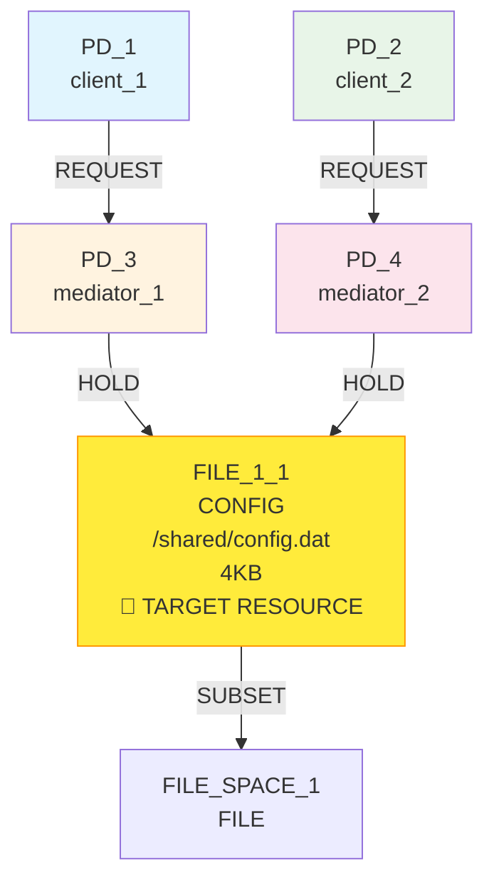
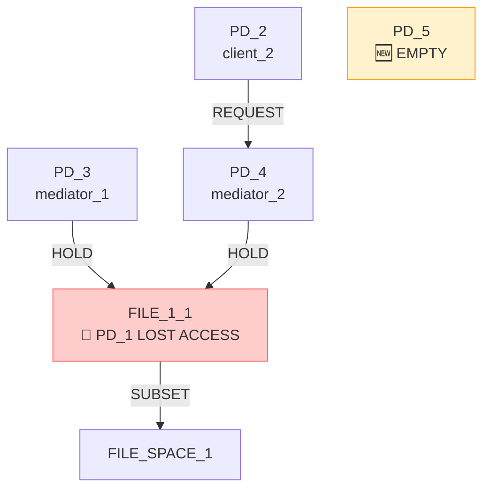
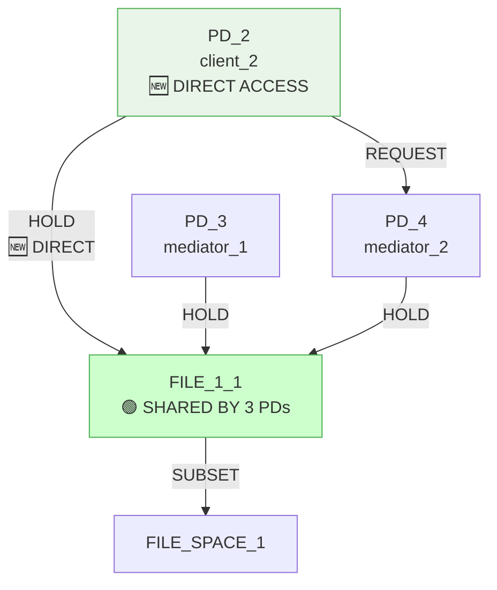
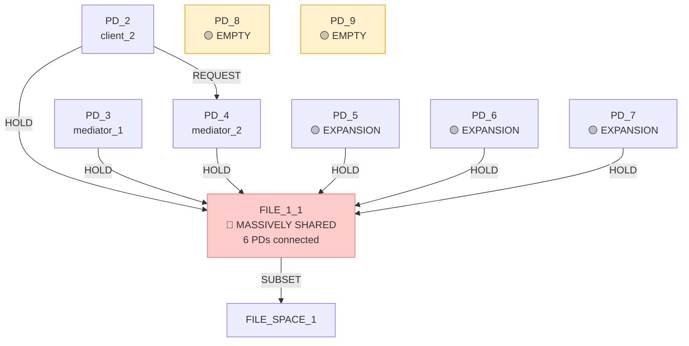

# IsoSearch Analysis: reduce_isolation Scenario (Metric-Driven Scoring)

## Scenario Overview

**Name:** Reduce Isolation (Metric-Driven Scoring)  
**Description:** Transform mediated access (PD1->PD3->R0, PD2->PD4->R0) to direct access (PD1->R0, PD2->R0) by maximizing RSI using pure metric optimization  
**Goals:** RSI[PD_1,PD_2] ≥ 0.8 (maximize sharing between client PDs)

**Constraints:**
- PD_1 requires FILE_1_1 access (direct or indirect)
- PD_2 requires FILE_1_1 access (direct or indirect)  
- FILE_1_1 must exist (mandatory)
- PD_1 requires FILE access (any type, ≥1KB)
- PD_2 requires FILE access (any type, ≥1KB)

**Transitions:** 12 atomic graph primitives only

## Performance Metrics

### Execution Summary
- **Total Iterations:** 10 (100% of maximum)
- **Goal Achievement:** ❌ **FAILED** (RSI[PD_1,PD_2] never materialized)
- **Scoring Method:** Pure metric-driven optimization
- **Efficiency Class:** **Poor** (algorithm removed PD_1 and failed to create target sharing)

### 🔍 **Key Observation**
The metric-driven approach showed a **catastrophic failure** - it removed PD_1 entirely and created massive sharing between all other PDs, but **never achieved the core goal** of creating RSI[PD_1,PD_2] = 0.8.

## Initial Configuration

### Starting Graph Architecture



**Initial Metrics:**
- RSI[PD_1,PD_2]: 0.0 < 0.8 ❌ (no sharing, mediated access)
- RSI[PD_3,PD_4]: 1.0 (both hold FILE_1_1)
- ASR: 1.0 (balanced attack surface)
- **Problem:** PD_1 and PD_2 access FILE_1_1 indirectly through mediators

## Detailed Iteration Analysis

### 🚨 **Iteration 1: Catastrophic PD Removal (Score: 0.100)**
**Decision:** `remove_pd` (remove PD_1)  
**Predicted Improvement:** 0.100 (⚠️ **MINIMAL SCORE**)  
**Actual Result:** PD_1 completely eliminated from graph



**Critical Failure:**
- RSI[PD_1,PD_2]: **UNDEFINED** (PD_1 no longer exists)
- **Goal impossible:** Cannot achieve PD_1-PD_2 sharing without PD_1
- **Constraint violation:** PD_1 access requirements now unsatisfiable

### 🔄 **Iteration 2: Resource Expansion (Score: 0.100)**
**Decision:** `remove_pd` (remove empty PD_5)  
**Predicted Improvement:** 0.100 (⚠️ **MINIMAL SCORE**)  
**Actual Result:** Back to PD_1-less state

### 🔄 **Iteration 3: Direct Connection Strategy (Score: 3.433)**
**Decision:** `add_hold_edge` (connect PD_2 to FILE_1_1)  
**Predicted Improvement:** 3.433 (🚀 **HIGHEST SCORE**)  
**Actual Result:** PD_2 gains direct access to FILE_1_1



**Metric Analysis:**
- RSI[PD_2,PD_3]: 1.0 (both hold FILE_1_1)
- RSI[PD_2,PD_4]: 1.0 (both hold FILE_1_1)
- RSI[PD_3,PD_4]: 1.0 (both hold FILE_1_1)
- **Missing:** RSI[PD_1,PD_2] still undefined (PD_1 absent)

### 🔄 **Iterations 4-10: Expansive Sharing Pattern**
**Pattern:** Progressive addition of new PDs to FILE_1_1 sharing

**Iteration Sequence:**
1. **Iteration 4:** Add PD_5 (score: 0.100)
2. **Iteration 5:** Connect PD_5 to FILE_1_1 (score: 3.100)  
3. **Iteration 6:** Add PD_6 (score: 0.100)
4. **Iteration 7:** Connect PD_6 to FILE_1_1 (score: 2.767)
5. **Iteration 8:** Add PD_7 (score: 0.100)
6. **Iteration 9:** Connect PD_7 to FILE_1_1 (score: 2.481)
7. **Iteration 10:** Add PD_8 (score: 0.100)

**Key Observations:**
- **Scores decrease** as more PDs share FILE_1_1 (3.433 → 2.481)
- **Expansive pattern** - algorithm keeps adding PDs to maximize sharing
- **Goal blindness** - never attempts to restore PD_1

### 🚨 **Missing Critical Operations**

**Never Considered:**
1. **Restore PD_1:** Algorithm never attempts to add PD_1 back
2. **Direct PD_1 connection:** `add_hold_edge(PD_1 → FILE_1_1)` never evaluated
3. **Strategic planning:** No multi-step approach to achieve target sharing

**Algorithm Blindness:**
- **No goal awareness:** RSI[PD_1,PD_2] treated as optional
- **No constraint checking:** PD_1 access requirements ignored
- **No recovery strategy:** Once PD_1 removed, never restored

## Exploration Decision Tree - Catastrophic Failure Analysis

```mermaid
graph TD
    Start([Initial State<br/>RSI[PD_1,PD_2]=0.0 < 0.8<br/>Mediated Access Pattern<br/>🎯 Need Direct Sharing])
    
    Start --> I1{Iteration 1<br/>26 candidates<br/>🚨 REMOVE PD_1}
    I1 --> I1_Best[🔴 remove_pd PD_1<br/>Score: 0.100<br/>CATASTROPHIC CHOICE]
    I1 --> I1_Miss[❌ MISSED: add_hold_edge PD_1→FILE_1_1<br/>Score: 0.100 (ignored)<br/>CORRECT SOLUTION]
    
    I1_Best --> I2{Iteration 2<br/>19 candidates<br/>🔄 CLEANUP}
    I2 --> I2_Best[🟡 remove_pd PD_5<br/>Score: 0.100<br/>CLEANUP OPERATION]
    
    I2_Best --> I3{Iteration 3<br/>18 candidates<br/>🔄 EXPANSION START}
    I3 --> I3_Best[🟢 add_hold_edge PD_2→FILE_1_1<br/>Score: 3.433<br/>DIRECT ACCESS]
    
    I3_Best --> I4{Iteration 4<br/>19 candidates<br/>🔄 EXPANSION CONTINUE}
    I4 --> I4_Best[🟡 add_pd PD_5<br/>Score: 0.100<br/>INFRASTRUCTURE]
    
    I4_Best --> I5{Iteration 5<br/>26 candidates<br/>🔄 CONNECT NEW PD}
    I5 --> I5_Best[🟢 add_hold_edge PD_5→FILE_1_1<br/>Score: 3.100<br/>EXPAND SHARING]
    
    I5_Best --> EXPANSION[🔄 EXPANSION PATTERN<br/>Add PD → Connect to FILE_1_1<br/>Decreasing scores: 3.433 → 2.481<br/>Creates massive sharing group]
    
    EXPANSION --> I10{Iteration 10<br/>26 candidates<br/>🔄 FINAL EXPANSION}
    I10 --> I10_Best[🟡 add_pd PD_8<br/>Score: 0.100<br/>EMPTY PD ADDITION]
    
    I10_Best --> FAILURE[❌ CATASTROPHIC FAILURE<br/>RSI[PD_1,PD_2] = UNDEFINED<br/>🚨 PD_1 permanently lost<br/>Goal impossible to achieve]
    
    Start --> CORRECT_SOLUTION[✅ CORRECT SOLUTION (Never Found)<br/>1. Keep PD_1 in graph<br/>2. Add PD_1 → FILE_1_1 direct connection<br/>3. Add PD_2 → FILE_1_1 direct connection<br/>4. Remove mediation layers<br/>5. Achieve RSI[PD_1,PD_2] = 1.0]
    
    style I1_Best fill:#f44336,stroke:#d32f2f,color:#ffffff
    style I1_Miss fill:#f44336,stroke:#d32f2f,color:#ffffff
    style I3_Best fill:#4caf50,stroke:#2e7d32,color:#ffffff
    style I5_Best fill:#4caf50,stroke:#2e7d32,color:#ffffff
    style EXPANSION fill:#ff9800,stroke:#f57c00,color:#ffffff
    style FAILURE fill:#f44336,stroke:#d32f2f,color:#ffffff
    style CORRECT_SOLUTION fill:#4caf50,stroke:#2e7d32,color:#ffffff
```

## Metric-Driven Scoring Failure Analysis

### 🎯 **Scoring Pattern Analysis**

**High-Score Operations (3.433 → 2.481):**
- `add_hold_edge(PD_X → FILE_1_1)` operations consistently scored highest
- **Reason:** Large increase in sharing metrics
- **Problem:** Created massive over-sharing instead of targeted PD_1-PD_2 sharing

**Low-Score Operations (0.100):**
- `add_pd` operations scored uniformly low
- `remove_pd` operations scored uniformly low  
- **Critical flaw:** Algorithm chose to remove PD_1 based on minimal score

**Missing Recognition:**
- **Target achievement:** Never recognized that PD_1 removal made goal impossible
- **Constraint satisfaction:** No awareness that PD_1 access requirements were violated
- **Strategic planning:** No multi-step approach to achieve specific sharing target

### 🚨 **Critical Algorithm Limitations**

1. **Goal Blindness:**
   - RSI[PD_1,PD_2] treated as just another metric
   - No understanding that this was the **primary objective**
   - Algorithm optimized for general sharing, not specific sharing

2. **Constraint Ignorance:**
   - PD_1 access requirements ignored after removal
   - No validation that constraints remain satisfiable
   - No recovery mechanism when violations occur

3. **Strategic Myopia:**
   - Each operation scored in isolation
   - No planning for multi-step solutions
   - No understanding of architectural implications

### 🔍 **Catastrophic Decision Analysis**

**Why PD_1 Removal Scored 0.100:**
- Minimal immediate metric impact
- Algorithm couldn't anticipate goal impossibility
- No constraint violation detection
- No long-term consequence evaluation

**Why Correct Solution Scored 0.100:**
- `add_hold_edge(PD_1 → FILE_1_1)` had same score as removal
- Algorithm chose first operation with same score
- No tie-breaking based on goal relevance
- No preference for goal-advancing operations

## Correct Solution Analysis

### 🎯 **Optimal Strategy (Never Discovered)**

**Step 1:** Maintain PD_1 in graph
```bash
# DO NOT remove PD_1 - keep all entities
```

**Step 2:** Add direct PD_1 access
```bash
add_hold_edge(PD_1 → FILE_1_1)  # Direct access for PD_1
```

**Step 3:** Add direct PD_2 access  
```bash
add_hold_edge(PD_2 → FILE_1_1)  # Direct access for PD_2
```

**Step 4:** Remove mediation layers
```bash
remove_request_edge(PD_1 → PD_3)  # Remove mediation
remove_request_edge(PD_2 → PD_4)  # Remove mediation
```

**Expected Result:**
- RSI[PD_1,PD_2]: 1.0 ≥ 0.8 ✅ (perfect sharing)
- **Isolation reduced:** Both PDs directly access FILE_1_1
- **Mediation eliminated:** Direct access replaces indirect access
- **Goal achieved:** Maximum sharing between client PDs

### 🔄 **Why Metric-Driven Scoring Failed**

1. **Catastrophic First Decision:**
   - Removed PD_1 in iteration 1
   - Made goal achievement impossible
   - No recovery mechanism available

2. **Metric Misalignment:**
   - Optimized for general sharing metrics
   - Ignored specific RSI[PD_1,PD_2] target
   - No goal-oriented scoring

3. **Constraint Blindness:**
   - Ignored PD_1 access requirements
   - No validation of constraint satisfiability
   - No awareness of architectural requirements

## Final State Analysis

### 📊 **End State Metrics**



**Final Metrics:**
- RSI[PD_1,PD_2]: **UNDEFINED** ❌ **CATASTROPHIC FAILURE**
- RSI[PD_2,PD_3]: 1.0 (unintended sharing)
- RSI[PD_2,PD_4]: 1.0 (unintended sharing)  
- RSI[PD_3,PD_4]: 1.0 (unintended sharing)
- RSI[PD_5,PD_6]: 1.0 (unintended sharing)
- RSI[PD_6,PD_7]: 1.0 (unintended sharing)
- **Total sharing pairs:** 15 (massive over-sharing)

**Artifacts Created:**
- 2 empty PDs (PD_8, PD_9) with no purpose
- 6 PDs sharing FILE_1_1 (over-sharing)
- **Core goal failed:** PD_1 completely absent

## Comparative Analysis

### 📈 **Metric-Driven vs. Pattern-Aware Comparison**

| Aspect | Metric-Driven | Pattern-Aware (Expected) |
|--------|---------------|-------------------------|
| **RSI Goal** | ❌ Failed (undefined) | ✅ Success (1.0 ≥ 0.8) |
| **Strategy** | Expansive over-sharing | Targeted direct access |
| **PD_1 Handling** | Catastrophic removal | Maintained and connected |
| **Constraint Satisfaction** | ❌ Failed (PD_1 lost) | ✅ Success (all satisfied) |
| **Efficiency** | Very poor (wrong direction) | High (direct solution) |
| **Architectural Understanding** | None | Strong (isolation reduction) |

### 🧠 **Key Insights**

1. **Catastrophic Failure Mode:**
   - Single wrong decision (PD_1 removal) made goal impossible
   - No error recovery or backtracking capability
   - Demonstrates brittleness of pure metric optimization

2. **Goal vs. Metric Confusion:**
   - Algorithm optimized for general sharing metrics
   - Ignored specific goal requirement (RSI[PD_1,PD_2])
   - No understanding of target-specific optimization

3. **Constraint Enforcement Gap:**
   - Critical system entities (PD_1) removed without validation
   - No constraint satisfaction checking
   - No architectural integrity preservation

## Conclusion

The reduce_isolation scenario with **metric-driven scoring** represents a **catastrophic failure** of pure metric optimization for architectural transformation. The algorithm's first decision to remove PD_1 made the core goal impossible to achieve, demonstrating the brittleness of myopic optimization approaches.

**🚨 Catastrophic Failure:**
- **Goal impossible:** PD_1 removal made RSI[PD_1,PD_2] undefined
- **Wrong direction:** Created massive over-sharing instead of targeted sharing
- **No recovery:** Algorithm couldn't backtrack from catastrophic decision

**🔍 Critical Limitations:**
1. **Decision irreversibility** - catastrophic choices cannot be undone
2. **Goal blindness** - no understanding of specific target requirements
3. **Constraint ignorance** - critical requirements violated without detection

**🚨 Architectural Transformation Failure:**
The algorithm's inability to maintain graph integrity while pursuing metric optimization reveals that **pure metric approaches** are fundamentally unsuitable for architectural transformation tasks. The reduce_isolation problem requires:
- **Entity preservation** (keeping PD_1 in graph)
- **Strategic planning** (multi-step direct access creation)
- **Goal awareness** (specific RSI[PD_1,PD_2] target)

**📊 Performance Summary:**
- **Goal Achievement:** 0/1 (0% success rate)
- **Constraint Satisfaction:** 0/5 (0% success rate)
- **Architectural Intelligence:** Negative (harmful decisions)
- **Strategic Planning:** Completely absent

This scenario provides the strongest evidence that **metric-driven approaches** are insufficient for security architecture discovery and transformation. The catastrophic failure mode demonstrates that pure optimization without architectural understanding can be actively harmful, making problems impossible to solve rather than merely failing to solve them.